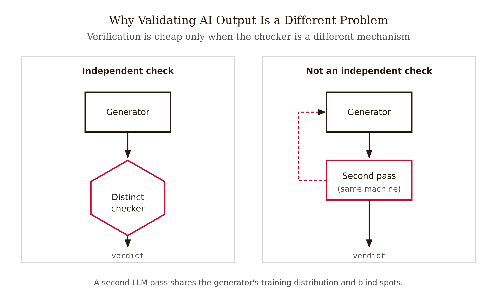
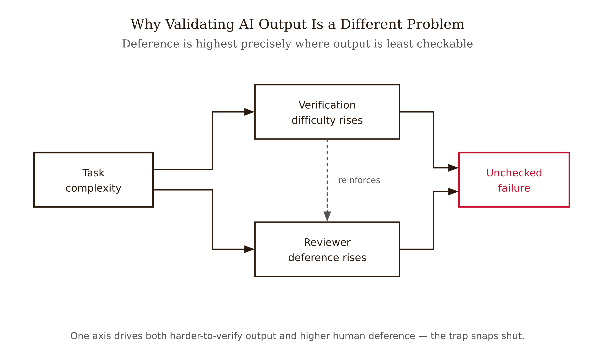
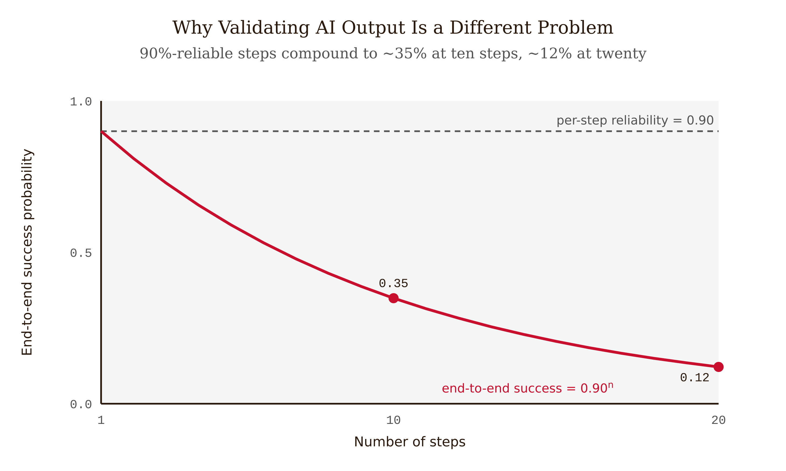
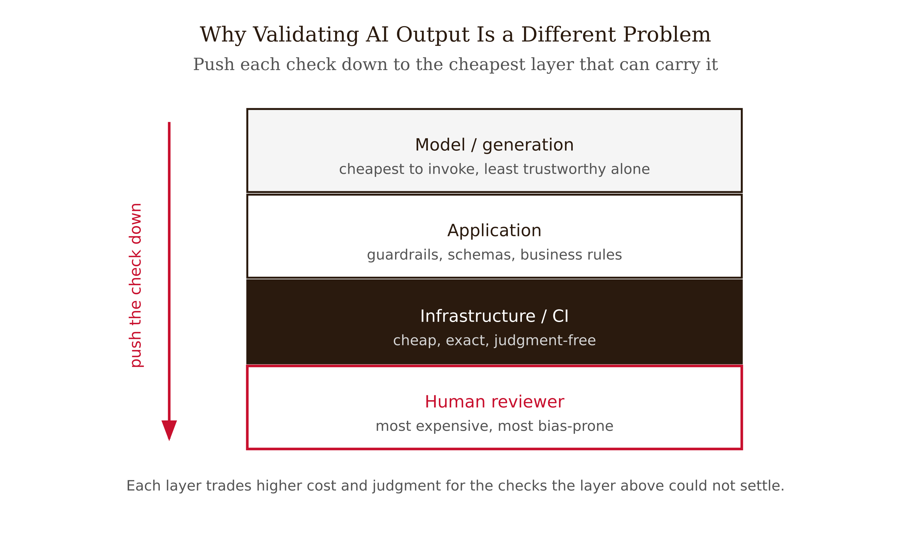

# Chapter 1 — Why Validating AI Output Is a Different Problem

*Plausible Is Not Correct, and the Generator Cannot Tell You Which It Is*

A senior engineer is reviewing a pull request. The change is a 40-line refactor of a date-handling utility, generated by an AI coding assistant and lightly edited. The diff is *clean*: consistent naming, sensible variable choices, a docstring that reads exactly as she would have written it, no obvious smell. The tests pass. She approves it in under two minutes — faster, she would later admit, than she reviews her own code, because there was nothing to argue with. It read right.

The function computed the wrong thing. It treated a half-open interval as closed, so every date range that ended at midnight was off by one day. The tests passed because the tests had been generated by the same assistant from the same misreading of the spec — they asserted the buggy behavior. The bug shipped, surfaced three weeks later as a billing discrepancy, and cost more to unwind than the feature saved.

Notice what did not happen. The engineer made no knowledge error. She knew date arithmetic cold. She made no reasoning error — given what she perceived, approval was correct. She made a **verification error**, and a specific one: she used the *fluency* of the output as evidence of its *correctness*. The code was well-formed, so she checked it the way you check well-formed code — lightly. Every cue she relied on, clean structure, confident docstring, passing tests, was a cue the AI system is optimized to produce, and none of them was load-bearing.

This is the chapter's whole subject in one scene. Producing the diff was easy. Knowing whether it was correct was the hard part — and the two mechanisms that should have helped (a second opinion from tests, a human reviewer) both failed in characteristic ways. The second opinion shared the generator's blind spot. The human reviewer was defeated by the very fluency she was supposed to scrutinize. The rest of this book is the systematic answer to the question: what do you trust instead? This chapter establishes why the obvious answers — ask the model again, put a human in the loop — are weaker than they look.

---

## The asymmetry, and why it partly fails

Start with the intuition every engineer carries, because it is almost right, and the way it breaks is the whole lesson.

In complexity theory there is a clean asymmetry between finding an answer and checking one. A completed Sudoku grid is trivial to verify — scan each row, column, and box for duplicates, a few hundred comparisons — but finding the solution from a blank grid is genuinely hard. The same shape recurs everywhere: a factorization is hard to find and a one-line multiplication to check; a mathematical proof is hard to discover and, if written formally, mechanically verifiable; a program is hard to write and sometimes checkable against a specification. This is the formal heart of the complexity class NP — problems where a solution, once handed to you, comes with a *certificate* you can verify cheaply and independently.

It is also the intellectual ancestry of this book. Floyd (1967) and Hoare (1969) made the verification of a program a separate, formal activity from its writing, by attaching pre- and post-conditions you could check against the code independent of how the code was written. The idea that "is this correct?" can be turned into a mechanical question is older than software engineering as a profession.

So the natural move, when an AI produces a hard-won answer, is: *verify it — which should be the easy part.* And for many output types this is exactly right, and exactly what the later chapters exploit. Does the code compile? The compiler checks in milliseconds. Does the citation exist? Look it up. Does the JSON match the schema? Validate it. Where a cheap, independent certificate exists, the asymmetry is your friend.

Here is where it breaks. **The asymmetry assumes the verifier is independent of the generator.** Checking a Sudoku grid is easy because the checker — the duplicate-scan rule — is a *different mechanism* from whatever search produced the solution. When you ask a language model to verify its own answer, or spin up a second model to grade the first, you do not get an independent checker. You get the same approximate-retrieval machine, with the same training distribution, the same blind spots, and the same confident failure modes. The "certificate" it produces is not a check against ground truth. It is another generation, conditioned on the first.

*Figure 1.1 — The generate-verify asymmetry holds only when the checker is a different mechanism from the generator.*

<!-- → [FIGURE: Two-column diagram — left column labeled "Classical asymmetry (NP)": Generator (search / hard) and Verifier (certificate check / cheap + independent) are visually distinct mechanisms; right column labeled "LLM self-verification": Generator and Verifier share the same box (same model, same distribution, same blind spots). Caption: The classical generate-verify asymmetry assumes independence. An LLM verifier is not independent of the LLM generator — it is the same machine run again.] -->

The evidence is direct. Stechly, Valmeekam & Kambhampati (2024) tested LLM self-verification on reasoning and planning tasks — asking models to verify their own or others' solutions — and found it unreliable, with self-critique loops failing to deliver the gains the verify-is-easy intuition predicts. Huang et al. (2024) tested intrinsic self-correction — re-examination with no external feedback and no oracle label — and found that models do not dependably improve and sometimes get *worse* after "correcting," because the model has no independent signal about whether its first answer was right. A system fluent enough to produce a wrong answer is fluent enough to produce a fluent defense of it.

There is genuine nuance to hold. Some carefully structured verification prompts do recover gains, and some 2025–2026 work reports that targeted verification can be far cheaper computationally than full regeneration. The honest statement is not "LLMs can never check anything." It is: external grounding is the reliable lever; prompt-only self-checking is contested and must be measured, not assumed. The reliable signal comes from *outside* the model. A second LLM pass can be a useful screen, but it is not a ground-truth check, and treating it as one is the most common over-trust in the field.

---

## The fluency problem: well-formed is not correct

Why does "it read right" fool a competent expert? Because of what a language model is *for*. A model is trained to produce text that is probable — fluent, well-structured, idiomatic, confident. It is extraordinarily good at the *surface* properties of correct output: clean code, grammatical prose, correctly-formatted citations, the cadence of an expert. It is separately good, and far less reliably so, at the *substance* — whether the code does the right thing, whether the cited case exists, whether the claim is true.

The trap is that humans use surface as a cheap proxy for substance, and ordinarily that proxy is decent. In a world before language models, a fluently-written legal brief with correctly-formatted citations was weak but real evidence of a competent author who probably got the substance right, because producing the fluent surface was *correlated* with doing the underlying work. The model severs that correlation. It produces the surface essentially for free, with no necessary connection to the substance. So the proxy you have used your whole career — well-formed implies probably-correct — becomes actively misleading, and it misleads you most exactly where the model is most fluent, which is exactly where you relax.

Make it concrete across output types.

**Code.** A model emits syntactically perfect code that compiles, reads cleanly, and implements the wrong specification. Fluency is orthogonal to correctness. The clean diff gets approved faster, not scrutinized harder.

**Factual and legal writing.** A brief cites cases in flawless Bluebook form. Some of the cases do not exist. The form is a strong, false signal of the substance. This is not hypothetical — sanctioned filings of fabricated AI-generated citations are now a documented genre in U.S. courts. Note that ground truth here is mechanically checkable at one layer (does the case exist?) and not at another (is the argument sound?). That gap is where later chapters live.

**Reasoning.** A model produces a step-by-step derivation that is articulate, well-organized, and arrives at the wrong number, with one plausible-looking algebra slip buried in step 4. The form of reasoning — numbered steps, "therefore," confident tone — is not the validity of reasoning.

### Fluency does not just fool you — it lowers your guard

The deeper problem is human-factors, not just epistemic. **Automation bias** is the measured tendency of humans to over-rely on automated outputs: to miss problems the automation did not flag, and to follow automated recommendations even against valid contradicting evidence. This is not a metaphor and not a property of careless people. Skitka, Mosier and colleagues documented it in trained aircrews — experts, high stakes, real instruments — making both error types when an imperfect but reliable automated aid was present.

The finding that matters most here comes from Lyell & Coiera (2017), a systematic review establishing that **automation bias rises with verification complexity and cognitive load.** The harder it is to independently check an automated recommendation, the more humans defer to it. Read that against the fluency problem and the trap closes: AI produces the most fluent, hardest-to-independently-verify output precisely on the most complex tasks — and that is exactly the regime where humans defer most. Fluency does not merely fail to signal correctness; it actively suppresses the scrutiny that would have caught the error.

*Figure 1.2 — Fluency suppresses scrutiny exactly where it should rise: complexity drives both harder verification and higher deference.*

<!-- → [FIGURE: Diagram showing the reinforcing loop — "Task complexity increases" → "AI output is more fluent" (top arrow) and "Task complexity increases" → "Verification difficulty increases" → "Automation bias increases" (bottom path); both paths converge on "Scrutiny decreases". Caption: The fluency trap is self-reinforcing. Higher-complexity tasks produce more fluent AI output and raise verification difficulty simultaneously, both reducing the scrutiny that would catch errors.] -->

A caution on sourcing, because this book shows its evidence and flags what it cannot stand behind. A widely-repeated secondary claim holds that reviewers checking AI-generated output miss substantially more issues than independent reviewers — often cited as roughly 27% more, from a Wang et al. (2024) study. I have not been able to confirm that specific study, number, or effect size in a primary venue, so I will not state it as established. `[verify — locate primary citation: venue, N, DOI, exact effect size, before relying on the number.]` The *direction* — that fluent automated output degrades reviewer vigilance, and that this worsens with verification difficulty — rests on the well-sourced Lyell & Coiera (2017) review and the Skitka/Mosier aviation work. When you see a clean percentage in this domain, ask for the primary source. This is a field where confabulated statistics travel fast precisely because they sound right.

---

## Compounding error: how a 90%-reliable agent fails a task

So far the failures are single-shot: one diff, one brief, one answer. Agentic systems add a structural failure that single-shot validation cannot see, and you can derive it yourself with arithmetic.

Suppose an agent executes a task as a sequence of steps — read a file, call a tool, parse a result, decide, act, repeat. Suppose each step is independently 90% reliable: nine times in ten it does the right thing. That sounds fine; 90% is solid. Now suppose the steps are roughly independent and errors propagate — a wrong output at step *k* becomes confident input to step *k+1*. The probability that all ten steps are correct is:

$$P(\text{success}) \approx 0.9^{10} \approx 0.35$$

A chain of individually-reliable steps is an end-to-end coin flip that loses. Push to twenty steps and $0.9^{20} \approx 0.12$ — the task succeeds roughly one time in eight. The reliability you care about, the whole task, decays *exponentially* with the number of steps, even though every individual step looked trustworthy in isolation.

*Figure 1.3 — Compounding error: end-to-end success decays exponentially with chain length even at 90% per-step reliability.*

Two honest qualifications, because the model is illustrative, not a measured law. The independence assumption is doing a lot of work. Real trajectories are not perfectly independent: errors can be correlated (a model that misreads the spec is wrong in a consistent direction across steps, which the simple product overstates), or self-correcting (a later step's tool output can surface and fix an earlier mistake, which the product understates). How correlated agentic step errors actually are in production is genuinely under-measured — it is one of this chapter's open questions. The *point* survives the qualification: in sequential systems, end-to-end reliability is not the per-step reliability, and the gap between them grows with length.

<!-- → [CHART: Line chart — x-axis: number of steps (1 to 20); y-axis: end-to-end success probability (0 to 1.0); two curves, one for p=0.90 per step and one for p=0.95 per step, both decaying toward zero; a horizontal dashed line at 0.35 marks the 10-step / 90%-per-step result. Caption: End-to-end reliability decays exponentially with chain length even when per-step reliability is high. At 10 steps and 90% per-step reliability, the task succeeds roughly one time in three.] -->

The validation consequence is the whole reason this matters. The dangerous case is not the step that fails loudly — that one throws an exception, trips a check, gets caught. The dangerous case is the step that produces a *plausible-but-wrong* output: at step 2 the agent makes a reasonable assumption that happens to be false, steps 3 through 12 build on it confidently, and step 12 executes an irreversible action — deletes the wrong resource, sends the wrong email, ships the wrong config. No single step failed loudly. Final-answer validation cannot catch this, because the final answer is the *consequence* of the early error, not a place where the error is visible. You have to validate the **trajectory** — the sequence of actions and intermediate states — and you have to checkpoint *before* irreversible actions, not after.

The fluency problem and compounding error reinforce each other in agents. Each wrong step is fluent, so nothing trips the human's alarm either. The agent that misread the spec in step 2 produces a clean, confident, well-formed step-12 output — because that is what fluent generation does regardless of whether the premises were right.

---

## Where does the check live?

Every claim above points to one organizing question, the question the rest of this book answers output type by output type: **where does the load-bearing check live?** Not "is there a check" — there is always a check — but which check is actually carrying the weight, and is it the right one for that property.

Name four layers, ordered by how cheap and how trustworthy each is.

<!-- → [TABLE: Validation responsibility stack — four rows: (1) Model/generation: examples = self-critique / "are you sure?" — can guarantee = cheapest to invoke — catch = no independent ground truth; least trustworthy alone. (2) Application: examples = schema checks / tool feedback / retrieval grounding — can guarantee = a real external signal where one exists — catch = only as good as the contract you can express. (3) Infrastructure/CI: examples = compiler / typechecker / linter / SAST / secrets scan — can guarantee = exact, repeatable, blocks merge; judgment-free — catch = catches form & rule-matched patterns, not intent. (4) Human reviewer: examples = expert sign-off / domain read — can guarantee = highest authority; the only layer that can judge novel intent — catch = lowest throughput; most vulnerable to automation bias. Caption: The responsibility stack, ordered cheapest to most expensive, least to most bias-prone. The engineering move is to push the check to the lowest layer that can actually carry it.] -->

Read the table top to bottom and a design principle falls out. The model layer is cheapest and least trustworthy alone. The human layer is the highest authority and the most expensive *and* the most bias-prone. The instinct to "just put a human in the loop" assigns the load-bearing check to the single most expensive, lowest-throughput, most-automation-bias-prone layer — and does it for exactly the fluent, complex outputs where that layer is weakest.

*Figure 1.4 — The validation-responsibility stack: push each check down to the cheapest layer that can carry it.*

The engineering move this book teaches is the opposite: push the check *down* to the cheapest layer that can actually carry it. If a property is decidable — does it compile, does it validate, does the citation exist — that check belongs in layer 2 or 3, where the verdict is exact, repeatable, and immune to fluency. Reserve the scarce, fallible human for the judgments that genuinely require judgment, and design that layer to fight the automation bias you now know is coming.

This is also why validation responsibility cannot be a single owner. The model cannot validate itself reliably. The human cannot be the first line of defense for everything without drowning. The check has to be distributed across layers by output type, with each layer doing the part it can do exactly.

The cheap, exact, judgment-free layer — infrastructure — is precisely where ground truth is *mechanically available*. That is not a coincidence; it is the thesis. Validation works where ground truth is mechanically available and fails where it is not. The right place to start is the layer where it is most available and the check is most trustworthy.

That layer is the subject of the next chapter: the deterministic floor — compilers, typecheckers, schema validators, linters, SAST. Validators that do not need judgment, cannot be fooled by fluency, and tell you the same thing every time. We start there not because it is the most powerful layer but because it is the only layer where the verdict is free of both the model's self-delusion and the human's strained attention. You build up from the floor.

---

## What would change my mind

The chapter's load-bearing claim is that the generator cannot be trusted to validate its own substantive output, because an LLM verifier is not independent of the LLM generator. A robust, replicated demonstration that intrinsic self-verification — no external tool, no oracle label, no human — reliably catches a model's own errors at a rate competitive with an external deterministic check, across diverse tasks and model families and *without* leaking ground truth into the verification prompt, would force a serious revision. The responsibility stack would gain a trustworthy layer-1 check, and "start at the deterministic floor" would weaken from "necessary because nothing above it is reliable alone" to "still cheapest, but no longer the only trustworthy option." The current evidence (Huang et al. 2024; Stechly et al. 2024) points the other way, but this is exactly the kind of result that 2026–2028 work could overturn for specific task classes, and I would rather be corrected by a clean experiment than defend the claim past its evidence.

---

## Still puzzling

Does the verify-easier-than-generate asymmetry ever hold robustly for LLMs, and under what conditions? It plainly holds when an external certificate exists; whether anything analogous holds for the model's intrinsic self-judgment is contested and probably needs a task-typed answer — formal and decidable versus open-ended — rather than a single yes or no.

How correlated are agentic step errors in practice? The $0.9^n$ model assumes independence. Real trajectories may have correlated errors, overstating the product's pessimism, or self-correcting ones, understating it. Empirical step-error correlation data is thin, and the right validation design depends on which regime you are in.

Can automation bias be engineered down in AI-review workflows — cognitive forcing functions, adversarial framing, bounded scope — without an unacceptable throughput cost? Whether any of it survives contact with shipping deadlines is an open practical question.

Is expressed model confidence ever calibrated enough to use as a triage signal, and if so for which tasks? Treating it as informative is dangerous by default, but a blanket "ignore confidence" may leave a cheap signal on the table where calibration has been measured.

---

## LLM Exercises

1. **(Analyze — compute something)** An agent automates a data-migration task in 8 steps. Each step is independently 92% reliable and errors propagate. (a) Compute the approximate end-to-end success probability. (b) The team wants 95% end-to-end reliability with the chain length fixed at 8 — what per-step reliability does that require (solve for *r* in $r^8 = 0.95$)? (c) In two sentences, explain why "raise per-step reliability" and "shorten the chain / checkpoint mid-trajectory" are both valid responses, and which one this chapter argues is structurally safer for irreversible actions, and why.

2. **(Evaluate)** Here is a review process verbatim: *"All AI-generated code goes through a human reviewer before merge. Reviewers approve when the code reads clearly, follows our style guide, and the AI-written tests pass."* (a) Identify every point where this process is vulnerable to a fluency-problem failure. (b) Name which layer of the responsibility stack is being asked to carry the load-bearing check, and why that is the wrong layer for at least one of the properties it is checking. (c) Propose one *deterministic* check that would move part of the burden off the human, and state precisely what it would and would not catch.

3. **(Apply — produce something)** Take one AI-generated artifact you actually have — a function, a paragraph of factual writing with citations, or a structured-data blob. For each layer of the responsibility stack (model / application / infrastructure / human), write one concrete check that *could* live at that layer for this specific artifact, and label what each check can guarantee and what it cannot. Then circle the *cheapest* layer that can give you an *exact* verdict on at least one property, and explain why that is where the check should start. Deliverable: a four-row table plus a two-sentence justification.

4. **(Understand)** In your own words and without using the phrase "verification is easier than generation," explain to a skeptical colleague why spinning up a second LLM call to grade the first one is not the same kind of check as running the compiler. Use the word "independent" and reference the asymmetry argument in this chapter.

---

## References

- Huang, J., Chen, X., Mishra, S., Zheng, H. S., Yu, A. W., Song, X., & Zhou, D. (2024). [Large Language Models Cannot Self-Correct Reasoning Yet](https://arxiv.org/abs/2310.01798). *ICLR 2024.* arXiv:2310.01798.
- Stechly, K., Valmeekam, K., & Kambhampati, S. (2024). [On the Self-Verification Limitations of Large Language Models on Reasoning and Planning Tasks](https://arxiv.org/abs/2402.08115). arXiv:2402.08115. *(NeurIPS 2024.)*
- Floyd, R. W. (1967). Assigning Meanings to Programs. *Proceedings of Symposia in Applied Mathematics*, Vol. 19, American Mathematical Society, 19–32.
- Hoare, C. A. R. (1969). An Axiomatic Basis for Computer Programming. *Communications of the ACM* 12(10), 576–580. DOI:10.1145/363235.363259.
- Lyell, D., & Coiera, E. (2017). Automation bias and verification complexity: a systematic review. *Journal of the American Medical Informatics Association* 24(2), 423–431. DOI:10.1093/jamia/ocw105.
- Skitka, L. J., Mosier, K. L., & Burdick, M. (1999). Does automation bias decision-making? *International Journal of Human-Computer Studies* 51(5), 991–1006. DOI:10.1006/ijhc.1999.0252. `[verify exact pages/issue]`
- Mosier, K. L., & Skitka, L. J. (1996). Human decision makers and automated decision aids: Made for each other? In R. Parasuraman & M. Mouloua (Eds.), *Automation and Human Performance: Theory and Applications*. Erlbaum. `[verify chapter pages]`
- Wang et al. (2024). "Reviewers miss ~27% more issues on AI-generated output (d ≈ 0.62)." `[verify — primary venue, N, DOI, and effect size NOT confirmed; do NOT state as established. Direction is carried by Lyell & Coiera 2017 instead.]`
