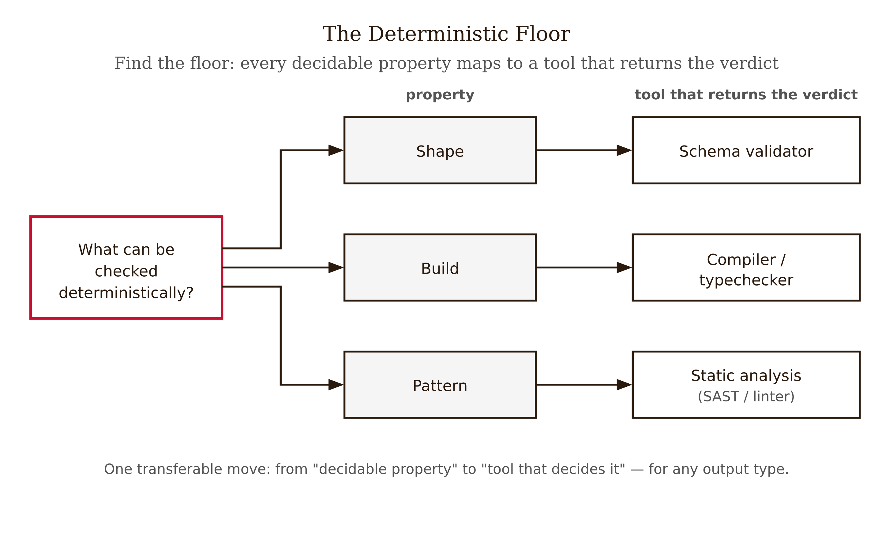
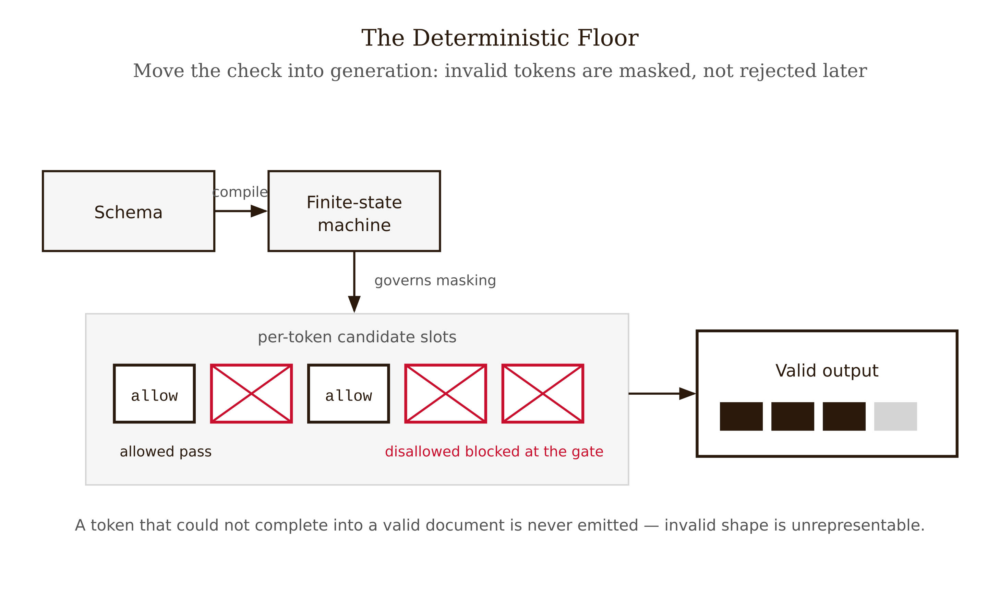
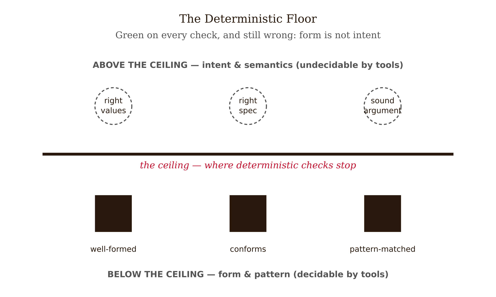
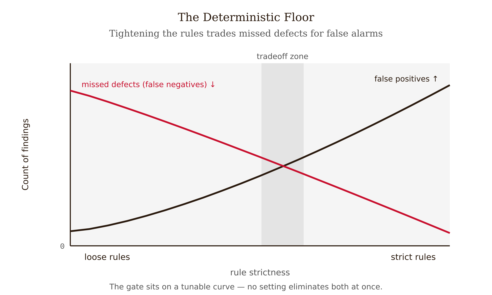

# Chapter 2 — The Deterministic Floor: Validators That Don't Need Judgment

*Find the compiler-equivalent for every output type, and make it block the merge*

Would you ship code that does not compile?

Of course not. You would not even consider it. The compiler is a gate you have never once argued with: red means stop, and you fix it before the thought of merging crosses your mind. You do not call a meeting about whether the type error is *really* an error. You do not weigh the compiler's confidence against your own. It returns a verdict and the verdict is final, because it is *exact*.

Now: would you ship an AI-generated answer that "reads right"? You probably have, this week. The clean diff from Chapter 1 got approved in two minutes. The factual paragraph with confident citations went into the report. The structured-data blob that *looked* like valid JSON got passed downstream. For these you held a meeting in your head — *does this look okay?* — and you let fluency cast the deciding vote.

The whole chapter lives in that asymmetry. You already own a judgment-free gate for one output type. You trust it completely, precisely *because* it does not have an opinion — it has a verdict. The discipline of the deterministic floor is extending that instinct to *every* AI output type: stop asking "does this look right?" and start asking **"what's the compiler-equivalent here?"**

For code, the literal compiler. For structured data, the schema validator. For security patterns, SAST. For committed secrets, a pattern scanner. Each returns the same verdict for the same input, every time, without judgment — and so each is immune to exactly the thing that defeated you in Chapter 1: it cannot be fooled by fluency, because it never reads the output the way you do. It checks a property, not an impression.

<!-- → [INFOGRAPHIC: Deterministic validator stack — four rows labeled: Compiler/typechecker (code shape), Schema validator (structured data), Linter/SAST (rule-matched patterns), Secrets scanner (committed credentials); each row shows: input → tool → binary verdict; caption: "Each tool checks one property, exactly, with no judgment"] -->

---

## What "deterministic" buys you

A deterministic validator is a function from output to verdict that is *referentially transparent*: same input, same verdict, every time, with no hidden state. Run the typechecker on the same source twice and you get the same answer. Validate the same document against the same JSON Schema on two machines, two years apart — identical verdict. No temperature, no sampling, no "it depends how you ask." This is the Floyd/Hoare inheritance from Chapter 1: correctness-of-a-checkable-property is turned into a mechanical question with a mechanical answer.

Three properties follow, and each maps onto a Chapter 1 failure it defeats.

**Exactness within its domain.** A compiler rejects ill-typed code; a schema validator rejects a non-conforming document; a linter flags its rule violations — no false uncertainty, no "I think this is probably fine." Within the property it checks, it is right. Outside that property it is silent, which is the subject of §2.5.

**Immunity to fluency.** The validator never reads the output as prose. It does not perceive confidence, clean structure, or a convincing docstring. The FSM that enforces a schema *does not care how sure the model sounds.* This is the direct antidote to Chapter 1's core problem: the surface features that defeat a human reviewer are invisible to a deterministic check.

**Repeatability, hence automatability.** Because the verdict is exact and stateless, you can run it on every change, automatically, in CI, and make it block the merge. No human is in the critical path for the properties it covers. The expensive, bias-prone human layer is no longer load-bearing for those properties. That is the whole point.

Now: why make this the *first* layer rather than asking the model to check itself? Chapter 1 already answered the principle; two bodies of evidence make it precise.

Huang et al. (2024) showed that intrinsic self-correction — re-examination with no external signal — does not dependably improve answers and can degrade them. The model has no independent ground truth, so "check your work" is just another generation from the same source of error. The validation signal has to come from *outside* the model, and a deterministic tool is the cheapest possible outside: a tool whose verdict does not depend on the model's opinion at all.

Chen et al. (2024), "Teaching Large Language Models to Self-Debug," showed the other side: when you feed a model *execution feedback* — run the code, return the actual error and trace — code-generation accuracy improves materially, in sharp contrast to ungrounded self-critique. The mechanism is precisely the chapter's point. A deterministic tool (the interpreter, the compiler) converts a fuzzy "is this right?" into a *hard signal* — the program crashed at line 12 with this trace — that the model can actually act on. The interpreter, not the model's self-assessment, is the oracle. Gehring et al. (2024, RLEF) push the same principle into the *training* loop: grounding generation in execution results drives reliability at scale. The deterministic-feedback principle is not an inference-time hack bolted on at the end; it is the load-bearing signal from runtime loops up through how models are trained.

One clarification before proceeding: "external" does not mean "a second model." It means a tool that mechanically checks a property and cannot be argued with. A compiler is a better validator of compilability than the smartest model's opinion of compilability, because the compiler *is* the ground truth for that property and the model only *predicts* it. When a deterministic check exists for a property, use it; do not spend a model call predicting what a tool can decide.

---

## The move: find the floor for any output type

The skill this chapter wants to leave in your hands is not a memorized tool list — tool lists rot, and a list teaches you nothing about the output type the list forgot. The transferable skill is a question you run on *any* AI output: **"What property of this output can be checked deterministically, and what tool returns that verdict?"**

*Figure 2.1 — The "what's the compiler-equivalent here?" move: shape maps to schema, build to compiler, pattern to static analysis.*

Three patterns calibrate the move.

**Shape → schema.** Is the output supposed to have a structure? Then a schema validator decides conformance exactly. JSON Schema is a deterministic contract: a document validates or it does not, with a machine-checkable verdict and no judgment. Pydantic (Python) and Zod (TypeScript) compile such contracts into runtime validators you can call before any downstream code touches the data.

**Build → compiler/typechecker.** Is the output code in a typed language? Then "does it build, are the types sound?" is decided by the compiler, exactly. Niklaus Wirth's argument that strict static typing is a *feature*, not a constraint, is precisely this: the typechecker is a judgment-free validator of program structure that catches whole classes of error before the code ever runs.

**Pattern → static analysis.** Is there a class of defect expressible as a pattern in the source? Then SAST and linters decide rule-matches exactly. Frances Allen's program-analysis lineage — reasoning about a program's properties from its source without executing it — is where this comes from. A linter flagging an unused variable, a SAST rule flagging a string-concatenated SQL query, a secrets scanner flagging a committed API key: each is a deterministic pattern check that runs in CI and blocks the merge.

Run the move across output types and the floor appears for each:

<!-- → [TABLE: Output type to deterministic check mapping — columns: Output type, Deterministic property, Tool; rows: Generated code (compiles? types sound?), Generated code (rule-matched defect?), Generated code (committed secret?), Structured data (conforms to schema?), Config/IaC (valid? policy-compliant?), Factual claims (does the cited source exist?)] -->

The last row is the instructive one. Even for *factual* output — which seems hopelessly judgment-laden — there is a deterministic sub-property: a citation either resolves to a real document or it does not. That check would have caught the fabricated-case legal briefs of Chapter 1 without any judgment about the argument's quality. Finding the decidable sub-property inside an apparently undecidable output type is the move at its most valuable. You will rarely get the *whole* output type onto the floor — but you can almost always get *some property* of it there, and that property is then checked for free, exactly, forever.

---

## The purest case: constrained decoding

There is one variant of the deterministic validator strong enough to deserve its own section, because it changes *when* the check happens.

Ordinarily you generate first and validate after: the model emits a JSON blob, you run the schema validator, you accept or reject. **Constrained decoding** moves the check *into generation.* Compile the schema into a finite-state machine, and at each decoding step mask out any token that would make the partial output unable to complete into a valid document. The model is only ever allowed to emit tokens consistent with the schema.

*Figure 2.2 — Constrained decoding masks invalid tokens at each step, making structurally invalid shape unrepresentable.*

The consequence is categorical: structurally-invalid output becomes *unrepresentable.* Not "unlikely." Not "rare with a good prompt." Impossible. The FSM does not permit the tokens that would form an invalid document. This is the cleanest illustration in the book of a validator that cannot be fooled by fluency: the machine does not read the output, does not perceive the model's confidence, does not weigh the surrounding prose. It enforces a structural constraint at the token level. You get a **mathematical guarantee of shape**, not a statistical one — a different *kind* of assurance from "we prompted it nicely and it usually returns valid JSON."

This is also the right place to retire a habit. "Please return only valid JSON" in a prompt is a *hope*, and Chapter 1's brittleness lesson applies: hopes are fragile. A provider-level structured-output mode backed by constrained decoding is a *contract.* The shift from prompt-hope to API-guarantee is one of the genuine improvements in this space: structured-output mode with constrained decoding replaced "please return JSON" prompting across mainstream providers, turning a probabilistic ask into a deterministic shape contract. When the property you need is shape, prefer the API-level guarantee to the prompt-level plea.

<!-- → [FIGURE: Constrained decoding vs. generate-then-validate — two parallel timelines; top: generate (unconstrained) → schema validator → accept/reject; bottom: FSM masks invalid tokens at each decoding step → output always valid by construction; caption: "The FSM moves the check into generation — invalid shape becomes unrepresentable, not just rejected"] -->

One honest caveat: there is an open question about whether forcing the FSM *degrades content quality* while guaranteeing shape — whether the constraint on token selection introduces errors in the values it does permit. The evidence is mixed and model-dependent. Treat constrained decoding as a shape guarantee with a possible, measurable quality cost, not a free lunch. `[verify — constrained-decoding quality/cost tradeoff is contested and model-specific]`

Now for the limit that the last caveat is pointing toward.

---

## The ceiling: form is not intent

Everything above is the floor's strength. This section is its limit, and you must hold the limit as firmly as the strength, because the characteristic failure of teams that *discover* the deterministic floor is to over-trust it — to mistake a green CI pipeline for a correct system.

State it plainly: **the deterministic floor catches *form* and *rule-matched patterns*, and says nothing about *intent* or *semantics.***

*Figure 2.3 — The floor and its ceiling: form and rule-matched patterns are decidable below the line; intent and semantics sit above it.*

Code can compile, satisfy the typechecker, pass every linter rule, and clear SAST — and implement the wrong specification. The off-by-one date bug from Chapter 1 would sail through the entire deterministic floor. It is well-typed. It is well-styled. It contains no rule-matched vulnerability. It is also wrong, and no compiler on earth knows the intended semantics of "billing period" to tell you so.

Structured data can validate against the schema and carry wrong values. A `temperature_celsius` field set to 9999 validates. A `currency: "USD"` field validates whether the amount is right or off by a factor of a hundred. Shape is decided; *truth* is not.

SAST is deterministic in its rule check, but its *coverage* is a judgment call that trades false positives against false negatives. Tighten the rules and you raise the false-positive load that erodes the team's trust in the gate; loosen them and you raise the silent false negatives. Industry figures suggest something on the order of a one-million-line codebase might surface tens of thousands of findings, with a few percent being false positives — but **these are vendor-illustrative figures, not peer-reviewed constants**, cited only to make the tradeoff concrete. `[verify — SAST scale/noise numbers are vendor illustrative, not measured constants]` The determinism lives in the rule check; the rule set's coverage and tuning are human decisions, and so is the policy of what severity fails the build versus merely flags it.

*Figure 2.4 — SAST gating: tightening rules trades fewer missed defects for more false positives along a tunable curve.*

<!-- → [FIGURE: "The floor's ceiling" — two-panel diagram; left panel shows all deterministic checks passing (compiler green, schema valid, linter clean, SAST silent); right panel shows the same artifact with an arrow pointing to the wrong-intent failure it still contains (wrong spec, wrong value, vulnerability outside rule set); caption: "Green is a statement about form. It is the entry condition for the layers above it, not the verdict."] -->

So the deterministic floor is **necessary, cheap, non-negotiable in CI — and not sufficient.** It covers the properties where ground truth is mechanically available by construction: well-formedness (compiler), structural conformance (schema), rule-matched patterns (linter/SAST/secrets). For those properties the verdict is exact and neither the model's self-assessment nor the human's bias-prone attention is the load-bearing check, which is the entire reason to start here. But "by construction" is also the limit: the floor only covers properties you can *construct* a mechanical check for, and *intent* is not one of them.

This is precisely why the book does not stop at Chapter 2. Above the floor, ground truth stops being mechanically free and you have to earn it — tests that encode the spec (Chapter 3), retrieval grounding and citation-support checking (Chapter 4), reasoning verification (Chapter 5). Each layer is more powerful, more expensive, and less certain than the floor. The discipline is to push every check as far *down* toward the floor as it will go — get every decidable property checked for free — and to know exactly which residual properties cannot live there, so you spend your expensive layers only on what genuinely needs them.

---

## LLM Exercises

**Exercise 2.1 (Apply).** Wire a minimal CI gate for an AI-generated output. Pick a small typed project (or a JSON-producing endpoint). Configure a pipeline (GitHub Actions, GitLab CI, or a Makefile target) that runs, in order: a typecheck or schema validation, a linter, and — for structured output — a JSON Schema / Pydantic / Zod validation. Then *deliberately* feed it a fluent-but-broken AI output and demonstrate the gate rejecting it. Deliverable: the pipeline config plus a log of the gate going red, and one sentence naming exactly which deterministic property failed.

**Exercise 2.2 (Analyze).** Produce an AI output that passes *every* check in your Exercise 2.1 gate and is still wrong. For code: a well-typed, lint-clean function implementing the wrong spec. For structured data: a schema-valid document with a semantically wrong value. Deliverable: the passing-but-wrong artifact, the green pipeline output, and a paragraph explaining *why no deterministic check in your gate could have caught it* — tied explicitly to the "form is not intent" argument above.

**Exercise 2.3 (Evaluate).** You run SAST on a 500k-LOC codebase and get 9,000 findings; spot-checking suggests roughly 8% are false positives. Leadership wants the build to *fail* on findings so they get fixed. (a) Propose a gating policy: which severities should fail the build, which should merely flag, and why. (b) Quantify the cost of your policy — roughly how many false positives will block builds per week given your assumptions, and what that does to team trust in the gate. (c) Defend your line against the opposite policy ("fail on everything") using the false-positive/false-negative tradeoff. (d) State explicitly which part of your decision is deterministic (the rule check) and which part is judgment (the gating policy).

**Exercise 2.4 (Apply).** For each of the following AI output types, run the §2.3 move and name (i) one deterministic property you can check, (ii) the tool that returns the verdict, and (iii) one property that is *not* on the floor: an SQL migration script; a citation-bearing factual summary; a Kubernetes manifest generated by an agent; a function that parses user-uploaded CSVs. Deliverable: a four-row table with all three columns filled. The third column is the point — it is the handoff to later chapters.

---

## References

- Huang, J., Chen, X., Mishra, S., Zheng, H. S., Yu, A. W., Song, X., & Zhou, D. (2024). *Large Language Models Cannot Self-Correct Reasoning Yet.* ICLR 2024. arXiv:2310.01798. — intrinsic self-correction does not dependably improve and can degrade.
- Chen, X., Lin, M., Schärli, N., & Zhou, D. (2024). *Teaching Large Language Models to Self-Debug.* ICLR 2024. arXiv:2304.05128. — execution feedback (run the code, return the error) improves code generation, in contrast to ungrounded self-critique.
- Gehring, J., et al. (2024). *RLEF: Grounding Code LLMs in Execution Feedback with Reinforcement Learning.* arXiv:2410.02089. — execution-grounded RL drives reliability at training scale; SOTA on CodeContests/HumanEval+/MBPP+.
- Willard, B. T., & Louf, R. (2023). *Efficient Guided Generation for Large Language Models.* arXiv:2307.09702. — FSM-constrained decoding (Outlines): structurally-invalid output becomes unrepresentable.
- Wirth, N. — strong static typing as a feature (Pascal/Modula lineage); Allen, F. E. — static program analysis (reasoning about source without executing it).
- Floyd, R. W. (1967); Hoare, C. A. R. (1969). *An Axiomatic Basis for Computer Programming.* CACM 12(10), 576–580. — correctness-of-a-checkable-property as a mechanical question.
- Tooling: Pydantic (https://docs.pydantic.dev/), Zod (https://zod.dev/), JSON Schema (https://json-schema.org/), plus compilers/typecheckers, linters, SAST, and secrets scanners as the deterministic floor.

