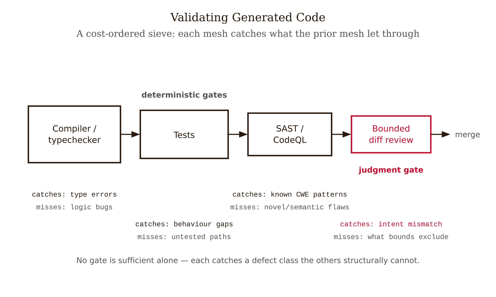
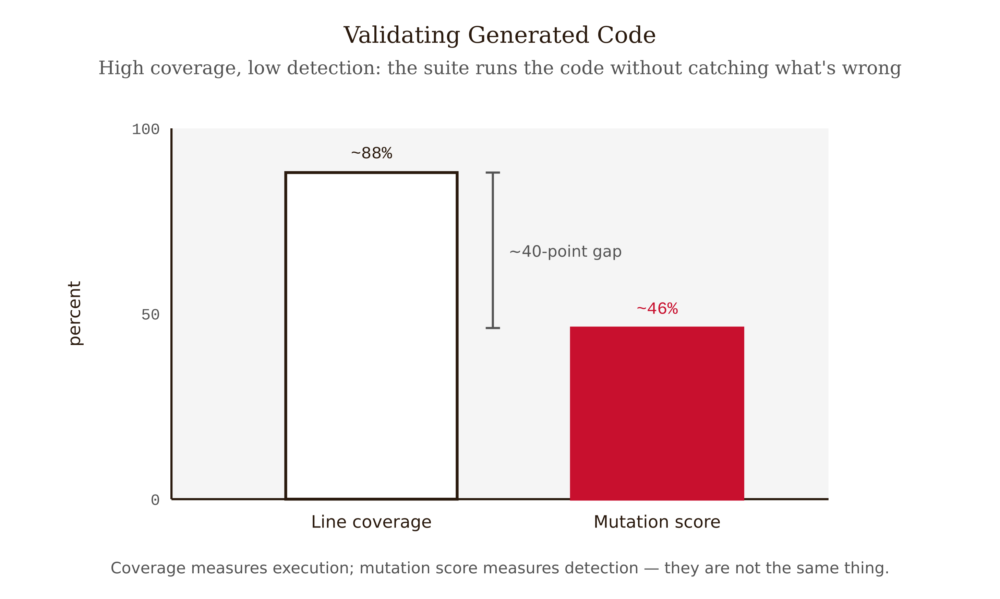
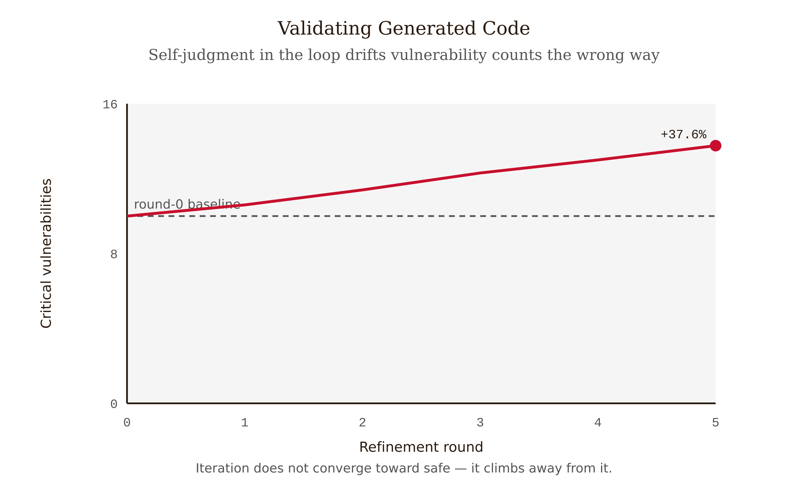
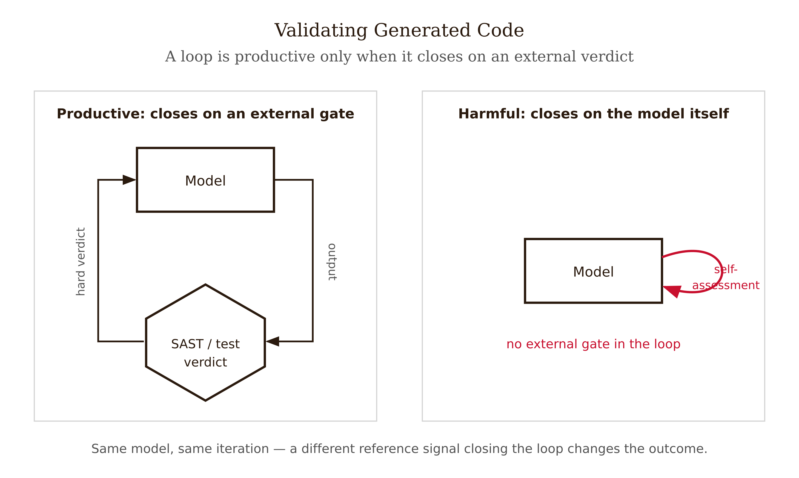
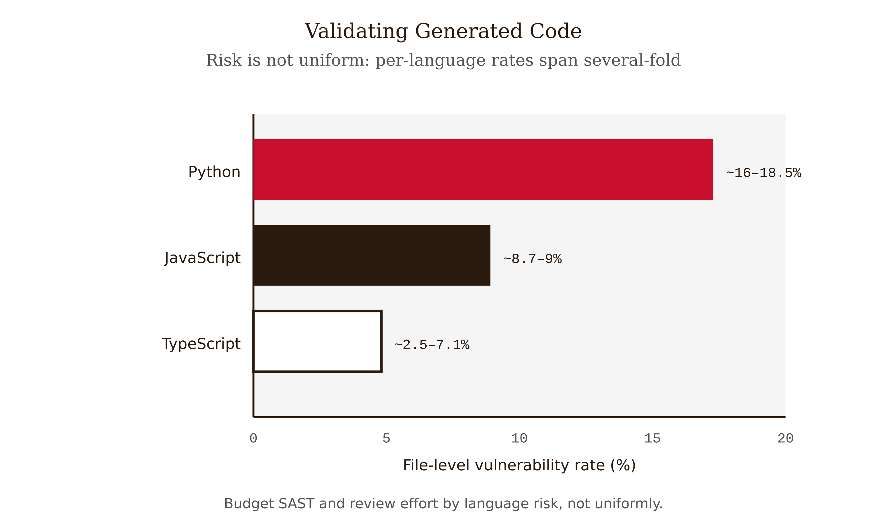

# Chapter 3 — Validating Generated Code

*Compiler, Tests, SAST, Diff — Why the Cheapest Oracle Goes First and Why You Never Let the Model Grade Itself*

---

A backend engineer asked an assistant to add a search endpoint to a Java service. The model produced a clean handler: it parsed the query parameter, built a SQL statement, returned the rows as JSON. The code compiled on the first try. The type checker was silent. The engineer ran the existing test suite — 94% line coverage on the new file — and every test was green. The PR diff was forty lines, all of it readable, all of it idiomatic. Two reviewers approved it in under five minutes each. It shipped.

It contained a SQL injection. The query parameter was concatenated directly into the statement string. Three weeks later a security scan flagged it; by then the endpoint had been live and reachable.

Walk back through what each gate actually certified. The **compiler** certified that the code was a valid Java program — true, and irrelevant to the bug; injection is perfectly valid Java. The **type checker** certified that a `String` went where a `String` was expected — also true, also irrelevant. The **tests** certified that the endpoint returned the right rows *for the inputs the tests supplied* — and not one of those inputs was `'; DROP TABLE users; --`, because the engineer who wrote the tests was thinking about correct search results, not adversarial strings. The 94% coverage number certified that the tests *executed* almost every line. It said nothing about whether the tests would *notice* if a line were wrong. And the **reviewers** read forty lines of fluent, idiomatic code and pattern-matched it to "looks fine," which is exactly what fluent code is designed to do.

Every gate did its job. The vulnerability survived all of them because no gate in the stack was a *security* gate. The tests validated the spec the engineer encoded — "return matching rows" — not the intent he held, which silently included "and don't let a query string rewrite the database." There is no oracle for that intent but a check that looks specifically for the known-bad pattern. That check is SAST, and it was not in the pipeline.

This chapter is about building the pipeline so that the next injection dies at a gate instead of in production.

---

## The stack as a sieve: what each layer catches and what it cannot

Think of validation not as a single check but as a sieve with four meshes, each catching a defect class the previous mesh let through. The ordering is not arbitrary: it is sorted by cost. The cheapest, most certain verdict runs first so that broken code dies before you spend a human minute on it.

*Figure 3.1 — The four-gate sieve: compiler, tests, SAST, and bounded review each catch what the prior gate let through.*

**Gate 1 — Compiler and type checker.** Catches syntax errors, type mismatches, undefined symbols, arity errors. Misses everything semantic. A program can be flawlessly typed and completely wrong. This gate is deterministic, instant, and non-negotiable: it is free to run on every commit and it never produces a false "looks fine."

**Gate 2 — Tests (human-owned).** Catches spec violations — cases where the encoded behavior is wrong. Misses two large classes. First, **the intent gap**: the test validates the specification you wrote down, not the intent you held in your head. A green suite proves the code does what the tests say, never what you meant. Second, **the detection gap**: a suite can execute a line (coverage) without asserting anything that would fail if the line were wrong (detection). The two are not the same property, and conflating them is the most common testing error in the AI era.

**Gate 3 — SAST and CodeQL.** Catches known-bad patterns — the CWE catalog. Cross-site scripting, SQL and log injection, hardcoded secrets, insecure deserialization, crypto misuse. Misses novel logic bugs, design errors, and anything not in its rule set. The crucial point about Gate 3 is that it catches a defect class the tests *structurally cannot*. A passing test tells you nothing about injection safety. Only a tool that looks for the injection pattern does.

**Gate 4 — Bounded diff review (human).** Catches design and intent errors in the changed hunks — the things no automated rule encodes, like "this is the wrong abstraction" or "this silently changes the meaning of an existing field." Misses anything outside the diff, and anything the reviewer's attention slid past. This gate is last and narrowest on purpose: by the time a human reads the code, three deterministic gates have already removed the broken, the spec-violating, and the known-insecure, so the human spends scarce attention only on what genuinely requires judgment. *Bounded* is the operative word — the reviewer reads the changed hunks, not the whole file, because unbounded review under fluency is exactly where the story's reviewers failed.

The single most important property of the sieve is that **no gate is sufficient alone, and the gates do not substitute for each other.** You cannot test your way to security. You cannot SAST your way to correctness. You cannot review your way to either at scale. The defense is the layering.

One misconception to kill directly: "The tests pass, so the code is correct and safe." Green means *spec-satisfied* — the code does what the tests assert. It does not mean *intended* (the tests may encode the wrong behavior) and it says nothing about security (no functional test exercises the injection pattern unless you wrote one to). The opening story's endpoint passed every test and shipped an injection. "Passes the tests" is a claim about Gate 2 only; the other three gates are still owed.

---

## Coverage is not detection: the mutation-testing diagnostic

Here is the demonstration that makes the detection gap visceral. Take an AI-generated test suite reporting 90% line coverage. By the coverage number, it looks thorough. Now run mutation testing on it.

Mutation testing comes from DeMillo, Lipton & Sayward's 1978 paper "Hints on Test Data Selection," and its idea is precise: **a test that executes a line proves nothing about whether the test would notice if that line were wrong.** So you perturb the program on purpose — flip a `>` to `>=`, change a `+` to a `-`, delete a statement, negate a boolean — producing a *mutant*. Then you run the suite against the mutant. If a test fails, the suite *killed* the mutant: it detected the fault. If every test still passes, the mutant *survived*: the suite ran the mutated line but asserted nothing that depended on it being correct. The **mutation score** is the fraction of mutants killed. It is a direct measure of detection, where coverage is only a measure of execution.

Run mutation testing on an AI-generated suite and watch the gap open. The practitioner pattern documented across 2025–2026 writeups is stark: AI-generated suites hitting **~80–93% line coverage but only ~34–58% mutation score**. A forty-point gap between "executed" and "detected" is the tell. The tests run the code; they do not check it. They were written to satisfy a coverage gate, and an LLM is very good at producing assertions that touch a line — `assertNotNull(result)` after a call that can never return null — without asserting anything that would fail under a real regression.

*Figure 3.2 — Coverage is not detection: AI-generated suites report high line coverage but a far lower mutation score.*

This is the detection gap, made measurable. And it explains a specific way AI code generation fails: ask a model to "write tests to cover this function" and you will reliably get high coverage and low detection, because coverage is the legible target and detection is not. The model optimizes the thing you named.

The structural fix is older than the problem: write the assertion *before* the code. A test written red-first is a *specification* — it states the behavior you want and fails until the code provides it — so it necessarily asserts something that distinguishes right from wrong. A test written after the fact, especially by a model tracing the implementation it already sees, tends to be a shape that follows the code rather than an oracle that constrains it.

The operational rule: **for critical paths, gate on mutation score, not coverage.** Tools exist per language — PIT for Java, Stryker for JavaScript/TypeScript, mutmut for Python.

A second misconception to kill: "90% coverage means the tests are good." Coverage measures execution; mutation score measures detection. They diverge sharply for AI-written tests precisely because models can generate assertions that touch lines without checking them. A 90%-coverage / 50%-mutation suite is a suite that runs your code and would not notice if half of it broke.

---

## The self-improvement trap: why iterating for security makes it worse

Now the chapter's counter-intuitive core. The intuitive move, when a model produces code you are uneasy about, is to ask it to improve: "make this more secure," "harden this," "fix any vulnerabilities." Iterate a few times and surely it converges toward safe.

It does the opposite. Aljohani et al. (2025), accepted at IEEE-ISTAS 2025 (arXiv:2506.11022), ran a controlled experiment — 400 code samples across 40 rounds of "improvement" under four prompting strategies — and found a **37.6% increase in critical vulnerabilities after just five refinement iterations** [verify]. Asking the model to improve its own code for security made the code measurably *less* secure as the iterations compounded.

*Figure 3.3 — The self-improvement trap: critical vulnerabilities rise across refinement rounds rather than converging toward safe.*

Why would self-improvement degrade security? The mechanism is this book's central thesis in miniature. When you ask the model to "improve" code, you replace an external deterministic verdict with the model's own judgment of its work — and the model's judgment is a fluency-driven generator, not an oracle. Each "improvement" round rewrites code toward what *reads* as more robust: more error handling, more configuration, more surface. More surface is more attack surface. And nothing in the loop is *checking* security; the model is optimizing for the appearance of having addressed the prompt, which is exactly the failure mode of letting a fluent system grade itself. There is no ground-truth signal in the loop, so the loop drifts toward plausibility, not safety.

This sharpens a distinction that is easy to blur: **not all iteration is harmful — only iteration against the model's own judgment.** Iterating against a *deterministic* signal is the productive loop. A failing test, a compiler error, a SAST finding — those are external oracles. Feed the model "CodeQL reports SQL injection on line 14" and the loop has ground truth to converge toward. Feed it "make this more secure" and the loop has only the model's self-assessment, which drifts. The dispute in the field is precisely about *which feedback signal* you put in the loop — external deterministic verdict (helpful) versus model self-judgment (harmful).

*Figure 3.5 — Iterate against the deterministic signal, not the model's judgment: external-grounded loop versus self-grounded loop.*

The guard is operational and blunt: **do not loop the model on security against its own judgment. Run a SAST gate and stop.** If SAST flags something, that finding — not "improve this" — is what you feed back, and you re-run SAST to confirm the fix landed. The deterministic gate is the reference line the model iteration does not get to overwrite.

One honest caveat: whether feeding SAST or mutation results back to the model converges *safely*, or eventually hits the same degradation, is open. Practitioner reports are optimistic, but there is no controlled evidence that even the deterministic-signal loop converges over many rounds. Treat the SAST-feedback loop as emerging practice: useful, deterministic at the gate, unproven at convergence.

A third misconception to kill: "If I ask the model to fix it enough times, it'll get safe." The controlled result is the reverse: five rounds of self-improvement raised critical vulnerabilities roughly 37.6% [verify]. The model is optimizing the *look* of having hardened the code, with no ground-truth security signal in the loop. Iteration helps only when the loop closes on an external deterministic verdict.

---

## The empirical picture, and how to budget review by language

Two 2025 studies give the stack its evidence base — one a controlled lab benchmark, one a field corpus — and together they justify why SAST is a layer, not a luxury.

**The lab benchmark — Veracode (2025) GenAI Code Security Report.** Across 80 curated coding tasks run on 100+ LLMs in four languages, AI-generated code introduced security flaws in **~45%** of cases [verify]. Java was worst at **~72%**; JavaScript, Python, and C# clustered at 38–45%. Models failed to defend against cross-site scripting (CWE-80) in **~86%** of relevant tasks and log injection (CWE-117) in **~88%**. And the finding that matters most for planning: **newer and larger models were not meaningfully more secure.** The XSS and log-injection miss rates are so high that a pipeline without a pattern-matching security gate is, on these numbers, shipping injectable code roughly nine times out of ten in the relevant cases.

**The field corpus — arXiv:2510.26103.** The real-world counterpart analyzed **7,703 files** explicitly attributed to four AI tools, scanned with CodeQL, yielding 4,241 CWE instances across 77 vulnerability types. Most files were clean — **87.9% had no CWE-mapped vulnerability** — but the rate varied sharply by language: **Python ran hot at 16.18–18.50%**, JavaScript at 8.66–8.99%, and **TypeScript lowest at 2.50–7.14%**.

The Python-vs-TypeScript gap is the chapter's defensible "language matters" data point, and it licenses a concrete planning move: **budget SAST and review effort by language risk.** Generated Python earns a heavier SAST and review allocation than generated TypeScript, because the field data says Python carries roughly two-to-seven times the vulnerability density. This is risk allocation grounded in data.

*Figure 3.4 — Vulnerability density varies by language: Python runs roughly two-to-seven times higher than TypeScript.*

One final misconception: "Newer, bigger models write safer code, so this will fix itself." Veracode's finding is that larger models were *not* meaningfully more secure — the defect rate is structural, not a scaling artifact. The validation layer is the durable answer; "wait for a better model" is not.

---

## Assembling the stack in CI

Putting it together as a pipeline, the order is the cost order from the sieve section, and each stage *fails closed* — a failure blocks the merge rather than warning and proceeding.

1. **Compile and typecheck.** Rejects nonsense. Instant, deterministic, runs on every push.
2. **Run human-owned tests, gated on mutation score for critical paths.** Rejects spec violations and — via the mutation gate — rejects suites that cover without detecting. Coverage may be reported but is not the gate.
3. **SAST and CodeQL.** Rejects known CWE patterns — the XSS and log-injection class the tests are blind to. Non-optional. SAST findings, not "improve this," are what get fed back to the model.
4. **Bounded diff review.** A human reads only the changed hunks, looking for design and intent errors — the residual that no rule encodes. Last, narrowest, most fluency-vulnerable; protected by being bounded and by everything upstream having already run.

Two rules sit on top. First, **iterate only against deterministic signals**: the loop closes on a failing test or a SAST finding, never on the model's self-assessment of its own security. Second, **the human gate owns the residual risk it cannot offload** — the intent gap and the novel logic bug are real, they have no automated oracle, and the reviewer signs off knowing the stack narrowed what remains to them, not that it eliminated it.

That residual — *tests validate the spec not the intent; SAST catches known patterns not novel ones* — is the honest edge of what code validation can certify. It is also the bridge to the next chapter. Code is the output type where ground truth is *most* mechanically available, and even here two gaps require human judgment. Factual claims are harder: a citation either resolves or it doesn't (mechanical, like a compiler), but whether it *supports* the claim attached to it is a judgment call. The sieve gets harder to build when the meshes themselves stop being deterministic.

---

## Exercises

**Exercise 3.1 — Analyze.** Take this PR description verbatim: *"Added the new auth handler. Compiles clean, 96% test coverage, two approvals. Merging."* (a) For each of the four gates, state what this description tells you was certified and what was not. (b) Name the one gate that is conspicuously missing and the defect class it would have caught. (c) State the single most likely class of bug that *no* gate in this description would catch, and explain why.

**Exercise 3.2 — Evaluate.** You are handed an AI-generated test suite reporting 91% line coverage. Describe the exact procedure you would run to determine whether the suite actually *detects* faults, name the tool you'd use for your language, and state the threshold gap (between coverage and the new metric) that would convince you the tests assert little. Explain in one sentence why coverage alone could not have told you this.

**Exercise 3.3 — Apply, produce something.** Run the self-improvement experiment in miniature. Take a small, working function — one that builds a query or renders user input into HTML. Ask a model to "make this more secure," take its output, and ask again — three rounds total. After *each* round, run a SAST tool and record the vulnerability count. Produce: a short table of round-number versus vulnerability count, and a one-paragraph statement of whether you reproduced the direction of the arXiv:2506.11022 effect, plus what the deterministic SAST gate told you that the model's self-assessment did not.

**Exercise 3.4 — Create.** Design the CI validation stack for a service that mixes generated Python and generated TypeScript. Specify the four gates in order, state for each one defect class it catches and one it cannot, define your mutation-score gate and which paths it applies to, justify a *different* SAST and review budget for the Python and TypeScript portions citing the arXiv:2510.26103 figures, and write the one-sentence rule your pipeline enforces about model self-iteration on security.

---

## What would change my mind

A controlled, replicated demonstration that closing the improvement loop on the model's *own* judgment converges toward more-secure code — that the arXiv:2506.11022 degradation is an artifact of weak prompting or a specific model generation and reverses under better elicitation on current frontier models. The chapter's claim is that self-judgment in the loop drifts toward plausibility because there is no ground-truth signal; if iterating against self-assessment reliably *reduced* critical vulnerabilities across models and tasks, the "never let the model grade itself" rule would soften to "self-iteration is fine when X holds," and the deterministic-gate-as-reference-line discipline would become one option among several. I would also weaken the "SAST is non-optional" stance if a model generation arrived whose XSS and log-injection defense rates were high enough that functional tests plus review caught the security class without a dedicated pattern scanner — but Veracode's "scale doesn't help" finding is current evidence against that.

---

## Still puzzling

**Safe convergence of the deterministic-feedback loop.** Iterating against a SAST finding has ground truth at the gate, but whether the loop as a whole converges safely — or eventually hits degradation by another route — is unproven. Practitioner optimism, no controlled evidence.

**The true field vulnerability rate.** The ~12% file-level GitHub figure rests on self-reported attribution and CodeQL recall limits, so it is a floor. We lack ground-truth-labeled corpora to know the real rate.

**Automatic detection of under-specified oracles.** The intent gap — tests that pass while leaving behavior unspecified — has no reliable oracle but the human. "Intent formalization" is an active but immature research direction.

**Will the snapshot hold?** Veracode's "larger isn't safer" and the Python/TypeScript gap are model-generation-specific. The deterministic-first principle is stable; the numbers will age, possibly within two to three years.

---

## References

- DeMillo, R. A., Lipton, R. J., & Sayward, F. G. (1978). Hints on Test Data Selection: Help for the Practicing Programmer. *Computer*, 11(4), 34–41. — origin of mutation testing; "coverage is not detection."
- Beck, K. (2003). *Test-Driven Development: By Example.* Addison-Wesley.
- Veracode (2025). *GenAI Code Security Report.* — 80 tasks, 100+ models; ~45% overall flaw rate; Java ~72%; CWE-80 ~86%, CWE-117 ~88%; larger ≠ safer. `[verify exact figures against Veracode materials before printing]`
- Aljohani, A., et al. (2025). Security Degradation in Iterative AI Code Generation. *IEEE-ISTAS 2025.* arXiv:2506.11022. — 400 samples, 40 rounds, 4 strategies; 37.6% increase in critical vulnerabilities after five iterations. `[verify the 37.6% figure; the "21.1% crypto" sub-figure is NOT confirmed — check the PDF body before printing]`
- (2025). Security Vulnerabilities in AI-Generated Code: A Large-Scale Analysis of Public GitHub Repositories. arXiv:2510.26103. — 7,703 files; 4,241 CWEs; 87.9% clean; Python 16.18–18.50% vs TypeScript 2.50–7.14%. `[verify author list before quoting]`
- Hoare, C. A. R. (1969). An Axiomatic Basis for Computer Programming. *Communications of the ACM*, 12(10), 576–580.
- Tooling: PIT (Java mutation testing), Stryker (JS/TS), mutmut (Python), CodeQL (SAST).

---

**Tags:** generated-code-validation, deterministic-first, layered-defense, mutation-testing, coverage-vs-detection, sast, self-improvement-trap, security-degradation, intent-gap, veracode-2025
