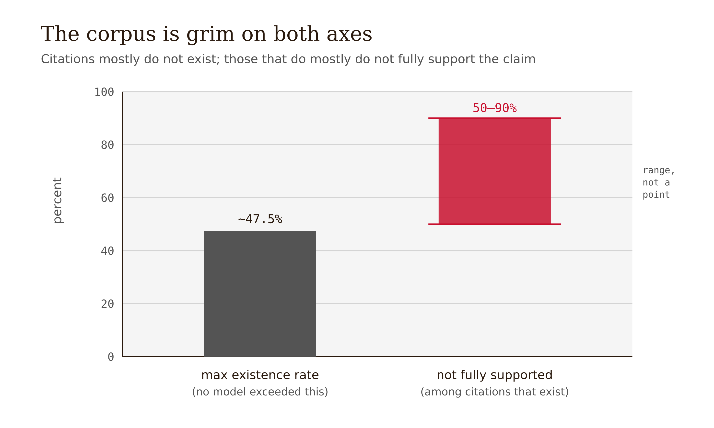
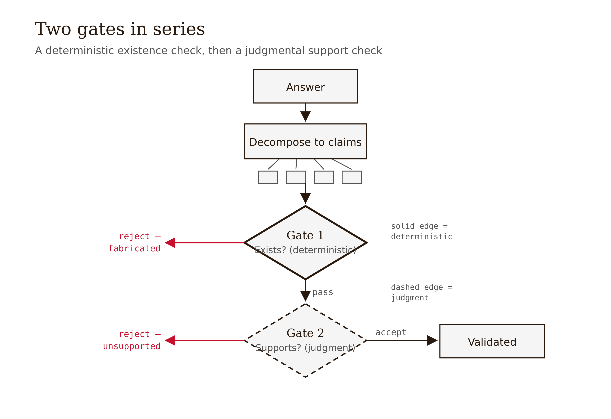

# Chapter 4 — Validating Factual Claims

*Does the Citation Exist, and Does It Support the Claim — Two Different Questions, and Why Grounding Moves the Failure Instead of Removing It*

In 2023, lawyers representing a plaintiff in a personal-injury suit against the airline Avianca filed a brief in the Southern District of New York. It was competent legal writing: it argued the law, quoted holdings, cited precedent with proper internal citations — case names, reporters, page numbers, the works. The opposing counsel went to look the cases up. They did not exist. Not "were misremembered" — did not exist. The airlines named in the captions were invented; the quotations were fabricated; the internal citations pointed nowhere. The brief had been drafted with ChatGPT, which produced fluent, properly formatted, entirely fictional law.

What turned an embarrassment into a teaching case was what happened next. Challenged by the court, the lawyers did not immediately retreat. They asked ChatGPT whether the cases were real, and ChatGPT *assured them the cases existed* and could be found on Westlaw and LexisNexis. They submitted that assurance. The cases still did not exist. Judge P. Kevin Castel sanctioned the lawyers and their firm **$5,000**, describing one of the fabricated analyses as "gibberish." (*Mata v. Avianca, Inc.*, 678 F. Supp. 3d 443, S.D.N.Y. 2023 — case name, facts, sanction, and judge all verified.)

Sit with the shape of that failure, because it is two distinct failures wearing one coat.

The first is **citation existence**: the cited cases do not exist, and that is a *mechanical* fact. A clerk with database access could have falsified the brief in an afternoon by checking whether each citation resolves. No judgment required. The cases are there or they are not. The second is the **fluency trap** from Chapter 1, now documented in a court record: the fabrications were filed *because they read as real.* Properly formatted legal citations carry an authority that the reader extends to their content. The lawyers did not check existence because the prose did not look like the kind of thing that needed checking. And when they did "check" — by asking the model — they let a fluent system grade its own output, which is the anti-pattern from Chapter 3 reappearing in a new domain.

Notice what would have caught it. Not a better lawyer reading more carefully; fluency defeats careful reading, which is the whole problem. What would have caught it is a deterministic gate: resolve every citation against a real database, reject the document if any fails to resolve. That check is cheap, it requires no judgment, and it would have stopped *Mata v. Avianca* before it was filed. This chapter builds out from that gate — and then confronts the harder gate the existence check cannot replace.

---

## Three properties, not one

The *Mata* case makes "the citation doesn't exist" vivid, but existence is only the first of three distinct properties, and conflating them is the source of most factual-validation errors. A citation attached to a claim can be evaluated on three separate axes.

*Figure 4.1 — A citation's three independent properties — exists, supports, correct — checked as ordered gates of rising difficulty.*

**Existence.** Does the referenced document exist? Does the DOI resolve, the URL load, the case appear in the reporter, the paper appear in the index? This is *mechanical*. The answer is binary and judgment-free. It is the compiler of factual validation.

**Support.** Granting that the document exists — does it actually *say* what the claim attributes to it? A real paper can be cited for a finding it never reported; a real case can be cited for a holding it never made. Checking support requires reading the source and comparing it to the claim. This is *judgment*, not a lookup.

**Correctness.** Granting that the document exists *and* supports the claim — is the claim *true*? The source may itself be wrong, outdated, or retracted. A faithfully-cited claim can still be false. This requires domain knowledge and, sometimes, ground truth that does not exist anywhere retrievable.

<!-- → [TABLE: Three-axis citation evaluation — columns: Property, What it checks, Mechanical or judgmental, What it catches, What it misses; rows: Existence (does the reference resolve / mechanical / fabricated citations / real-citation-wrong-claim), Support (does the source say what's attributed / judgmental / real-citation-wrong-claim / correctness of the underlying source), Correctness (is the claim true / requires domain knowledge / outdated or wrong sources / novel-domain facts with no retrievable ground truth). Caption: The three properties are independent. A citation can exist and not support. It can support and be incorrect. Existence catches the *Mata* failure; support catches the second class; correctness requires expert judgment.] -->

These three are independent. A citation can exist and not support the claim — the most common case. It can support a claim and be factually incorrect, because the source was wrong. It can be fabricated entirely, as in *Mata*. The field's vocabulary captures part of this: *faithful* (does the answer reflect its sources?) is not the same as *correct* (is the answer true?), and both are distinct from *existing*. The three-way distinction is well-established and citable; what remain contested are the exact magnitudes. Across one body of work spanning roughly 17,000 generated citations, no model exceeded a roughly 0.475 existence rate — more than half of cited references did not exist. Among citations that *did* exist, 50–90% of responses were not fully supported by the sources cited. The specific percentages surfaced partly from preprints that post-date a normal verification pass and should be treated as directional, not settled `[verify: arXiv:2602.23452, arXiv:2603.07287]`. The *direction* is not in doubt: both failures are common, and the two gates are both necessary because they catch different things.

*Figure 4.4 — Corpus evidence: citation existence tops out near 47.5%, and 50–90% of responses are not fully supported.*

One misconception to close here: "the answer has citations, so it's grounded and trustworthy." A citation is a checkable object with three independent properties, and the presence of a citation tells you about *none* of them. The reference may not exist; it may exist and not support the claim; it may support the claim and be wrong. "It has citations" is the *start* of validation, not the end of it.

---

## Hallucination lives in spans

To validate a factual answer you need to know *what to check*, and the field has made that question answerable by moving from a coarse verdict to a fine one. The old framing asked: is this answer hallucinated? — a binary label on the whole output. That is nearly useless for validation, because a four-paragraph answer is rarely all-true or all-false. It is mostly grounded with a few unsupported substrings woven in, and a binary label tells you nothing about *where*.

SemEval-2025 Task 3, **Mu-SHROOM** (arXiv:2504.11975), reframes detection as **span-labeling**: mark the specific substrings of generated text that are not supported by a reference document. The shared task ran across 14 languages, over outputs from 38 LLMs, drawing 2,618 submissions from 43 teams. The conceptual shift matters more than the numbers: hallucination is now treated as *localized*, and localization is what makes claim-level validation tractable.

The connection to the three-property framework: if hallucination lives in spans, then validation is a per-claim operation. Decompose the answer into atomic claims, and check each one — does its citation exist, does the cited span support it? The span-level view turns "validate this answer" (intractable, holistic, fluency-vulnerable) into "validate these twelve claims" (tractable, itemized, each with a gate). It also suggests the right review affordance: a UI that highlights the suspect spans so a human reviewer reads the *unsupported* substrings rather than the fluent whole. The fluent paragraph reads as uniformly authoritative; the highlighted span says "look here, this is where the support is missing."

One honest limit the Mu-SHROOM shared task itself reveals: the boundary between *fully supported*, *partially supported*, and *unsupported* is fuzzy even for human annotators. Span-label agreement on borderline cases is imperfect. The three-way distinction is genuinely fuzzier than the binary existence check, which is precisely why support-checking is the judgmental gate and existence is the mechanical one.

---

## RAG reduces hallucination — and relocates the failure

The standard production fix for factual hallucination is Retrieval-Augmented Generation: instead of asking the model to answer from its parameters, you retrieve relevant documents first and condition the generation on them. Ground the model in evidence and it confabulates less. This works, and it is worth being precise about both the "works" and its price.

*Figure 4.3 — RAG relocates the failure: the confabulation burst moves from the generator (pre-RAG) onto the retriever (post-RAG).*

It works. Ayala & Béchard (NAACL 2024) deployed RAG in a structured-output setting and report that it significantly reduces hallucination and improves out-of-domain generalization. In a higher-stakes domain, MEGA-RAG (Xiong et al., *Frontiers in Public Health*, 2025) achieved a greater than 40% reduction in hallucination rate versus baselines including a standalone LLM and standard RAG, in public-health question answering `[verify >40% figure phrasing]`, via multi-source retrieval, a cross-encoder reranker, and discrepancy-aware refinement. The reduction is real and replicated across domains.

<!-- → [FIGURE: Before/after RAG diagram — left side labeled "Without RAG": arrow from model parameters to answer, labeled "confabulation"; right side labeled "With RAG": retriever pulls documents, model conditions on retrieved passage, arrow to answer labeled "generation on retrieved document"; a second arrow labeled "retrieval error" points from the retrieval step to a wrong retrieved document that flows to a "confident, well-cited, wrong answer". Caption: RAG relocates the failure. Before RAG, the failure mode is confabulation from parameters. After RAG, a confident and well-cited answer can still be wrong — because the retriever supplied the wrong passage.] -->

Now the price, and it is the chapter's central mechanism. RAG does not *remove* the failure; it *relocates* it. Before RAG, the failure mode is confabulation: the model invents facts and citations from its parameters — the *Mata* failure. After RAG, the answer is only as correct as the documents the retriever supplied. If the retriever pulls an outdated passage, an off-topic passage, or misses the relevant document entirely, the model will produce a **confident, well-cited, wrong** answer — grounded in the wrong source. The citation will exist (it is a real retrieved document) and may even support the claim (the model faithfully reflected the bad passage), and the answer will still be false, because the *retrieval* was wrong.

This is the book's thesis applied to factual validation: **validation relocates the failure rather than dissolving it.** The arrow of blame moves left, from the generator to the retriever. And it changes what you must validate. A pre-RAG validator checks the generation. A RAG validator must also check the *retrieval* — is the retrieved passage relevant? recent? actually the best available source? — because that is where the residual error now lives.

And the residual is not small. MEGA-RAG's greater-than-40% reduction means the other roughly 60% of hallucinations survive. In a public-health or clinical setting, that residual is exactly the fraction that needs an expert before it reaches a patient or a policy. The data justifies "RAG *then* expert," not "RAG *instead of* expert."

---

## The pipeline, and where the human must own the residual

Assembling the chapter into a method, the layering mirrors Chapter 3's sieve — cheapest deterministic check first, judgment last — adapted to the thinner oracle that factual claims afford.

*Figure 4.2 — The two-gate citation check: a deterministic existence gate, then a judgmental support gate, each with its own reject exit.*

**Step 1: Decompose into atomic claims.** Using the span-level view, break the answer into checkable units, each with the source it leans on. You cannot run a per-citation check on an unsegmented paragraph.

**Step 2: Citation-existence gate (deterministic).** For each claim's citation, resolve the DOI, URL, or case citation. If it does not resolve, reject. This is mechanical, cheap, judgment-free, and it stops *Mata v. Avianca* outright. Run it first, on everything.

**Step 3: Retrieval-quality check, if RAG (deterministic-ish).** Validate that the retrieved passage is relevant and current — not just that *a* document came back. The failure moved upstream; check upstream.

**Step 4: Claim-support gate (judgmental).** For each existing citation, retrieve the cited span and ask whether the source actually says what the claim attributes to it. This catches the real-citation-wrong-claim class that the existence gate waves through.

**Step 5: Human expert for the residual, in high-stakes domains.** Correctness — axis 3 from the three-property framework — and novel-domain accuracy have no mechanical oracle. The expert owns what the gates cannot certify.

<!-- → [FIGURE: Layered pipeline diagram — five sequential gates shown as sieves/filters, left to right: (1) "Decompose into claims"; (2) "Existence gate — mechanical — stops fabrications"; (3) "Retrieval quality — if RAG — stops wrong-source errors"; (4) "Support gate — judgmental — stops real-citation-wrong-claim"; (5) "Human expert — correctness residual". Arrows show what each gate catches dropping out, and what passes through to the next. Caption: The factual-validation pipeline, cheapest gate first. Each gate catches a different failure class. The expert is not a failsafe for the whole pipeline — they own the specific residual that no earlier gate can certify.] -->

The honest tension is at gate 4. Existence is mechanically checkable; support is not. And the obvious automation — use another LLM to judge whether the source supports the claim — **reintroduces the fluency problem.** You are now asking a fluent system to judge whether a fluent system's claim is supported, and the judge can be fooled by the same plausibility that fooled the original reader. Whether automated claim-support checking is reliable enough to *certify* high-stakes claims is unresolved, and it is precisely the LLM-as-judge problem this book takes up later. In high-stakes domains — legal, medical, financial — gate 4 is where a human expert enters, and gate 5 acknowledges that some correctness questions have no retrievable ground truth at all.

That unresolved gate is the bridge to the next chapter. Checking claim support with an LLM is a special case of a larger question: can a model reliably validate *reasoning* — its own or another's? The support check is a reasoning judgment ("does this premise entail this conclusion?"), and judging reasoning with a fluent model runs straight into the failure mode we have now seen three times — fluency defeating the judge. Chapter 5 takes that on directly: validating reasoning chains, where the oracle is thinnest of all, and where the question "did the model check its work?" finally has to be answered honestly.

---

## What would change my mind

A demonstration that automated claim-support checking — LLM-as-judge or NLI-based entailment — reaches reliability high enough to *certify* support in high-stakes domains without a human, on adversarial cases where the claim and the source are both fluent and superficially aligned but substantively mismatched, would overturn this chapter's central claim that support-checking is irreducibly judgmental. If a method demonstrably resisted the fluency trap on that class of case, at expert-level reliability across domains, then gate 4 could be automated and "high-stakes domains need expert review" would weaken to "high-stakes domains need expert review where the automated support-checker's confidence is low." I would also revisit the "RAG relocates the failure" framing if a retrieval architecture were shown to drive retrieval error below generation error to the point that validating retrieval added little — but the current evidence, a roughly 60% residual even at greater-than-40% reduction, argues the other way.

---

## Still puzzling

Whether automated support-checking can be made reliable enough to certify rather than merely screen is open, and it cross-references the LLM-as-judge problem the book returns to later.

What fraction of residual error after RAG is retrieval error versus generation error, and how to attribute it automatically — no standard decomposition exists. The engineering consequence is clear (validate retrieval too), but the measurement is not.

Factual validation with no retrievable ground truth — genuinely novel domains where there may be no source to ground against — is the hard residual this chapter admits is unsolved. It defers to the scalable-oversight problem later in the book.

Cross-lingual hallucination detection: Mu-SHROOM shows detection performance varies sharply by language, and low-resource languages are under-served. A pipeline validated in English may not transfer.

The fuzzy "partially supported" boundary: reliable three-way span labeling is open even for humans, which limits how crisp the support gate can be made.

---

## LLM Exercises

1. **(Analyze)** Take an LLM answer to a factual question that includes three citations. For each citation, evaluate the three properties from this chapter separately: (a) does it exist? (b) does it support the specific claim it's attached to? (c) is the claim correct? Find — or construct — at least one citation that *exists but does not support* its claim, and explain why the existence gate would have passed it.

2. **(Evaluate)** You are shown a RAG system's answer: confident, fluent, with a citation to a real document in the knowledge base. The answer is nonetheless factually wrong. (a) Name the failure mode from the RAG section. (b) Explain why the citation-existence gate and even the claim-support gate could *both* pass while the answer is still wrong. (c) State the additional check that would have caught it, and which pipeline stage it belongs to.

3. **(Apply — produce something)** Build and run a two-gate check on a real LLM answer. Pick a question, get an answer with at least four citations from a model. Gate 1: resolve every citation (DOI/URL/search) and record exists/doesn't. Gate 2: for each *existing* citation, read the source and label the claim *fully supported / partially supported / unsupported*. Produce: a small table of citation × (exists?, support-label), a one-sentence statement of how many failed each gate, and a note on any citation that *exists but doesn't support* — the class the existence gate alone would miss.

4. **(Create)** Design a factual-validation pipeline for a stated high-stakes domain (pick one: a clinical decision-support tool, a legal-research assistant, or a financial-disclosure summarizer). Specify the five stages from this chapter, state for each what it catches and what it cannot, identify exactly where the human expert enters and what residual risk they own, and justify — citing the RAG-relocates-failure mechanism and the MEGA-RAG greater-than-40% figure — why "RAG then expert" rather than "RAG instead of expert" is the defensible architecture for your domain.

---

## References

- Garfield, E. (1955). Citation Indexes for Science: A New Dimension in Documentation through Association of Ideas. *Science*, 122(3159), 108–111. (A citation as a checkable, indexable object — the lineage of the existence check.)
- Bush, V. (1945). As We May Think. *The Atlantic.* (Knowledge as a traceable graph of linked claims; framing for "an untraceable claim is unverifiable by construction.")
- Lewis, P., et al. (2020). Retrieval-Augmented Generation for Knowledge-Intensive NLP Tasks. *NeurIPS 2020.* (Canonical RAG; the technique this chapter both recommends and criticizes.) `[verify venue/year specifics before printing]`
- Vázquez, R., et al. (2025). SemEval-2025 Task 3: Mu-SHROOM, the Multilingual Shared Task on Hallucinations and Related Observable Overgeneration Mistakes. [arXiv:2504.11975](https://arxiv.org/abs/2504.11975). (Span-labeling; 14 languages, 38 LLMs, 2,618 submissions / 43 teams.)
- Ayala, O. M., & Béchard, P. (2024). Reducing Hallucination in Structured Outputs via Retrieval-Augmented Generation. *NAACL 2024 (Industry Track)*, 228–238. [arXiv:2404.08189](https://arxiv.org/abs/2404.08189). (RAG significantly reduces hallucination in structured output; ServiceNow deployment.)
- Xiong, X., et al. (2025). MEGA-RAG: a retrieval-augmented generation framework with multi-evidence guided answer refinement for mitigating hallucinations of LLMs in public health. *Frontiers in Public Health*, 13:1635381 (PMC12540348; PubMed 41132171). (>40% hallucination reduction vs. baselines.) `[verify the >40% figure phrasing before printing]`
- *Mata v. Avianca, Inc.*, 678 F. Supp. 3d 443 (S.D.N.Y. 2023). (Fabricated ChatGPT-generated precedents; Judge P. Kevin Castel sanctioned the lawyers $5,000, June 22, 2023; "gibberish." Case name, facts, sanction verified.)
- "Correctness is not Faithfulness" (2024). [arXiv:2412.18004](https://arxiv.org/abs/2412.18004). (Formalizes the support-vs-correctness distinction.) `[verify title/authors before quoting]`
- Citation-corpus existence/support figures (existence ≤ ~0.475; 50–90% of responses not fully supported) — surfaced partly from future-dated preprints arXiv:2602.23452 ("CiteAudit") and arXiv:2603.07287. `[verify — do not print exact percentages as settled; the existence-vs-support distinction is established, the magnitudes are not.]`
