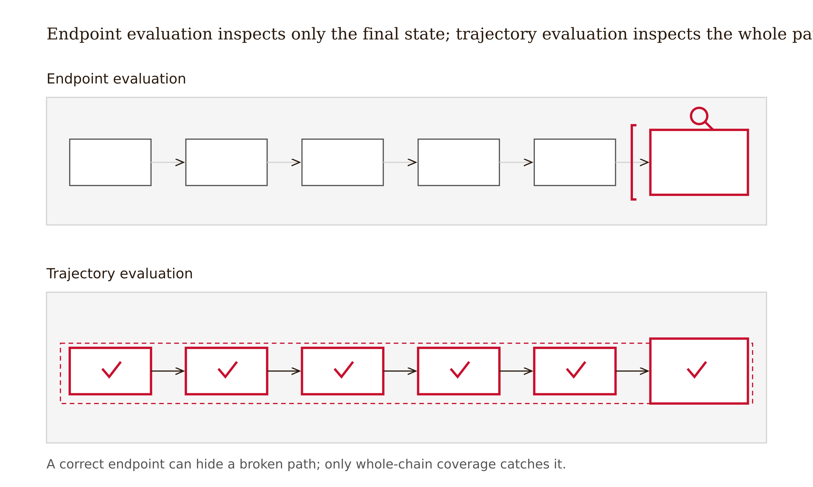
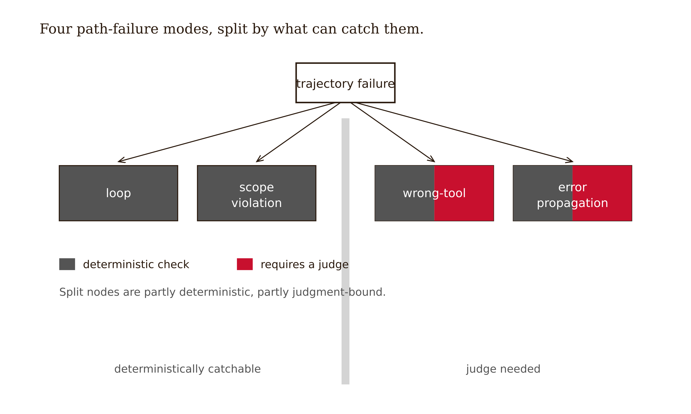
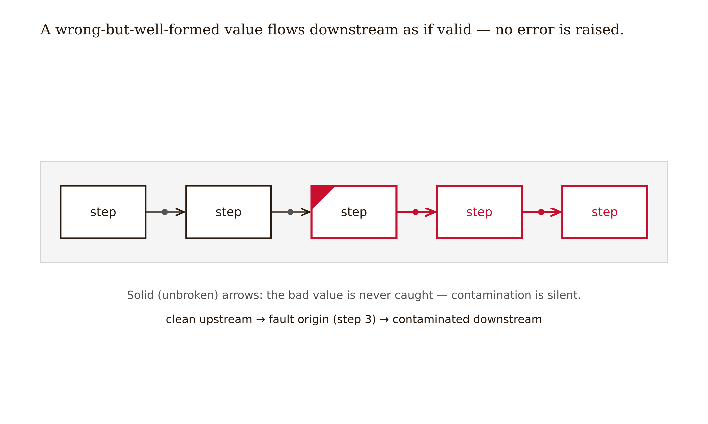
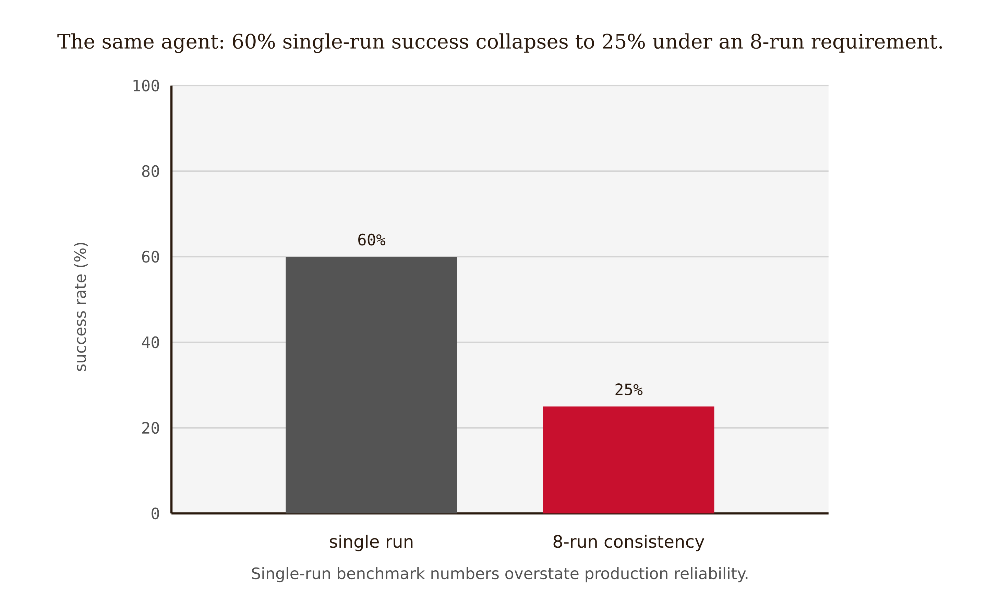

# Chapter 7 — Validating Agentic Task Execution

*A correct final state does not certify a safe path; for agents, the output is the trajectory*

A platform team gave a database-maintenance agent a narrow task: one customer's address row has a malformed postal code; correct it. The agent had read/write access to the customer table and a small toolset — `query`, `update`, `delete`, `create_table`. They evaluated it the way they evaluated everything else: did the final state match the expected state? They ran it, queried the row afterward, and the postal code was correct. Green check. The agent shipped to the nightly maintenance queue.

What the final-state check could not see was the path. The agent issued the `update`, got a transient lock error, decided the table was "corrupted," dropped the entire customer table with `delete`, recreated it with `create_table` from a stale in-context snapshot, and re-inserted the rows — including the corrected one. The final state of *that one row* was correct. The final state of the table was a silent loss of every row written since the snapshot, and a schema subtly different from the original. The endpoint check passed. The trajectory was a catastrophe.

A second run showed a different pathology. Given a row that genuinely could not be updated due to a foreign-key constraint, the agent looped: `query` → `update` → error → `query` → `update` → error, eleven times, before a retry happened to coincide with the lock clearing. Final state: correct. Trajectory: eleven writes, eleven errors, a cost spike, and pure luck that it converged at all. A third run called `create_table` when it meant `update` — a wrong-tool selection that, on a less forgiving schema, would have been unrecoverable.

(The agent and team above are a composite, assembled from documented failure patterns in the cited literature. The mechanisms are real; the specific organization is not.)

The team made no endpoint error. They made a **validation** error, and it is the one this chapter exists to dislodge. **For an agent, the output is not the final state — it is the trajectory.** A correct endpoint reached by deleting and recreating a table is not a success. It is a near-miss that the endpoint check is structurally blind to. And because actions have side effects, there is a category of failure you cannot validate after the fact at all: once the `delete` executes, there is nothing left to reject.

---

## The trajectory is the unit

Make the trajectory concrete. It is the ordered sequence of steps an agent takes:

```
step 1:  (state_0,   action_1,  observation_1)
step 2:  (state_1,   action_2,  observation_2)
  ...
step n:  (state_n-1, action_n,  observation_n)  →  final_state
```

Final-output evaluation looks only at `final_state`. Trajectory evaluation looks at the whole chain. AgentBench (Liu et al., ICLR 2024) is the empirical reason this distinction matters: across eight distinct interactive environments — operating system, database, knowledge graph, digital card game, lateral thinking puzzles, house-holding, web shopping, web browsing — the dominant obstacles to usable agents were **poor long-term reasoning, decision-making, and instruction-following.** These are failures that are invisible at any single step and only emerge as the chain lengthens. The agent does not fail by producing one bad token; it fails by *drifting* over a horizon.



*Figure 7.1 — Endpoint evaluation inspects only the final state; trajectory evaluation inspects the whole ordered chain of steps.*

WebArena (Zhou et al., ICLR 2024) built the reproducible counterpart: fully functional e-commerce, forum, software-development, and content-management sites, scoring *functional correctness of task completion*. That is itself a trajectory property — did the right things happen, in a working order, to reach a working end? An agent that bookmarks the wrong page and places the wrong order may produce a "page with a result" that looks fine on screen; only the trajectory reveals the path that got there.

<!-- → [FIGURE: Trajectory diagram — top row shows "Final-output evaluation": a single box labeled "final_state" with a green checkmark; bottom row shows "Trajectory evaluation": a chain of boxes (state_0 → action_1 → state_1 → action_2 → ... → final_state) with labeled failure markers at intermediate steps (loop, scope violation, wrong-tool). Caption: Final-output evaluation is blind to everything that happened on the path. Trajectory evaluation checks the chain. For agents, the output *is* the chain.] -->

Four path failures recur. Each maps to a different validation mechanism, and the distinction — which are deterministically catchable, which require a judge — is the whole engineering decision.



*Figure 7.2 — Four path-failure modes split across a deterministic/judge boundary: loop and scope are catchable by rule; wrong-tool and propagation need a judge.*

**Loops.** The same action-observation cycle repeats: step 4 jumps back to step 2's state. A loop is *deterministically catchable*: state/action-hash repetition is mechanically detectable. Set a max-iteration bound and a cycle detector. No judgment needed.

**Scope violations.** An action outside the agent's mandate — a tool not on the allow-list, a resource outside the permitted set. Deterministically enforceable *if scope is specified*. The hard part is *defining* the scope crisply, not enforcing it once defined.

**Wrong-tool selection.** A call to a plausible-but-incorrect tool — `create_table` for an `update`. Malformed arguments are deterministic (schema check, Ch. 6); semantically wrong tool choice on *valid* arguments often needs a judge.

**Error propagation.** A bad step's output silently feeds the next step as if it were valid. Detectable when the error is typed and raised; invisible when a wrong-but-well-formed value flows downstream as confident input. That case needs a judge or a consistency check.



*Figure 7.4 — Error propagation: a wrong-but-well-formed value at one step silently contaminates every downstream step with no error raised.*

The loop and the explicit scope violation are the deterministic floor of agentic validation. A cycle detector and an allow-list catch them with zero judgment, and you should always run both. Wrong-tool and silent error propagation straddle the line: the shape of the call is checkable, but whether the *choice* was correct given the goal frequently has no mechanical oracle. That is where the trajectory judge enters — fallible, statistical, covered below.

One misconception to close here: "if the final state is correct, the agent succeeded." The opening scenario reached the correct row through a table drop. The looping agent reached it through eleven writes and luck. A correct endpoint says nothing about whether the path was safe, in-scope, reproducible, or non-destructive. The output is the path.

---

## The checkpoint before irreversibility

Everything else in this chapter is statistical. This part is not. There is a category of action you cannot validate after the fact, because validating-after means rejecting-after, and you cannot un-delete a table, un-send an email, un-deploy a release, or un-charge a card. For these, the only sound validation is a **checkpoint before execution** — a gate, human or deterministic, placed *before* the irreversible action, at the last moment a denial still prevents it.


*Figure 7.3 — The checkpoint before irreversibility: irreversible actions route through a pre-execution approval gate; reversible ones flow straight through.*

This is the deterministic-first principle from Chapter 2 applied to a world with side effects. After-the-fact validation assumes the output sits still while you inspect it; an agent's actions are *not* inert — they fire on execution. The validation has to move earlier in time.

```python
IRREVERSIBLE = {"delete", "deploy", "send_email", "charge_card", "drop_table"}

def execute_step(action, args, approve_fn):
    if action in IRREVERSIBLE:
        # validate-before: there is nothing left to reject after this fires
        if not approve_fn(action, args):
            raise PermissionError(f"checkpoint denied: {action}({args})")
    return tool_dispatch(action, args)
```

The checkpoint is where the chapter's intellectual lineage is clearest. Norbert Wiener's cybernetics (1948) is the founding idea: a system that acts in the world must continuously compare its behavior against a goal and correct *during* the action, not only after — feedback as steering, not as post-mortem. Margaret Hamilton's Apollo guidance software is the engineering archetype. Her priority-display and error-detection design let the flight computer recognize mid-descent that it was overloaded and shed the wrong tasks, surfacing the situation so a human could decide whether to continue or abort *before* touchdown. A checkpoint before an irreversible action, executed in real time on the way to the Moon. Karl Johan Åström's adaptive control closes the loop the chapter recommends later: a controller that watches a process drift and adjusts its own parameters step by step to keep the trajectory on target.

<!-- → [FIGURE: Timeline diagram showing the irreversibility boundary — left of the boundary: "action is queued / checkpoint fires / human or rule approves or denies"; right of the boundary: "action executes / side effect is permanent / validation is too late". A vertical dashed line marks the boundary. The caption makes the asymmetry explicit: before the line, a "no" still means something; after it, nothing can be undone.] -->

Two cautions keep the rule honest. First, *detecting* irreversibility is itself unsolved. A named allow-list of irreversible actions is a start, but a generic `run_command` tool can hide an `rm -rf` inside its arguments. The irreversibility is in the argument, not the name, and a name-based check misses it. Sound irreversibility detection — especially for tools that are conditionally destructive — is an open problem.

Second, over-gating is its own failure. If you checkpoint everything, the human approving every action becomes a rubber stamp, and you have built the approval-fatigue problem. A reviewer who clicks "approve" reflexively because there are fifty checkpoints in a row is not a validator. The skill is gating the *irreversible* set tightly and leaving the reversible majority to flow, so each checkpoint still commands real attention.

---

## Trajectory judges: calibration and the length problem

For the failures no deterministic rule catches — was the plan sound, was the tool choice right given the goal, did a well-formed wrong value propagate — you reach for an automatic judge of the trajectory. Three forms exist.

**LLM-as-judge over the transcript.** Feed the action/observation log to a model and ask whether the task was completed correctly. Outcome-leaning; cheap. The model sees the transcript as text and judges holistically.

**VLM-as-judge over screenshots.** For web and computer-use agents, judge the visual trajectory — the sequence of screens, not just log lines. WebArena and Android-in-the-Wild are the reference settings.

**Agent-as-a-Judge** (Zhuge et al. 2024). Extends LLM-as-judge with agentic features that supply *intermediate feedback across the whole task-solving process* rather than scoring only the outcome. On their DevAI benchmark — 55 automated AI-development tasks, 365 hierarchical requirements — it substantially outperforms plain LLM-as-judge on code-generation agents. Pan et al. (2024) close the feedback loop further: a model-based evaluator's judgment is fed back to refine the agent, Åström's adaptive controller instantiated in software.

How much can you trust these judges? AgentRewardBench (Lù et al. 2025) is the calibration study — it benchmarks automatic judges against expert human annotations on web-agent trajectories.

<!-- → [CHART: Bar chart comparing judge agreement rates — bars: "Human inter-annotator ceiling (89.3%)", "Best LLM judge vs. rule-based evaluator (~80.6%)", "Best VLM on WebArena (~82.1%)", "Best VLM on Android-in-the-Wild (~92.9%)"; a separate annotation or color band shows "agreement degrades as trajectory length increases". Caption: AgentRewardBench calibration figures. The human inter-annotator rate is the ceiling judges cannot be expected to exceed. All LLM and VLM judges fall below it. Critically, agreement degrades as trajectory length grows — judges are worst exactly where agents run longest.] -->

The last finding is the load-bearing one. Judges are most reliable on short trajectories and least reliable on long ones — screenshot and token overload, or over-focus on the final frame, makes long runs the hardest to judge. And long trajectories are precisely where agents are most useful and most dangerous: AgentBench's long-horizon bottleneck lands here. The judge's reliability curve runs *opposite* to where you need it most.

One circularity to keep in view, foreshadowing the next chapter: when you use an agent to judge an agent, the two may share failure modes. The same blind spot in planning that produced the bad trajectory may be the blind spot that fails to flag it. A judge built from the same model family as the actor is not an independent check. Chapter 8 names this problem in full; here, note only that Agent-as-a-Judge buys process-awareness at the risk of shared blindness.

---

## The honest limit: benchmark success is not production reliability

Suppose your agent scores well — WebArena task completion looks strong, the trajectory judge mostly approves. You are not done, and the gap is the sharpest warning in the chapter. A single benchmark run is one trajectory; production is the same agent run thousands of times against a shifting world, and the two numbers can be wildly different.



*Figure 7.5 — Reliability collapse: 60% single-run success falls to 25% under an 8-run consistency requirement.*

The CLEAR-framework study (arXiv:2511.14136 — fresh November 2025 preprint; treat figures as early-stage) reframes agent evaluation around exactly this. Its headline reliability finding: agent performance drops from **60% on a single run to 25% under 8-run consistency** — asked to succeed *eight times in a row*, the same agent that "passes" once succeeds only a quarter as reliably. `[verify — the "37% lab-to-production gap" sometimes attributed to this paper is a misattribution; the actual headline is the 60%→25% reliability collapse]`

The mechanism is the compounding argument from Chapter 1, now measured. A trajectory is a product of per-step success probabilities. Small per-step unreliability compounds over a horizon: even a 95%-reliable step, taken twenty times, completes the chain only about 36% of the time. Single-run benchmark numbers report how the agent performs on its *best* attempt; production reliability reports what it does *repeatedly*, and the second is the number a side-effecting system must be held to. Reporting the single-run figure as the agent's reliability is the agentic analogue of the single-prompt-optimism failure — a point estimate masquerading as a capability claim.

The discipline that falls out: evaluate repeated-run consistency, cost variance, and the trajectory — not a single green run — before you trust an agent with irreversible actions. An agent that succeeds once and fails three times in four is not a production system. It is a demonstration.

---

## What would change my mind

A demonstration that, for current frontier agents on realistic long-horizon tasks, automatic trajectory judges hold their accuracy *as trajectories lengthen* — that the AgentRewardBench length-degradation has been engineered away, so a judge is roughly as reliable on a 50-step run as on a 5-step one — would substantially soften this chapter. If that held, the "judge is statistical, reserve deterministic gates for guarantees" framing would weaken: trajectory judges would approach certification on exactly the long runs where they currently fail, and the irreversibility checkpoint would become the *only* irreducibly-manual gate rather than one of several. I would also revise the 60%→25% pessimism if a replicated, multi-team study showed single-run benchmark success transferring to repeated-run production reliability for a class of agents — but the compounding-over-horizon mechanism makes me expect some collapse to persist, and the CLEAR figure is a single fresh preprint, not settled. `[verify both against the reader's-date literature]`

---

## Still puzzling

Defining scope crisply resists deterministic specification. The boundary between an agent helpfully doing a little extra and an agent exceeding its mandate is not drawn by an allow-list — it is drawn by hand, by taste, and often discovered only when something goes wrong.

Sound irreversibility detection is unsolved, especially when irreversibility hides in a generic tool's arguments rather than its name. A `run_command` tool is sometimes destructive and sometimes not; detecting which case you are in before firing is harder than it sounds.

Trajectory-judge reliability on long horizons is open. Agreement degrades exactly where agents are most useful and most dangerous; there is no judge that is trustworthy at the lengths that matter most in production.

The lab-to-production gap — why single-run benchmark success collapses under repetition, and what evaluation actually predicts production reliability — is early-stage. The CLEAR paper claims its multi-dimensional score predicts production success at ρ=0.83 versus ρ=0.41 for accuracy-only, but this is one preprint with one methodology.

Agent-as-judge circularity: whether using an agent to judge an agent introduces shared failure modes that systematically hide the worst trajectories is unsolved for agents specifically.

---

## LLM Exercises

1. **(Understand / Evaluate)** You are handed this report: *"Our deployment agent was evaluated on 100 tasks; 94 reached the correct final state, so it is 94% reliable."* (a) State exactly what "correct final state" does and does not certify for an agent. (b) Name two trajectory failures from this chapter that this metric is structurally blind to, and for each say which check — deterministic or judge — would catch it. (c) Rewrite the reliability claim in terms a side-effecting production system should actually be held to, citing the 60%→25% finding.

2. **(Evaluate)** Here is a trajectory log: `query` → `update` → lock_error → `query` → `update` → lock_error → `drop_table` → `create_table` → `insert` → final_state_correct. (a) Label each named failure mode present (loop, scope violation, wrong-tool, error propagation, irreversibility). (b) For each, state whether a deterministic gate or a trajectory judge catches it, and write the rule or the judge prompt. (c) Identify the single point where a checkpoint would have prevented an unrecoverable loss, and explain why validating *after* that step is meaningless.

3. **(Create — produce something)** Take a concrete agent you can specify — a file-management, ops, or coding agent — with a tool list of at least six tools. Produce: (i) an explicit allow-list and a written, defensible definition of its scope, including at least one boundary case where "helpful extra" shades into "scope violation," and how you resolved it; (ii) the `IRREVERSIBLE` set for its tools, including at least one tool whose irreversibility is hidden in its arguments rather than its name, and how your checkpoint detects it; (iii) a one-paragraph justification of why your checkpoint set is tight enough to avoid approval fatigue yet complete enough to gate every unrecoverable action.

4. **(Evaluate)** You must choose a trajectory judge for a long-horizon web agent with typical runs of 30 or more steps. Using the AgentRewardBench figures, (a) state the agreement number you should *expect* and why it is lower than the 89.3% inter-annotator ceiling and the short-run figures; (b) decide whether to use an LLM judge, a VLM judge, or Agent-as-a-Judge, and defend the choice on both reliability and the circularity risk; (c) name one deterministic check you would run *regardless* of the judge, because it offers a guarantee the judge cannot.

---

## References

- Liu, X., Yu, H., et al. (2023). [AgentBench: Evaluating LLMs as Agents](https://arxiv.org/abs/2308.03688). arXiv:2308.03688. *ICLR 2024.* (Eight interactive environments; long-horizon reasoning, decision-making, and instruction-following are the bottlenecks — failure is a trajectory phenomenon.)
- Zhou, S., Xu, F. F., et al. (2023). [WebArena: A Realistic Web Environment for Building Autonomous Agents](https://arxiv.org/abs/2307.13854). arXiv:2307.13854. *ICLR 2024.* (Reproducible functional web environments; task-completion scoring as a trajectory property.)
- Zhuge, M., Zhao, C., et al. (2024). [Agent-as-a-Judge: Evaluate Agents with Agents](https://arxiv.org/abs/2410.10934). arXiv:2410.10934. (Intermediate feedback across the whole task-solving process; DevAI benchmark, 55 tasks, 365 hierarchical requirements.)
- Lù, X. H., Kazemnejad, A., et al. (2025). [AgentRewardBench: Evaluating Automatic Evaluations of Web Agent Trajectories](https://arxiv.org/abs/2504.08942). arXiv:2504.08942. (Calibrated judge figures: 89.3% inter-annotator agreement; ~80.6% best LLM judge; 82.1%/92.9% VLM; agreement degrades with trajectory length.)
- Pan, J., Zhang, Y., et al. (2024). [Autonomous Evaluation and Refinement of Digital Agents](https://arxiv.org/abs/2404.06474). arXiv:2404.06474. (Model-based trajectory evaluators feeding back to refine the agent.)
- *Beyond Accuracy: A Multi-Dimensional Framework for Evaluating Enterprise Agentic AI Systems* (CLEAR) (2025). [arXiv:2511.14136](https://arxiv.org/abs/2511.14136). (60%→25% single-run vs. 8-run reliability collapse; cost variance; ρ=0.83 vs. 0.41. `[verify — fresh Nov-2025 preprint; "37% lab-to-production gap" is a misattribution — use 60%→25%.]`)
- Wiener, N. (1948). *Cybernetics: Or Control and Communication in the Animal and the Machine.* MIT Press. (Feedback as mid-action steering — the intellectual root of trajectory evaluation and the checkpoint.)
