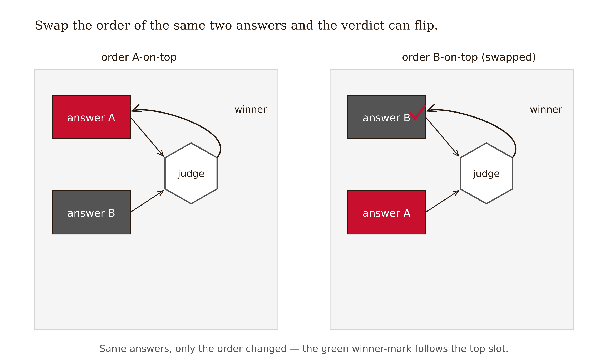
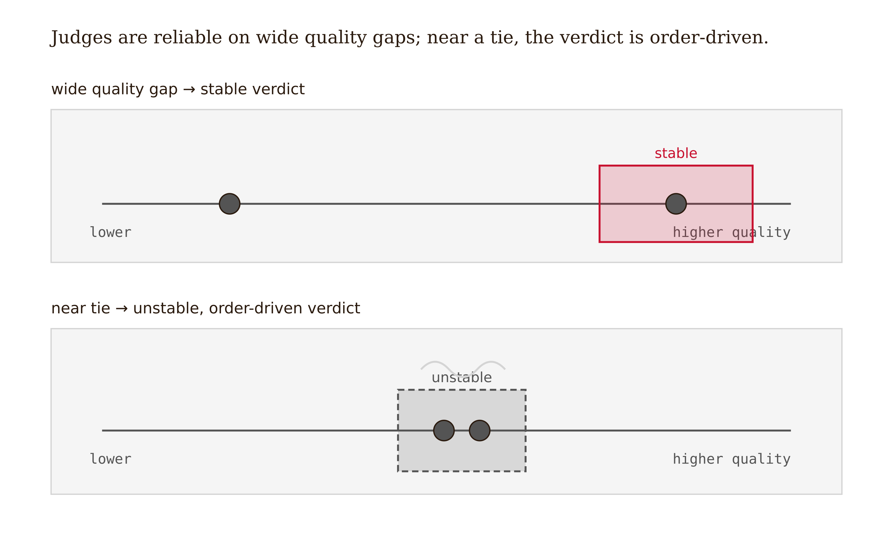
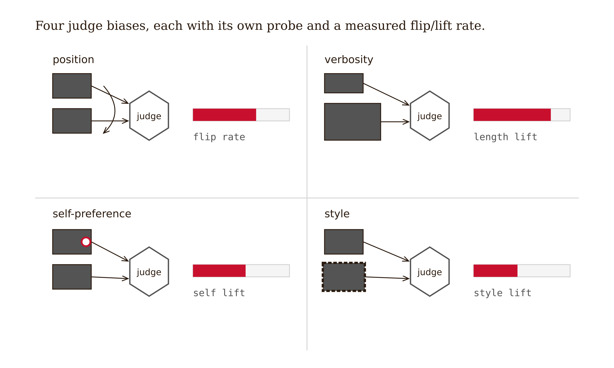
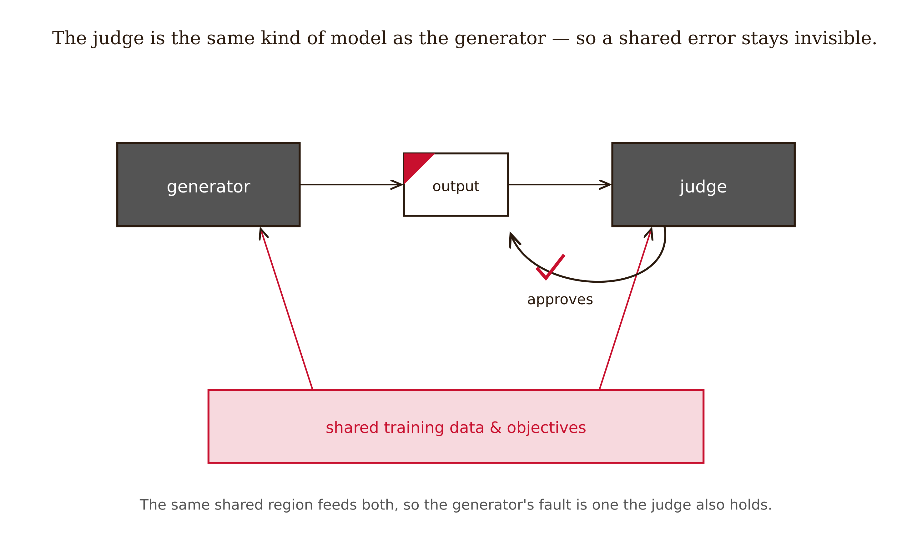
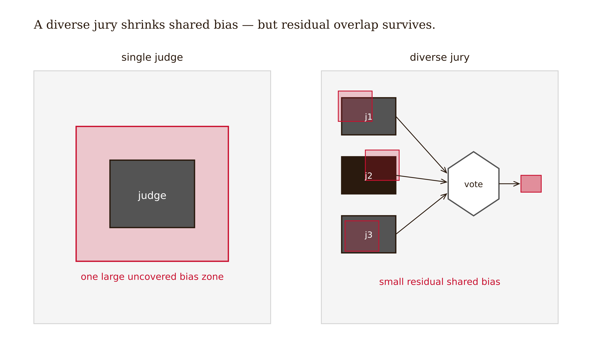

# Chapter 8 — LLM-as-Judge: Uses and Failure Modes

*A fluent model judging a fluent model can share the very blind spot it was hired to catch*

A team building a customer-support assistant wanted to choose between two candidate response generators. They had no labeled ground truth for "which reply is more helpful" — the whole point was open-ended quality, the kind of thing a schema or a test cannot score. So they did the now-standard thing: they used a strong LLM as a judge. For each of 80 support scenarios, they showed the judge the prompt and the two replies and asked which was better. Generator B won, 58 of 80. They wrote it up: *B is the better model; ship B.*

Then someone on the team ran one extra experiment. She presented the judge with the identical 80 pairs, but swapped the order — B first, A second, instead of A first, B second. The verdict moved. On a large fraction of the pairs where B had "won," A now won, for no reason but the swap. Same content. Same answers. The only thing that changed was which response the judge read first.

*Figure 8.1 — Swapping the order of two identical answers can flip the judge's verdict.*

This is Wang et al. (2023), "Large Language Models are not Fair Evaluators," in miniature. With ChatGPT as evaluator, Vicuna-13B "beat" ChatGPT on **66 of 80 queries purely by reordering the candidates.** The team made no generation error and no data error. They made a **validation** error: they treated a judge's verdict as if it measured the thing they cared about, when it partly measured an artifact of presentation.

And it is the cleanest possible illustration of the chapter's problem. They used a judge *because* there was no oracle for "more helpful." In exactly that regime — where ground truth is absent — the evaluator is another fluent model, and it can introduce errors of its own that look exactly like findings. This chapter is about using the judge anyway, because it is genuinely useful, while knowing precisely where it lies to you — and, crucially, learning to *test* a given judge for bias rather than memorizing which biases last year's papers catalogued.

<!-- → [FIGURE: Position bias demonstration — same two answers (A, B) shown to judge in two orderings; left: A first → judge prefers B; right: B first → judge prefers A; caption: "The verdict tracked order, not quality. Wang et al. found this on 66 of 80 pairs."] -->

---

## What the judge is good at — and the agreement number's fine print

Start with the legitimate case. Zheng et al. (2023), "Judging LLM-as-a-Judge with MT-Bench and Chatbot Arena" (NeurIPS 2023), is the origin paper. It introduced MT-Bench, analyzed Chatbot Arena crowd data, and reported the headline: **strong LLM judges (GPT-4) reach over 80% agreement with human preferences — the same level of agreement humans reach with one another.** That is a real, reproducible result, and it licenses real uses: coarse ranking and leaderboards (separating clearly-better from clearly-worse candidates across many comparisons), recoverable-error screening (a cheap first pass for groundedness, on-topic-ness, safety, where a false negative costs a re-check rather than a catastrophe), and scale (judging thousands of outputs no human team could read).

But the ">80% agreement" number has fine print the field routinely ignores, and it is **Jacob Cohen**'s fine print. In 1960, Cohen introduced his kappa coefficient precisely because *raw percent agreement* overstates reliability: two raters who agree 80% of the time may be only marginally better than two raters guessing, if the base rates make 80% easy to hit by chance. The honest reliability statistic is chance-corrected — agreement beyond what coincidence predicts. Almost no LLM-judge paper reports kappa; they report raw agreement. So treat "~80% judge–human agreement" as the ceiling-flavored number it is — encouraging, real, and *not* the same as "80% reliable."

The deeper lineage runs through peer review itself, institutionalized by **Henry Oldenburg** at the Royal Society in the 1660s. Peer review is the original fallible judge used to screen rather than certify, complete with documented biases — prestige, position-in-the-pile, reviewer self-interest — that map almost one-to-one onto the LLM-judge biases below. We have been here before; we know the failure modes; we use the mechanism anyway because the alternative is no filter at all. The LLM judge is in that tradition.

---

## The decision rule: coarse ranking is fine, close calls are not

The single most useful rule in this chapter comes from the *mechanism* of position bias, not from a warning. Shi et al. (2024), "Judging the Judges: A Systematic Study of Position Bias in LLM-as-a-Judge," measured position bias across **more than 150,000 evaluation instances, 15 judges, MT-Bench and DevBench**. The finding that matters: position bias is not random, it varies by judge and task, and it is **strongly modulated by the quality gap between candidates.** The closer the true quality of the two answers, the more the verdict is driven by ordering rather than content.

*Figure 8.2 — A wide quality gap yields a stable verdict; a near tie makes the verdict order-driven.*

That gives a clean, internalizable rule:

**Use the judge for coarse separation; refuse it near the margin.** When one candidate is clearly better, the judge's verdict tracks quality and position bias is small. When the candidates are near-equal — the close call you most want resolved — position bias dominates, and the judge is least trustworthy precisely where you need it most.

This is why the §8.1 team's 58–22 split was unsafe: a 58–22 split over 80 noisy pairs likely contains many near-ties, and near-ties are where the swap flips the verdict. The pairwise A/B comparison of two near-equal candidates is the *canonical misuse* of an LLM judge.

One common response is: average the verdict over both orderings. Balanced position calibration genuinely reduces position bias and you should do it. But averaging a coin-flip is still uninformative. On a true close call, the two orderings disagree *because the judge cannot tell the answers apart*, and the average is a 50/50 that tells you nothing about quality. Calibration removes the directional artifact; it does not manufacture a signal the judge does not have.

<!-- → [CHART: Quality gap vs. position flip rate — x-axis: quality gap between candidates (small to large); y-axis: fraction of pairs where swapping order changes the verdict; curve descending from high flip rate at small gap to near-zero at large gap; caption: "The judge is most unreliable exactly where the quality difference is smallest — Shi et al. 2024"] -->

---

## The bias catalog — and why you test for it instead of memorizing it

There is a catalog of judge biases, and you should know it. But the chapter's actual lesson is one level up: **bias profiles change as models improve, so the durable skill is the probe, not the list.** A recent preprint (arXiv:2604.23178, April 2026) reports that on current-generation models, position bias has become largely negligible (≤0.04 across five tested models, attributed to better instruction tuning) while *style* bias is now dominant (0.76–0.92) and under-studied. `[verify — fresh, future-dated preprint; single source]` If you had memorized "position bias is the big one" from the 2023 papers, you would be testing for yesterday's bias and missing today's.

*Figure 8.3 — Four judge biases, each with its own probe and a measured flip-or-lift rate.*

Learn the catalog as a set of *probes you can run*, each with a mechanism, a test, and a mitigation — and re-run the probes on every model you deploy.

| Bias | Mechanism | Detection probe | Mitigation | Status note |
|---|---|---|---|---|
| **Position** | Verdict tracks order, especially on close calls | Swap candidate order; measure flip rate | Balanced position calibration | Largely negligible on frontier models `[verify]` |
| **Verbosity** | Longer ≈ better, quality held equal | Pad one answer with on-topic filler; measure score lift | Length-controlled scoring; rubric scoring | Persistent; propagates into RLAIF training |
| **Self-preference** | Judge recognizes and favors its own outputs | Score self-generated vs. other-generated at equal quality; measure the gap | Diverse jury; never self-as-judge | Persistent; the engine of circularity |
| **Style** | Format/tone scored over substance | Hold content fixed, vary formatting/tone; measure score change | Substance-anchored rubric | **Dominant** per arXiv:2604.23178 `[verify]` |

The self-preference row is the one that connects to the whole chapter's thesis.

<!-- → [INFOGRAPHIC: Four-probe test workflow — four parallel tracks labeled Position, Verbosity, Self-preference, Style; each track shows: what to hold fixed, what to vary, what to measure; outputs feed into a single "bias profile" table; caption: "Run all four probes on your judge before deployment — the profile you measure may not match the 2023 papers"] --> Panickssery et al. (2024), "LLM Evaluators Recognize and Favor Their Own Generations" (NeurIPS 2024), showed the bias is **causal, not coincidental**: GPT-4 and Llama-2 can recognize their own outputs with non-trivial accuracy, and there is a *linear correlation between self-recognition capability and the strength of self-preference*, established causally by fine-tuning self-recognition up and watching self-preference rise with it. A judge that can detect its own style favors it. That is not a quirk; it is a mechanism, and it is the bridge to circularity.

The honest caveat: whether a model favoring its own outputs is *bias* or partly *legitimate calibration* is an open question — a model may genuinely produce better outputs in its own style. Hold the question open; the probe is the same either way. What matters is that you *measure* the self-preference rate on your judge before trusting its verdicts.

---

## Circularity: when the evaluator shares the generator's blind spot

Here is the deepest failure, and the one that makes LLM-as-judge categorically different from a deterministic validator. A compiler does not share a code generator's misconceptions; it is a different kind of thing. An LLM judge *is the same kind of thing as the generator* — a fluent model trained on overlapping data with overlapping objectives — so it can be **wrong in the same way the generator is wrong**, and rate a flawed answer highly *because* the flaw is one the judge also holds.

*Figure 8.4 — A judge sharing the generator's lineage approves a wrong-but-fluent answer whose fault it cannot see.*

Panickssery's self-recognition mechanism is the engine: if the judge recognizes its own style and favors it, then a wrong-but-fluent answer in the judge's own idiom gets rated highly precisely because it reads like something the judge would produce. The validation becomes circular — the answer is approved for sharing the judge's blind spot, not for being correct. This is the book's thesis at its sharpest: when ground truth is gone, the evaluator is *another instance of the thing being evaluated*, and it can confirm rather than catch the shared error.

The standard mitigation is a **jury, not a single judge**. Verga et al. (2024), "Replacing Judges with Juries" (the PoLL — Panel of LLM evaluators — paper), showed that a panel of several smaller models from *disjoint families* (Command R, GPT-3.5, Haiku) outperforms a single large judge (GPT-4), exhibits less intra-model bias, and costs less. The logic is diversity-defeats-circularity: models from different families have different blind spots, so a blind spot in one is caught by another, and the panel's shared bias is smaller than any single member's.

*Figure 8.5 — A diverse jury shrinks shared bias to a small residual overlap a single judge cannot.*

But say the honest part. A jury *partially* breaks circularity, not fully. If the panel members share pretraining corpora, share RLHF lineage, or were tuned on the same human-preference data, they may share blind spots that survive ensembling. Frontier models are less independent than their different names suggest — overlapping web-scale corpora, similar alignment recipes. There is no clean test for whether a given panel breaks circularity or merely averages a consensus around a shared error. So: prefer a diverse jury to a single judge, *especially* never use the generator's own model as its judge — and still treat the jury's verdict as a strong screen, not a certification, for anything near the margin.

<!-- → [FIGURE: Circularity diagram — generator (Model A) produces answer with Blind Spot X; Judge (also Model A, or close relative) evaluates; Blind Spot X is not caught because judge shares it; contrast panel: generator (Model A) → panel of models B, C, D from different families → Blind Spot X caught by B even if missed by C and D; caption: "Circularity is broken in proportion to genuine independence — and frontier models share more than their branding implies"] -->

---

## What the chapter argues

I have been building one claim from four angles. The LLM judge is a real and useful instrument — ">80% human agreement" is not nothing — but it is the tool you reach for *after* deterministic ground truth is exhausted (Chapter 2), not instead of it. In the exact regime where it is needed — open-ended quality with no oracle — the evaluator is another fluent model, and it inherits both the human reviewer's fluency-as-proxy weakness and a new one: it can share the generator's blind spots and rate a wrong answer highly for the wrong reason.

The governing rule from Shi et al. is the one to hold onto: **judges are fine for coarse ranking and screening, untrustworthy near the margin.** The quality-gap mechanism explains why: position bias and shared-blind-spot bias are both largest when the candidates are closest, precisely when you most want a verdict. That is not an accident; it is the structure of the problem.

The durable skill is not memorizing which biases are currently fashionable — the profile changes with every model generation, and yesterday's "biggest bias" may already be gone. The durable skill is running the probe: swap order, pad length, score self-vs-other, hold content and vary style. Measure the flip rates on *your* judge. Then decide what it can and cannot certify.

---

## LLM Exercises

**Exercise 8.1 (Understand/Evaluate).** A team reports: *"We used GPT-4 as a judge to compare two summarizers; it preferred Summarizer B on 60 of 100 examples, so B is better."* (a) Name the specific experiment from the chapter you would run *first* before trusting this, and what result would invalidate the conclusion. (b) Explain, using Shi et al.'s quality-gap mechanism, why a 60–40 split is more suspect than a 90–10 split. (c) State what claim, if any, this evaluation is licensed to make after you run the order-swap.

**Exercise 8.2 (Apply).** Build a four-probe bias test harness for one LLM judge of your choice on one task. Implement and run: (i) a **position** probe (swap order, report flip rate); (ii) a **verbosity** probe (pad one answer with on-topic filler, report score lift); (iii) a **self-preference** probe (score the judge's own output vs. another model's at equal quality, report the gap); (iv) a **style** probe (hold content fixed, vary formatting/tone, report score change). Produce a table — probe, metric, measured rate — and a one-paragraph verdict on which biases *your* judge actually exhibits, explicitly comparing to the 2023–2024 papers and noting any divergence.

**Exercise 8.3 (Evaluate).** You must validate open-ended answer quality with no mechanical ground truth. Walk a decision tree: (a) Is mechanical ground truth *truly* unavailable, or did you skip a deterministic check (Chapter 2)? (b) Are errors cheap and recoverable (screening) or not? (c) Is it a close call (small quality gap)? For each branch, state whether you use a deterministic validator, a single judge with probes, a diverse jury, or human escalation — and justify the close-call branch using the position-bias mechanism.

**Exercise 8.4 (Evaluate).** Critique this circularity-mitigation plan: *"To avoid self-preference, we'll judge our GPT-4-generated answers with a panel of GPT-4o, GPT-4-turbo, and GPT-3.5."* (a) Explain why this panel only partially breaks circularity and what it shares. (b) Propose a more independent panel and state the property you optimized for. (c) Explain why even a maximally diverse jury cannot be treated as certification for a close call, connecting to Cohen's chance-correction point.
