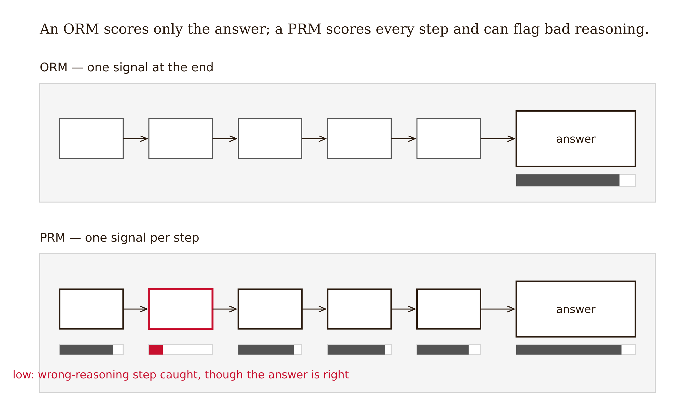
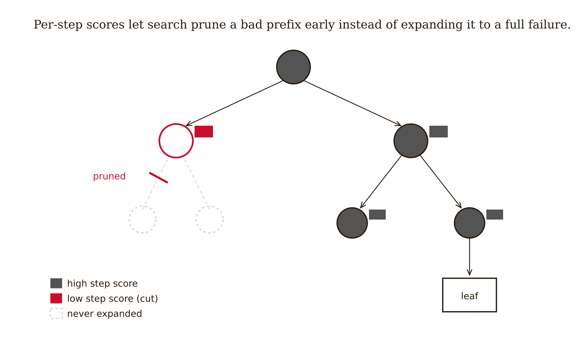
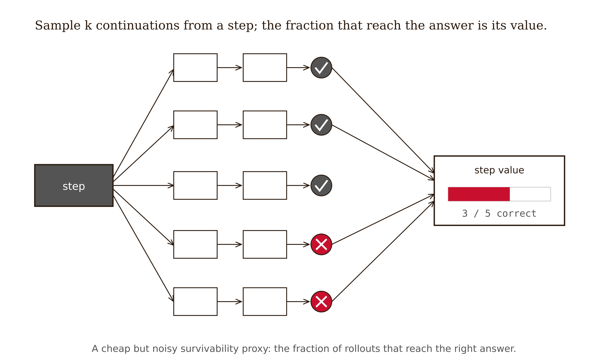
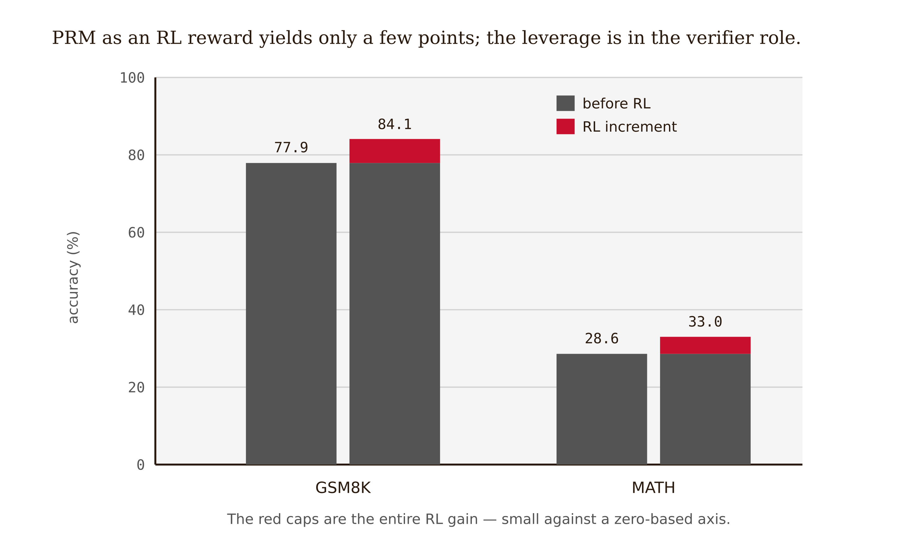
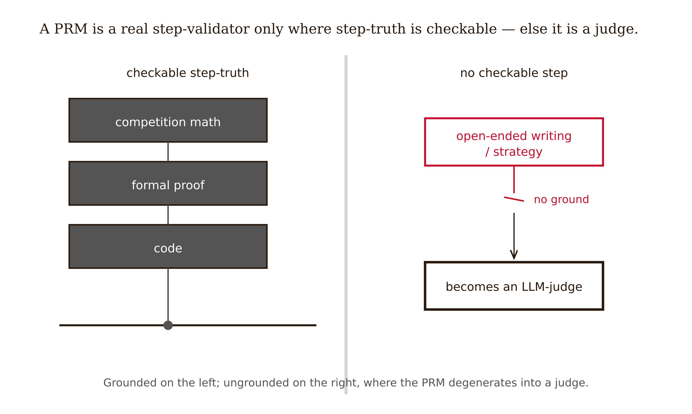

# Chapter 9 — Process Reward Models: Step-Level Verification

*Why Grading Every Step Beats Grading the Answer — Exactly As Far As "Correct Step" Has a Checkable Meaning*

---

Here is a short solution to a routine problem. Read it as a grader would.

> **Problem.** A shirt costs \$40. It is discounted 25%, then a 25% tax is added to the discounted price. What is the final price?
>
> **Step 1.** Discount: $40 \times 0.25 = 10$, so the discounted price is $40 - 10 = 30$.
> **Step 2.** Tax: a 25% tax on \$30 is $30 \times 0.25 = 7.50$, but I'll add it to the *original* price, $40 + 7.50 = 47.50$... no. The tax is on the discounted price. $30 + 7.50 = 37.50$.
> **Step 3.** Final answer: **\$37.50.**

The final answer is correct. \$37.50 is exactly right. An automated grader that checks only the last line stamps this solution *correct* and moves on. So does a reward model trained only on final-answer correctness — an **outcome reward model**, or ORM. It sees a problem, an answer matching the gold label, and emits a high reward.

Now read Step 2 again. The solver wrote down a *wrong* computation — adding tax to the original price, $40 + 7.50 = 47.50$ — caught itself, and recovered. This solution recovered. But a model that produces Step 2 reasoning is a model that, on a problem where the self-correction *doesn't* happen, will confidently report \$47.50. The ORM cannot see that. It saw a right answer and rewarded the whole trajectory, broken intermediate move included. Train a policy against that ORM and you teach it that trajectories containing this kind of error are fine, *as long as they land on the right number.*

This is a failure an ORM cannot escape by construction. It has exactly one bit of ground truth — the final answer — and spreads that one bit, undifferentiated, over every step before it. A solution that reaches the right answer through ten valid steps and one that reaches it through two errors that cancel are, to the ORM, identical. The ORM has no way to *localize* anything, because it never looked anywhere but the end.

A **process reward model**, or PRM, looks at every step. It emits a score per step — Step 1: valid; Step 2: contains an invalid move; Step 3: valid given the recovery. Now the right-answer/wrong-reasoning solution is *catchable*: the PRM flags Step 2 as low-value even though the final answer is right.

That is the entire idea of step-level verification. The rest of this chapter is about why it works, how the field learned to build PRMs without paying for 800,000 human labels, and — the part that matters most for this book — exactly where it stops working.

---

## The mechanism: one signal at the end versus one per step

Make the contrast precise. A reasoning trajectory is a sequence of steps $s_1, s_2, \ldots, s_T$ ending in a final answer $a$.

*Figure 9.1 — An ORM scores only the final answer; a PRM scores every step and flags a bad one.*

An **ORM** is a function of the endpoint:

$$r_{\text{ORM}}(s_1, \ldots, s_T) = f(a)$$

It depends on the steps *only through* the answer they produce. Two trajectories with the same final answer get the same score, regardless of what happened in between.

A **PRM** assigns a score to each prefix:

$$r_{\text{PRM}}(s_1, \ldots, s_t) = g(s_1, \ldots, s_t) \quad \text{for each } t = 1, \ldots, T$$

It emits $T$ scores, one per step. Two consequences fall straight out of this.

**Localization.** Because the PRM scores each prefix, the first $t$ at which the score drops is the location of the first error. You do not just learn *that* a solution is wrong; you learn *where* it went wrong. This is why a PRM is the natural verifier for search: in a tree or beam search over partial solutions, the PRM scores partial reasoning paths and steers generation away from prefixes that have already gone bad — you prune the branch at Step 2 instead of expanding it to a full wrong solution and discovering the failure only at the leaf.

*Figure 9.5 — Per-step scores let search prune a bad prefix early instead of expanding it to a wrong leaf.*

**Right-answer/wrong-reasoning rejection.** A trajectory can have a correct $a$ and still score low on some $s_t$. The opening solution is exactly this: high $f(a)$, low $g(s_1, s_2)$. The ORM is blind to it; the PRM is not.

One misconception to kill directly: "If the answer is right, the reasoning was right." The set of trajectories with a correct final answer is strictly larger than the set with correct *reasoning* — it includes lucky cancellations, hand-waves that happen to land, and shortcuts that work on this instance and fail on the next. An ORM rewards the larger set. A PRM tries to reward only the smaller one. The gap between those two sets is the entire reason process supervision exists.

Now — where do the per-step labels come from? This is the hard part, and it splits the field's history into three eras.

The first answer was: **humans.** Lightman et al. (2023, "Let's Verify Step by Step," arXiv:2305.20050) hired annotators to label each step of model-generated MATH solutions as correct, incorrect, or neutral. The result was **PRM800K** — 800,000 step-level labels — and the headline finding: a process-supervised verifier substantially outperformed an outcome-supervised one under best-of-N reranking, solving 78% of a representative MATH test subset. Process supervision works. It also costs 800,000 human judgments, which is the bottleneck the next era removed.

---

## Getting step labels for free: Monte-Carlo rollouts

If a human labeling each step is too expensive, can the model label its own steps? Math-Shepherd (Wang et al. 2024, arXiv:2312.08935, ACL 2024) found a way, and the mechanism is worth understanding because it is also where the noise comes from.

The idea: a step is *good* to the extent that continuing from it tends to reach the correct final answer. So estimate that tendency by rollout. From a given step $s_t$, sample $k$ continuations with a completer policy, run each to a final answer, and define the step's value as the empirical fraction that land on the correct answer:

*Figure 9.2 — A step's value is the fraction of sampled rollouts from it that reach the correct answer.*

$$\hat{v}(s_t) = \frac{\#\{\text{rollouts from } s_t \text{ reaching the correct answer}\}}{k}$$

No human looked at the step. The label is a Monte-Carlo estimate of "how survivable is this step." A step that almost always leads to the right answer scores near 1; a step from which the solver almost never recovers scores near 0.

This is a beautiful trick and a leaky one, and you must hold both facts at once. It is beautiful because it scales: you generate labels with compute instead of annotators. It is leaky because *survivability is not the same as correctness*. The two diverge in both directions.

A step can be logically correct but unsurvivable under a weak completer — the step is fine, but the completer is too weak to finish from it, so rollouts fail and the step gets a low label it does not deserve. A step can be logically wrong but survivable — the error is recoverable, or it is the kind of mistake the completer routinely corrects downstream, so rollouts still reach the right answer and the bad step gets a high label.

The Monte-Carlo label is therefore a *noisy proxy* for true step correctness, and the field does not have a clean way to measure how noisy. This is not a footnote; it is the first PRM-specific failure mode.

Math-Shepherd then used its automatically-labeled PRM two ways, and the *asymmetry between them* is the durable takeaway.

As a **test-time verifier** — rerank best-of-N candidate solutions by PRM score — it showed a large lift. As an **RL reward** — train the policy with step-level reinforcement against the PRM — it showed a modest lift. The numbers: Mistral-7B went from GSM8K 77.9% → 84.1% and MATH 28.6% → 33.0%. A few points. The rule this asymmetry encodes is real and durable:

*Figure 9.3 — Using a PRM as an RL reward yields only a few points on GSM8K and MATH.*

> A PRM helps far more as a test-time verifier than as an RL reward signal.

Why? The intuitive picture is that test-time verification *selects* among already-generated trajectories — it amplifies the policy's existing competence — whereas using the PRM as an RL reward asks the policy to *optimize against* it, which exposes the policy to label noise and to reward hacking. Selection is forgiving of a noisy signal in a way optimization is not.

A second misconception to kill: "A PRM is a tool for training better reasoning models." Mostly no. The big, reliable win is using a *fixed* PRM at inference time to pick or steer among a model's own outputs. Treating a PRM primarily as an RL reward overstates a few-point effect and walks into the reward-hacking problem. The PRM is, first and most usefully, a *verifier* — which is precisely this book's subject.

---

## Making the PRM think: generative verification

A discriminative PRM is a classifier: in goes a step, out comes a number. ThinkPRM (Khalifa, Mukhal, et al., 2025, arXiv:2504.16828, preprint) changed the form. Instead of emitting a bare per-step score, a **generative** PRM writes a *verification chain-of-thought* — it reasons through the step, in language, before scoring it. The PRM is now itself a reasoning model that critiques.

Two results matter.

**Label efficiency.** ThinkPRM-14B was trained on roughly 1,000 synthetic verification CoTs — about 1% of PRM800K's labels — and beat discriminative PRMs trained on ~100× more data on ProcessBench, and beat LLM-as-judge baselines on MATH-500 and AIME '24 under best-of-N and reward-guided search. The synthetic CoTs were generated by a reasoning model and filtered against known process labels — you bootstrap a few high-quality verification rationales rather than paying for a million human step-labels.

**Out-of-domain generalization.** On GPQA-Diamond and LiveCodeBench — domains *outside* the math training distribution — ThinkPRM surpassed discriminative verifiers trained on the full PRM800K by 8% and 4.5% respectively. A verifier that *reasons* about a step transfers better to a new domain than one that *pattern-matches* against the step's surface, because the reasoning recruits the model's general competence rather than the narrow statistics of the training set.

But notice what generalizes and what doesn't. ThinkPRM transfers from math to physics-flavored multiple choice (GPQA) and to code (LiveCodeBench) — domains that *still have checkable step-truth*. Code is interesting precisely because intermediate steps have execution and tests as ground truth. ThinkPRM does not, and cannot, manufacture a notion of "correct step" where none exists. That is the boundary.

One more misconception: "A generative PRM is just an LLM-judge, so it has the same problems." Half true, and the half that's false is the important half. A generative PRM is structurally a judge — it reads and reasons in language, so it can inherit Chapter 8's biases. But when it operates in a domain with checkable step-truth, it is trained and filtered against *real process labels* — it is a judge with a ground-truth tether. Cut the tether (open-ended tasks) and it *does* become an ordinary judge. The structure is the same; the grounding is what differs, and the grounding is everything.

---

## Where it stops: the open-ended-task limit

Here is the line the chapter is built around. A PRM works **exactly as far as "is this step correct?" has a checkable answer, and no further.**

*Figure 9.4 — Where steps are checkable a PRM validates; where they are not it collapses into an LLM-judge.*

Run down the domains.

**Competition and word-problem math** (GSM8K, MATH, AIME). A step is a derivation; its correctness is checkable against the rules of arithmetic and algebra. PRM home turf.

**Formal proof and theorem proving.** A step's validity is mechanically checkable by a proof assistant — the cleanest instance in the whole book of "ground truth mechanically available."

**Code reasoning** (LiveCodeBench). Intermediate steps have execution and tests as ground truth. ThinkPRM's out-of-domain strength here is not an accident; it is a domain that still has step-truth.

**Open-ended writing, product strategy, design review, a legal argument's persuasiveness.** There is *no mechanical notion of a correct intermediate step.* What is the "correct" second sentence of an essay? The "correct" middle move in a product strategy? The question does not have a checkable answer — it has a *judgment.*

In the first three domains, the PRM is a genuine step-level validator: it grounds each step in something close to mechanical truth, which is why it beats the ORM and the judge. In the fourth, the PRM has nothing to ground against. So what does it do? It scores steps by fluency, by surface plausibility, by resemblance to its training distribution. Which is to say: it becomes an LLM-judge, and it reinherits the entire Chapter 8 catalog — position bias, verbosity bias, self-preference, style bias, and the circularity problem of a model grading reasoning by the same intuitions that produced it.

A PRM is not a general solution to "verify reasoning." It is a specific solution to "verify reasoning *in a domain with checkable steps*." Calling it more than that is the central error to avoid.

The lineage here is older than 2023. Marvin Minsky framed the **credit-assignment problem** in 1961: how do you assign credit or blame to individual decisions in a long sequence that produces a single outcome? A PRM is, mechanically, a credit-assignment device — it spreads the one bit of final-answer signal back over the intermediate steps. Arthur Samuel's 1959 checkers program already valued *intermediate board positions*, not just wins and losses — arguably the first working "process reward" versus "outcome reward," the ORM-vs-PRM distinction in embryo. And Richard Sutton's temporal-difference learning is the modern machinery for temporal credit assignment — propagating reward back through a sequence of states — of which Math-Shepherd's Monte-Carlo step values are direct descendants. PRMs are credit assignment, applied to reasoning steps, in a domain where you can finally check whether the credit was deserved.

---

## Failure modes specific to PRMs

Four, each tied to the mechanism and each connecting to the thesis.

**Noisy Monte-Carlo labels.** Automated step values conflate "logically correct" with "tends to reach the right answer under this completer." The two diverge in both directions, and the field lacks a clean measure of label fidelity. An automated PRM can be systematically wrong about which steps are good, and you will not easily know.

**Reward hacking — the step-level Goodhart.** Optimize a policy against a PRM and it may learn to produce steps that *look* step-valid to the PRM while being substantively wrong. This is part of why the RL use is both weaker and riskier than the verifier use.

**Convergence with LLM-judges.** A generative PRM is a reasoning model that critiques steps, so in any domain without checkable step-truth it inherits Chapter 8's biases. Whether even in-domain generative PRMs pick up self-preference or style bias is largely unstudied. [verify as the literature matures]

**The generalization limit.** There is no reliable method to build a PRM for tasks lacking checkable intermediate steps. This is not a temporary gap to be closed next year; it is the same wall the book hits everywhere — validation needs ground truth, and open-ended reasoning does not supply step-level ground truth.

---

## Bridge to Chapter 10

A PRM is the most precise validator in this book, and it dies at exactly the line where step-truth runs out. Past that line you are back to a *judge* — and in the highest-stakes settings, the judge of last resort is not a model at all. It is a human, reading fluent AI output, deciding whether to sign off.

That human is the validation layer invoked precisely where compilers, tests, schemas, LLM-judges, and PRMs have all run out — and it is the layer the fluency of AI output most efficiently disables. Chapter 10 is about engineering *that* layer: why a human reviewing fluent output is the *more* compromised position, not the safer one, and what review protocols plausibly let a human catch what everything upstream missed. The PRM showed you validation working where ground truth is mechanical. The next chapter shows you what happens when the only validator left is a tired human, and the only thing they have to go on is how good the wrong answer looks.

---

## LLM Exercises

**Exercise 9.1 — Apply, produce something.** You are given this labeled solution to "Compute $\frac{2}{3} + \frac{1}{6}$": **Step 1:** common denominator is 6, so $\frac{2}{3} = \frac{4}{6}$. **Step 2:** $\frac{4}{6} + \frac{1}{6} = \frac{5}{12}$ (wrong: should be $\frac{5}{6}$). **Step 3:** simplify — $\frac{5}{12}$ is already in lowest terms, final answer $\frac{5}{12}$. (a) Give the ORM verdict against the gold answer $\frac{5}{6}$. (b) Give plausible PRM per-step scores and name the first failing step. (c) Construct a *different* solution to the same problem that an ORM would mark correct but that a PRM should penalize — a right-answer/wrong-reasoning case — and explain which step the PRM catches.

**Exercise 9.2 — Apply.** Here is a small Monte-Carlo rollout table for a Step 2 in some solution, $k = 5$ completions: [reaches correct answer: yes, no, yes, yes, no]. (a) Compute the Math-Shepherd-style step value $\hat{v}(s_2)$. (b) Now suppose Step 2 is in fact logically correct but the completer is weak. Explain in one sentence how the label you computed could be misleadingly low, and which failure mode from the last section this is.

**Exercise 9.3 — Evaluate.** A team proposes using a PRM to verify the intermediate steps of an AI system that writes *grant proposals* — scoring each paragraph for "step quality." (a) State whether a PRM is appropriate and why, using the domain test from the "Where it stops" section. (b) Predict the specific Chapter 8 failure modes the "PRM" will exhibit. (c) Name one sub-task inside grant-writing, if any, that *does* have checkable step-truth and could host a real validator.

**Exercise 9.4 — Evaluate.** A paper reports: "Adding our PRM improved final accuracy by 1.4 points." (a) State which of the two PRM uses — test-time verifier vs RL reward — this number is most consistent with, and why. (b) What additional measurement would you demand before concluding the PRM is a strong verifier?

**Exercise 9.5 — Analyze.** Map the PRM onto Minsky's credit-assignment problem and Samuel's checkers program in two or three sentences each: what is the "sequence of decisions," what is the "single final outcome," and what is the PRM doing that an ORM is not. Then state, in one sentence, why this 65-year-old framing does *not* extend to essay quality.

---

## What would change my mind

A reliable, validated method for building a PRM in a domain with *no* checkable step-truth — one that scores intermediate steps of open-ended work with demonstrably better-than-chance fidelity to *true* step quality, measured against some independent ground truth, and not merely reproducing an LLM-judge's preferences. The chapter's central claim is that the PRM's power is co-extensive with checkable step-truth and that without it the PRM collapses into a fluency-judging model with Chapter 8's biases. If someone exhibited a PRM that genuinely localized errors in open-ended reasoning — generalizing past verifiable domains in a way that survives adversarial probing for circularity and self-preference — then the boundary I've drawn would be wrong, the "validation needs ground truth" thesis would need qualification for the reasoning case, and PRMs would become a candidate partial answer to scalable oversight rather than a domain-bounded technique.

---

## Still puzzling

**Faithfulness of automated labels.** Monte-Carlo step values conflate "logically correct" with "survivable under this completer," and the field has no clean way to measure how far apart those are. Until it does, every automated PRM rests on an unmeasured proxy.

**Why the RL gain is so small.** PRMs help test-time search far more than policy optimization. The mechanism — selection tolerating noise that optimization cannot, plus reward hacking — is plausible but not established.

**Do generative PRMs inherit judge biases in-domain?** ThinkPRM is a reasoning model that critiques. Does it show self-preference or style bias even where step-truth is checkable, or does the ground-truth tether suppress them? Largely unstudied.

**The verify-and-search paradigm.** PRMs became load-bearing in test-time-compute reasoning. How much of frontier reasoning gains is the verifier versus the search budget versus the base policy is hard to separate, and the answer moves fast.

---

## References

- Lightman, H., Kosaraju, V., Burda, Y., Edwards, H., Baker, B., Lee, T., Leike, J., Schulman, J., Sutskever, I., & Cobbe, K. (2023). *Let's Verify Step by Step.* arXiv:2305.20050. — PRM > ORM on MATH; releases PRM800K, 800K step-level human labels; process-supervised verifier solves 78% of a representative MATH subset under best-of-N. Posted **2023**. `[verify venue]`
- Wang, P., Li, L., Shao, Z., Xu, R. X., Dai, D., Li, Y., Chen, D., Wu, Y., & Sui, Z. (2024). *Math-Shepherd: Verify and Reinforce LLMs Step-by-step without Human Annotations.* arXiv:2312.08935. ACL 2024. — automated step labels via Monte-Carlo rollouts; Mistral-7B GSM8K 77.9→84.1, MATH 28.6→33.0.
- Khalifa, M., Mukhal, M., et al. (2025). *Process Reward Models That Think (ThinkPRM).* arXiv:2504.16828. Preprint. — generative PRM; ~1K synthetic verification CoTs (~1% of PRM800K) beat discriminative PRMs on ProcessBench; OOD +8% GPQA-Diamond, +4.5% LiveCodeBench.
- Luo, L., et al. (2024). *Improve Mathematical Reasoning in Language Models by Automated Process Supervision (OmegaPRM).* arXiv:2406.06592. `[verify]`
- Minsky, M. (1961). *Steps Toward Artificial Intelligence.* Proceedings of the IRE 49(1): 8–30. `[verify URL]`
- Samuel, A. L. (1959). *Some Studies in Machine Learning Using the Game of Checkers.* IBM Journal of Research and Development 3(3): 210–229. `[verify URL]`
- Sutton, R. S., & Barto, A. G. (2018). *Reinforcement Learning: An Introduction* (2nd ed.). MIT Press.

---

**Tags:** process-reward-models, outcome-reward-models, step-level-verification, PRM800K, lets-verify-step-by-step, math-shepherd, monte-carlo-rollouts, thinkprm, generative-verifier, test-time-verifier, credit-assignment, reward-hacking, generalization-limit, ground-truth-availability
