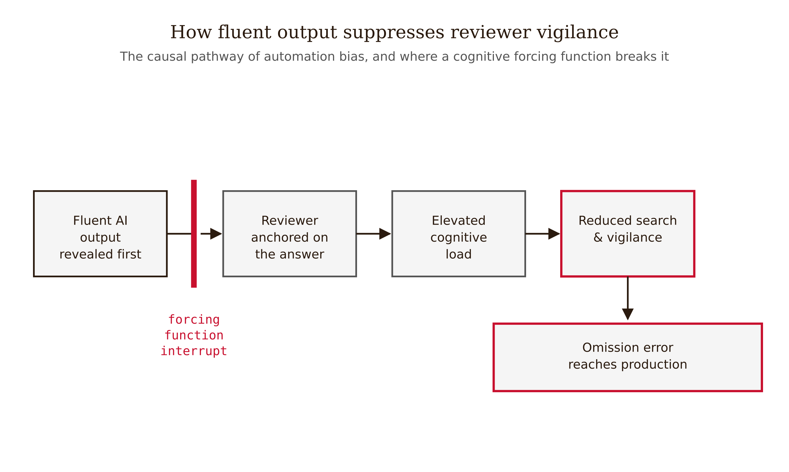
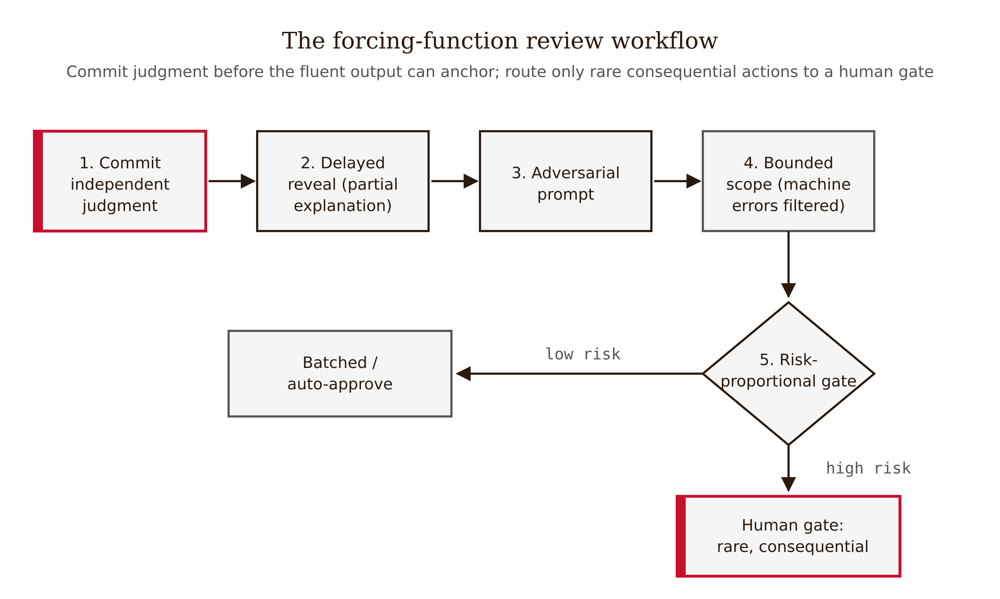
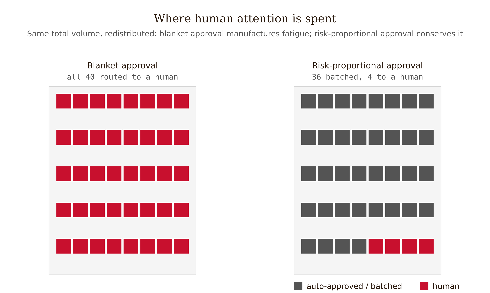
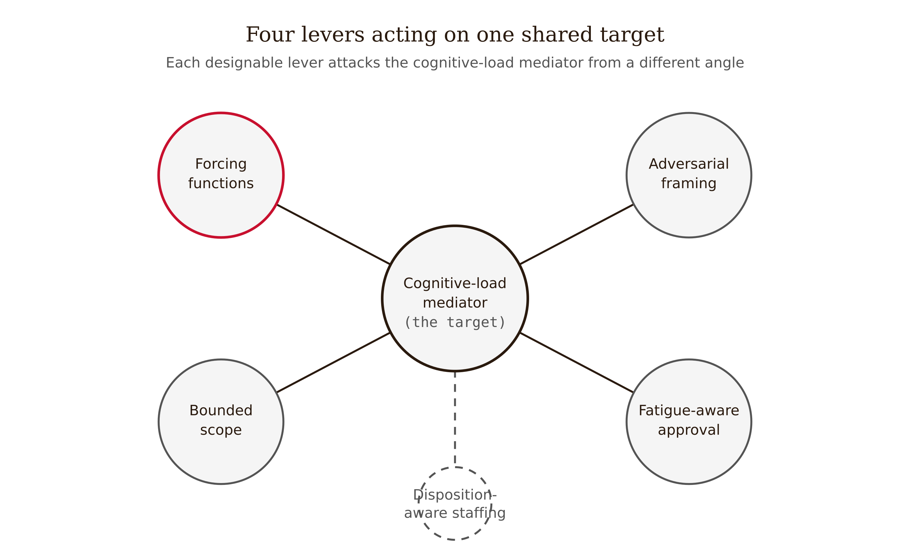

# Chapter 10 — Human Validation and Automation Bias

*The Layer of Last Resort Is the One Fluency Disables First — So Engineer It, Don't Trust It*

Consider a reviewer — the situation is a composite, the mechanism is real. They are the human-in-the-loop on an AI coding agent. The agent opens pull requests; the reviewer approves or rejects. Over a morning they review fifty PRs. Forty-nine are clean: the agent is good, the diffs are tidy, the code reads well, the tests pass. The reviewer approves them, and each approval is correct.

The fiftieth PR also reads well. The diff is tidy. The code is fluent — well-named variables, a sensible structure, a comment explaining the change. The reviewer approves it. It contains a logic error that flips a condition in an authorization check, and it ships.

Nothing about the reviewer was negligent in the ordinary sense. The problem is structural, and Lisanne Bainbridge named it in 1983 in "Ironies of Automation." When you automate the routine work and leave the human only the exceptions, you have stripped the human of exactly the practice and engagement that catching an exception *requires*. The reviewer who signs off on forty-nine good outputs is, by the fiftieth, in the worst possible state to catch the fiftieth: under-engaged, anchored on a history of correctness, reading fluent code that looks like the forty-nine clean ones *because it is fluent in the same way.* The skill of close reading atrophies precisely as the volume of "nothing to catch here" rises. The human is asked to intervene in the rare, high-stakes case for which monitoring — rather than authoring — has left them least prepared.

This is the inversion most engineers get backwards. The intuition is that *reviewing* is easier and safer than *authoring* — the work is done, you just check it. The human-factors literature says the opposite for fluent output: the reviewer of a fluent wrong answer is the *more* compromised position, not the less. The author had to construct the thing and confront every gap. The reviewer is handed a finished, confident, well-structured artifact and asked to find what is wrong with it — and the better it reads, the less scrutiny it draws.

That is **automation bias**, and this chapter is about why it is real, why you cannot fix it by telling people to be careful, and what you can build instead.

---

## What automation bias actually is

Automation bias is not a character flaw. It is a documented, replicable tendency to over-rely on automated decision support, reducing vigilance in seeking and processing information. It predates LLMs by decades — autopilots, clinical decision-support systems, GPS navigation. It comes in two error types:

*Figure 10.2 — Fluent output anchors the reviewer and raises cognitive load, producing omission errors a forcing function interrupts.*

**Omission error** — you miss something the automation did not flag. The authorization bug above is an omission error: the agent did not flag it, and the reviewer, trusting the agent's silence, did not look. Omission errors are the quiet ones; nothing alerts you that you missed anything.

**Commission error** — you act on a wrong automation recommendation, against evidence you had or could have obtained. Approving a migration the system recommended even though a check you could have run would have contradicted it.

The distinction matters for design because the two error types have different fixes. Omission errors are countered by forcing independent search: what did the automation *not* tell you? Commission errors are countered by forcing a check against an independent source before acting.

Now the load-bearing finding for this chapter. Lyell & Coiera's 2017 systematic review in JAMIA established that automation bias is associated with **cognitive load and task complexity** — and crucially, it is *not* merely a multitasking phenomenon, as the older literature had assumed. The heavier the verification task, the more the reviewer defaults to trusting the machine.

This is the sentence that turns a lament into an engineering discipline: **if cognitive load mediates the bias, then reducing cognitive load reduces the bias — and cognitive load is something you can design.** Bounding scope, decomposing claims, sending machine-catchable errors to the machine — these are not motivational posters. They are interventions on the variable Lyell & Coiera identified as the mediator. The bias is not fixed by finding better humans. It is addressed by engineering the conditions under which an ordinary human can exercise judgment.

<!-- → [FIGURE: Mechanism diagram — "Fluent AI output" → "High verification complexity" → "Cognitive load rises" → "Automation bias increases" → "Omission errors increase". A second arrow from "Cognitive load" shows the engineering lever: "Scope bounding / deterministic pre-filtering" → "Load decreases" → "Bias decreases". Caption: The Lyell & Coiera mediation chain, and where the design lever sits. Cognitive load is the designable variable; everything upstream of it is the problem, everything downstream is the consequence.] -->

---

## The two findings that break the obvious fixes

If telling people to be careful doesn't work, two reflexes follow: explain the AI's reasoning so the reviewer can judge it, and add friction so the reviewer has to engage. The evidence says both reflexes are at best half right — and one of them backfires.

### Cognitive forcing beats explainability — and reviewers hate it

Buçinca, Malaya & Gajos (2021, "To Trust or to Think") ran the comparison directly. They tested **cognitive forcing functions** — interventions that interrupt the reflexive acceptance of the AI answer — against the best **explainable-AI** interfaces. Three forcing functions: make the human commit a decision *before* seeing the AI suggestion; introduce a deliberate delay before the AI answer appears; let the human choose whether to see the AI at all.

The headline result: **cognitive forcing functions reduced overreliance more than the explainable-AI interventions did.** Explanations — the intuitive fix — were *worse* at reducing overreliance than simply forcing the human to engage before the AI could anchor them.

And the sting in the tail: **participants subjectively preferred the explanation interfaces and rated the cognitive-forcing interfaces as more effortful and less likable.** The intervention that *works* is the one reviewers *dislike.*

This has a direct design consequence. If the effective intervention is the disliked one, you cannot leave it to reviewer discretion — because given the choice, reviewers will route around friction and choose the comfortable interface that doesn't work. The forcing function has to be built into the *workflow*, removed from the individual's moment-to-moment choice, the same way you don't let individual developers opt out of CI.

A useful refinement from a 2025 follow-on (de Jong, Paananen, Tag & van Berkel, PACMHCI 9(2), Art. CSCW048, DOI 10.1145/3710946): *partial* explanations — withholding part of the reasoning so the human has to fill the gap — reduce overreliance more than the no-partial-explanation baseline, whereas explanations accepted wholesale tend to be rubber-stamped. Explanations are not useless; complete ones invite uncritical acceptance, and the value is in the engagement the gap forces, not the information the explanation supplies.

### Required corrections backfire; disposition dominates

Beck, Eckman, Kern & Kreuter (2025, "Bias in the Loop," arXiv:2509.08514, preprint) ran a randomized experiment with **N = 2,784**, manipulating AI suggestion quality, task burden, and financial incentives. Two findings go straight into design.

First: **individual attitude toward AI was the strongest predictor of performance — stronger than demographics or incentives.** AI-skeptics caught more errors. You cannot pay or instruct overreliance away; disposition dominates.

Second, and counterintuitive: **requiring corrections for flagged AI errors reduced engagement and increased acceptance of incorrect suggestions.** A friction that was meant to help — *you must justify any correction* — instead induced more rubber-stamping. Not every friction recruits engagement; the wrong friction trains the reviewer to take the path of least resistance, which is to accept.

<!-- → [TABLE: Two friction types compared — columns: Friction type, Study, What it does, Effect on overreliance; rows: Decide-before-seeing (Buçinca 2021 / forces independent judgment before anchoring / reduces overreliance), Mandatory delay (Buçinca 2021 / interrupts reflexive acceptance / reduces overreliance), Required correction justification (Beck 2025 / adds cost to disagreement / increases acceptance of wrong suggestions). Caption: Not all friction is the same. The first two force engagement *with the content*; the third adds cost to *disagreeing*, which is the wrong target. Guardrail design that assumes friction equals scrutiny will produce the Beck result.] -->

Hold these together with the load-mediation finding and you get the chapter's stance: the bias is real and load-mediated; explanations under-perform forcing functions; incentives don't help; disposition does; and friction cuts both ways. None of this is fixed by better intentions. All of it is addressable by design.

---

## Four levers for engineering the human layer

Frame the mitigations not as virtues but as four designable levers, each mapped to a cited mechanism.

*Figure 10.1 — The forcing-function workflow sequences five interventions before a risk-proportional approval gate.*

**Lever 1 — Cognitive forcing functions.** Build the interruption into the workflow. The validated forms: (a) *decide-before-seeing* — the reviewer commits an independent judgment *before* the AI output is revealed, defeating anchoring directly; (b) *mandatory delay* before the AI answer appears; (c) *hide-by-default* — the human chooses to reveal the AI rather than being handed it. Use partial rather than full explanations so the gap forces engagement. *Mechanism:* recruit active processing before the fluent answer can anchor. *Design rule:* remove it from reviewer discretion — they will not voluntarily choose the friction that works.

**Lever 2 — Adversarial framing.** Replace the confirmatory prompt with an adversarial one. "Is this correct?" invites the omission error — it primes the reviewer to look for confirmation and stop. "What are the three strongest reasons this is wrong?" or "find the bug; there is one" recruits the engagement the forcing-function literature shows is the active ingredient. *Mechanism:* a confirmatory frame searches for agreement; an adversarial frame searches for failure. *Honesty note:* adversarial framing is a well-motivated design hypothesis grounded in the same engagement mechanism Buçinca validated, not a separately RCT-confirmed result. `[verify]` as direct evidence appears.

**Lever 3 — Bounded scope.** This lever targets the mediator Lyell & Coiera identified directly. Small diffs, not large ones. Decomposed claims, not whole documents. One decision at a time, not a batch. *Mechanism:* automation bias rises with cognitive load and verification complexity; bounding scope lowers the load, which lowers the bias. A 400-line diff is not reviewed; it is skimmed and approved. A 20-line diff can actually be read. Combine this with Chapter 2's deterministic floor: send IDE-catchable and rule-catchable errors to the linter, the compiler, the test suite — not to the human. Do not spend scarce human attention on what a machine catches reliably; reserve it for what only a human can.

**Lever 4 — Fatigue-aware approval design.** The opening scenario at scale: an agent emitting dozens of approval prompts an hour converts human-in-the-loop into performative rubber-stamping. The decades-old analogue is **alert fatigue** in security operations, where true-positive detection collapses as alert volume rises regardless of analyst skill. The design principle, importable directly: human-in-the-loop works when decisions are rare and consequential; it fails when they are frequent and varied. Make approvals *risk-proportional* — auto-approve or batch the benign and low-risk (gated by deterministic checks), and surface to the human *only* the rare, consequential, irreversible actions. Blanket approval on everything is worse than no approval gate, because it manufactures the fatigue that guarantees the rubber stamp.

*Figure 10.4 — Risk-proportional approval auto-approves the benign and surfaces only the few consequential actions to a human.*

A fifth, organizational lever follows from Beck et al.: **disposition-aware staffing.** Since AI-skepticism predicts error-catching better than incentives do, staffing skeptics on high-stakes review is a real lever — with the open caveat that we do not know whether a skeptic stays skeptical after two hundred good outputs. Bainbridge predicts the vigilance decays.

*Figure 10.3 — Four levers plus an inferred staffing lever all act on the shared cognitive-load target.*

<!-- → [FIGURE: Two-workflow comparison — "Naive HITL / overreliance path": AI output shown first (full, fluent) → single "Approve?" button → reviewer accepts. Annotation: every condition for automation bias present. "Forcing-function workflow": (1) reviewer commits independent judgment before AI output revealed; (2) output revealed after deliberate delay, partial explanation only; (3) adversarial prompt displayed; (4) scope bounded, machine-catchable errors pre-filtered; (5) risk-proportional gate — benign actions batched, only rare-and-consequential surfaces to human. Caption: The naive workflow maximizes anchoring, omission errors, and fatigue. The forcing-function workflow removes reviewer discretion over the friction that works.] -->

James Reason's Swiss-cheese model ties this to the rest of the book. Each validation layer — deterministic checks, tests, LLM-judge, PRM, human review — is a slice with holes. An accident happens when the holes align: a fluent-but-wrong output the deterministic floor does not cover, the tests do not exercise, the judge rates highly, the PRM cannot help, and the human approves. The four levers shrink the hole in the *last* slice. The honest point of the model is that the hole never closes.

---

## What the engineered human layer still cannot do

Even a workflow with all four levers does not make the human a reliable backstop. It makes the human a *better-conditioned* backstop than the naive one. The residual risk is real and must be named.

**Forcing functions may not survive production.** Buçinca et al. is a controlled study; whether decide-first and mandatory-delay workflows hold up under real deadline pressure — or get quietly routed around the first time a release is late — is open. A forcing function the organization tolerates only until it is inconvenient is not a control.

**Skill atrophy is on a timer.** Bainbridge's irony applies here too: the reviewer's own competence decays as they monitor rather than author. A perfectly designed workflow staffed by reviewers whose close-reading skill has atrophied is still exposed. The decay timeline in AI-assisted engineering is unmeasured.

**The magnitude of the review penalty is under-measured.** The *direction* is well-supported — reviewing fluent AI output degrades error detection relative to independent work, on the cognitive-load mechanism (Lyell & Coiera) and the disposition findings (Beck et al.). A clean, peer-reviewed effect size for code and prose is not established. A widely-circulated figure of "27% more issues missed, Cohen's d = 0.62, Wang et al. 2024" could not be traced to any primary source — no venue, no DOI, no arXiv ID. The specifics appear only inside LLM-generated summaries, which is precisely the kind of confabulation this book treats as a warning. The direction stands on the verified sources. The number does not.

So the chapter's contribution to the book's thesis, stated plainly: **the human layer is not a reliable backstop by default; it must be engineered against a known, measured cognitive failure mode — and even engineered, it carries a residual risk that someone must explicitly own.** This is the layer where the book stops trusting "a human will catch it" and starts specifying the conditions under which a human *plausibly can*. It is not the layer where the problem is solved.

---

## What would change my mind

A robust, replicated demonstration that in realistic production conditions — real deadlines, real volume, not a controlled lab task — a naive human-in-the-loop review catches fluent-but-wrong AI output at a rate indistinguishable from an engineered forcing-function workflow. The chapter's claim is that automation bias is real, load-mediated, and unfixable by exhortation, so the human layer must be engineered. If it turned out that ordinary motivated reviewers under production conditions caught errors just as well without forcing functions — that the lab effects of Buçinca and the disposition effects of Beck did not survive contact with real work — then the four-lever design would drop from *necessary* to *nice-to-have*, and "engineer the human layer" would soften to "engineer it where you can measure that naive review is failing." The direction would still hold; the prescriptive force would not.

---

## Still puzzling

The magnitude of the review penalty is a genuine, citable gap. The direction is well-supported; a clean peer-reviewed effect size for reviewing AI code or prose versus independent work is not established, and the unverifiable "27%" figure should not fill that gap.

Whether forcing functions survive production is open. Lab results are clear; whether decide-first and mandatory-delay workflows hold under deadline pressure or get routed around is unanswered, and a forcing function that is tolerated only until inconvenient is not a control.

Whether the skeptic stays skeptical is unmeasured. Beck et al. show disposition predicts error-catching, suggesting a staffing lever. Bainbridge predicts the skeptic's vigilance — like the author's close-reading skill — decays after enough monitoring. The decay timeline is unknown.

Why required corrections backfired is not fully understood. Is mandatory friction reliably disengaging, or is it task-specific? This matters because much guardrail design assumes friction equals scrutiny, and Beck et al. is one strong but single preprint against that assumption.

---

## LLM Exercises

1. **(Analyze)** Take this workflow verbatim: *"The agent proposes a database migration, shows the full SQL and an explanation of what it does, and the on-call engineer clicks Approve. We approve about 40 migrations a shift."* (a) Identify every condition for automation bias present. (b) Classify the most likely error type — omission or commission — and justify. (c) Name which of the four levers is most violated and why.

2. **(Evaluate)** A team, worried about rubber-stamping, proposes: *"To approve an AI suggestion, the reviewer must type a one-sentence justification for every approval."* Using Beck et al. (2025), predict whether this increases scrutiny or backfires, and explain the mechanism. Then propose a different friction, grounded in Buçinca et al., that is more likely to recruit engagement, and say why the difference matters.

3. **(Create — produce something)** Design a review protocol for a specific setting of your choice — AI-generated code PRs, AI-drafted clinical summaries, or AI-proposed financial transactions. Produce: a step-by-step workflow instantiating all four levers; for each lever, the cited mechanism and the cognitive-load variable it targets; the risk-proportional approval policy (what auto-approves, what batches, what surfaces to a human); and a one-paragraph statement of the residual risk the protocol cannot remove and who owns it.

4. **(Evaluate)** A vendor claims their explainable-AI dashboard "reduces reviewer error by showing the model's full reasoning for every decision." Using Buçinca et al. (2021) and the partial-explanation follow-on, state what is right and what is likely wrong about this claim, and what single change to the interface you would predict reduces overreliance more.

5. **(Analyze)** Map a realistic ship-the-wrong-output trajectory onto James Reason's Swiss-cheese model for a pipeline of: deterministic checks → automated tests → LLM-judge → PRM → human review. Name a specific hole in each slice and describe the single output that slips through all five, ending at an approved, fluent, wrong result. Then say which one lever from the four would most shrink the final hole.

---

## References

- Bainbridge, L. (1983). [Ironies of Automation](https://doi.org/10.1016/0005-1098(83)90046-8). *Automatica* 19(6): 775–779. DOI:10.1016/0005-1098(83)90046-8. (Automating the routine strands the human with the un-practiced exceptions.)
- Lyell, D., & Coiera, E. (2017). [Automation bias and verification complexity: a systematic review](https://doi.org/10.1093/jamia/ocw105). *Journal of the American Medical Informatics Association* 24(2): 423–431. DOI:10.1093/jamia/ocw105. (Automation bias is mediated by cognitive load and verification complexity — the designable lever.)
- Buçinca, Z., Malaya, M. B., & Gajos, K. Z. (2021). [To Trust or to Think: Cognitive Forcing Functions Can Reduce Overreliance on AI in AI-Assisted Decision-Making](https://doi.org/10.1145/3449287). *Proceedings of the ACM on Human-Computer Interaction* 5(CSCW1), Art. 188. DOI:10.1145/3449287. arXiv:2102.09692. (Cognitive forcing > explainability for reducing overreliance; reviewers dislike the forcing interfaces.)
- de Jong, J., Paananen, V., Tag, B., & van Berkel, N. (2025). [Cognitive Forcing for Better Decision-Making: Reducing Overreliance on AI Systems Through Partial Explanations](https://doi.org/10.1145/3710946). *Proceedings of the ACM on Human-Computer Interaction* 9(2), Art. CSCW048. DOI:10.1145/3710946. (Partial explanations reduce overreliance more than the baseline.)
- Beck, J., Eckman, S., Kern, C., & Kreuter, F. (2025). [Bias in the Loop: How Humans Evaluate AI-Generated Suggestions](https://arxiv.org/abs/2509.08514). arXiv:2509.08514. **Preprint.** (N=2,784; disposition predicts error-catching better than incentives; required corrections backfired into more acceptance of wrong suggestions.)
- Reason, J. (1990). *Human Error.* Cambridge University Press. (The Swiss-cheese model of organizational accidents — layered defenses, aligning holes.)
- Parasuraman, R., & Manzey, D. H. (2010). [Complacency and Bias in Human Use of Automation](https://doi.org/10.1177/0018720810376055). *Human Factors* 52(3): 381–410. `[verify]` (Omission/commission distinction; empirical study of automation bias.)
- "Alert Fatigue in Security Operations Centres" (2025). *ACM Computing Surveys.* DOI:10.1145/3723158. `[verify]` (True-positive detection collapses as alert volume rises — the analogue for approval fatigue.)
- **Unverified — do not cite as fact:** the widely-circulated "27% more issues missed reviewing AI vs independent (Wang et al. 2024, Cohen's d = 0.62)" figure has no traceable primary source and is likely confabulated. The direction is carried by Lyell & Coiera (2017) and Beck et al. (2025).
