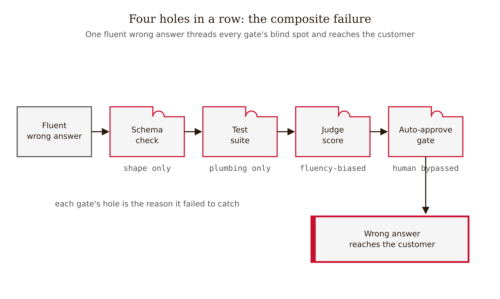
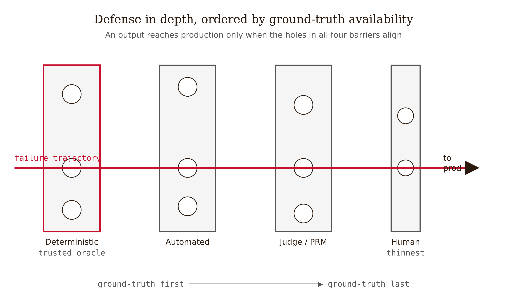
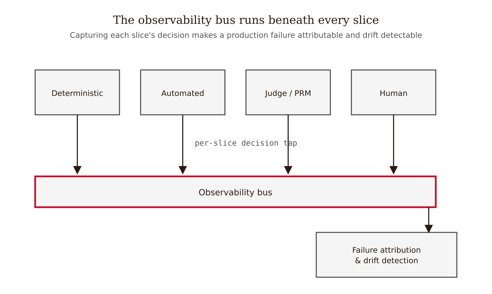
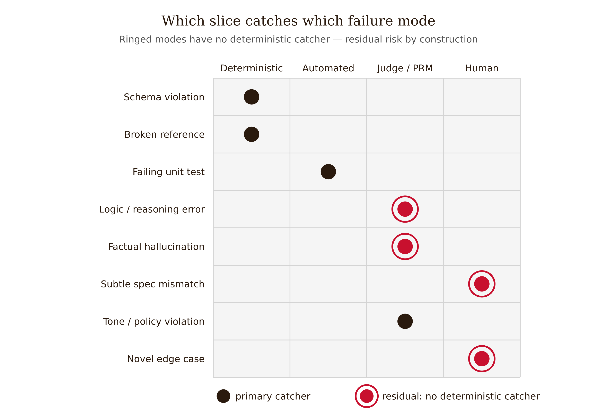

# Chapter 11 — Building a Validation Pipeline

*A validation pipeline is a Swiss-cheese stack: name each slice's holes, and the trajectory where they align*

Here is a team that did everything right and still shipped the wrong answer.

They had a schema validator on the response object. They had a test suite in CI. They had an LLM-as-judge scoring every answer for helpfulness, gated at 0.8. They had a human review queue. Four layers — a textbook defense-in-depth. The team was proud of it.

A customer asked a billing question. The model produced a fluent, well-structured answer citing a real document in the corpus. The schema validator passed: the response object was well-formed, every required field present. The test suite passed: it tested the pipeline's plumbing — that retrieval ran, that the judge was called — not the truth of any particular answer. The LLM judge scored it 0.86 for helpfulness: the answer *was* helpful-sounding, confident, and on-topic. The human queue never saw it, because answers scoring above 0.8 auto-approved to keep the queue manageable. The answer went to the customer. It was wrong: the cited document existed, but it described the *old* refund policy, and the model's claim was not supported by the span it pointed at. The customer acted on it. The error surfaced as a complaint two weeks later.

Walk the failure through the slices. The schema slice has a hole the size of every semantic error — it certifies shape, never truth (Chapter 2). The test slice tested the spec of the plumbing, not the intent of the answer (Chapter 3). The judge shared the generator's blind spot — it had no more access to ground truth than the generator did (Chapter 8). The human slice was real but had been routed *around* by an auto-approve threshold tuned for throughput (Chapter 10). Four slices, four holes, and the holes lined up.

*Figure 11.4 — One fluent wrong answer threading four gate holes in a row to the customer.*

This is James Reason's Swiss-cheese model, in software form, and it is exactly what this chapter teaches you to design against.

<!-- → [FIGURE: Swiss-cheese accident diagram — four slices labeled Schema, Tests, Judge, Human; each slice has holes; a trajectory arrow passes through all four holes simultaneously; caption: "A failure reaches production only when the holes in every slice happen to align. The §11.1 failure threaded all four."] -->

---

## The ordering rule: ground truth first

The slices do not go in a random order. The book's thesis dictates the order: **validation works where ground truth is mechanically available and fails where it isn't.** So put the slices that *have* mechanical ground truth first — they are the only ones that are actually reliable, and they are also the cheapest. Put the slices that lack ground truth (LLM-judge, PRM, human) last, where they handle the residual cases the reliable layers could not reach.

*Figure 11.1 — The layered validation pipeline as a Swiss-cheese stack ordered by ground-truth availability.*

The canonical ordering:

**1. Deterministic.** Compiler, typechecker, schema validator (Pydantic/Zod/JSON Schema), linter, SAST, dependency scanner, citation-existence check. These have an unambiguous oracle and zero judgment (Chapter 2). They are the *only* slices whose pass/fail is fully trustworthy. First and cheapest.

**2. Automated.** Unit tests hardened with mutation testing, claim-support and entailment checks for factual output, runtime guardrails, and a versioned eval-harness gate in CI (EleutherAI `lm-evaluation-harness`, Promptfoo, Ragas, DeepEval). These have *partial* ground truth — a test encodes a spec, an entailment check encodes a heuristic — reliable within their scope, blind outside it.

**3. Judge / PRM.** LLM-as-judge for screening and ranking (Chapter 8); step-level PRMs where the domain is formal enough that "correct step" is labelable (Chapter 9). These have no independent ground truth; they are a model's opinion. Use them to triage, never as the sole gate on anything consequential.

**4. Human.** Review engineered with cognitive forcing functions, adversarial framing, bounded scope, and risk-proportional approval (Chapter 10). The human is the last oracle — and Lisanne Bainbridge's "Ironies of Automation" (1983) tells you why this slice is thin and goes last: the human is asked to catch exactly the residual cases the automation could not, the hardest ones, while being de-skilled by not seeing the routine cases. The human slice is a real defense only if you design it to be.
<!-- FACT-CHECK FLAG: CONTRADICTED — see factchecks/11-building-a-validation-pipeline-assertions.md (the author of "Ironies of Automation," 1983, is LISANNE Bainbridge, not "Lucy". Correct the first name.) -->

W. Edwards Deming's quality dictum sharpens the stakes: *cease dependence on inspection to achieve quality; build it in.* The deterministic and automated slices build it in. The human slice is inspection at the end, the weakest form of quality control. The §11.1 failure was exactly this: a team that leaned on a final-inspection slice it had quietly automated away. You cannot inspect correctness into a fundamentally ungrounded output — which is why the residual-risk box never fully closes.

More layers is not more safety. A stack of four model-based and human slices can share one giant hole — the same blind spot the generator has — and catch nothing the generator got wrong. Reliability comes from the deterministic slices having ground truth, not from the slice count. Count oracles, not layers.

<!-- → [INFOGRAPHIC: Ordered validation stack — four rows labeled Deterministic, Automated, Judge/PRM, Human; each row shows: example tools/checks, ground-truth availability (full/partial/none/human), and what it catches vs. what its hole is; ordering rule stated below as: "Ground truth descends from full to none — that is the only ordering that makes the stack reliable"] -->

---

## The observability bus: making failure attributable

Walter Shewhart, inventing statistical process control in the 1920s, insisted you build quality into the process and *watch the process over time* — detect drift, distinguish common-cause variation (inherent noise) from special-cause variation (a real change demanding action). A validation pipeline needs the same nervous system, and without it the failure-mode-to-layer mapping is aspirational rather than operational.

*Figure 11.3 — The observability bus runs beneath every slice, making failure attributable and drift detectable.*

Run an **observability bus** underneath every slice — trace and eval logging that records, for each output, which slice saw it, what each slice decided, and where it exited. The stack for this is LangSmith, Langfuse, or Arize Phoenix; the OpenTelemetry GenAI semantic conventions are the emerging standard, still settling as of this writing. The bus does two jobs.

**Attribution.** When a wrong output reaches production, you can replay its trajectory and see *which slice's hole it passed through*. Was it the schema (so the error is semantic — push a harder check down to the automated slice)? The entailment check (tune the threshold)? Or the auto-approve threshold — a human-slice config that quietly routed around the defense, as in §11.1? If you cannot attribute a failure to a slice, you cannot fix the slice, and your next "fix" is a guess.

**Drift detection.** Treat the CI eval pass-rate as a Shewhart control chart. A pass-rate that wobbles within its historical band is common-cause variation — leave it alone. A pass-rate that steps down after a prompt change, a model upgrade, or a corpus update is special-cause variation — it signals a real regression and demands a specific process change, not a shrug.

The eval slice belongs *in CI*, gating every change against a **versioned eval set**, the same way you gate on unit tests. A green eval on an unversioned, possibly contaminated set is a number you cannot trust. A green eval on a versioned, held-out set, watched over time, is a defense. The shift in the field has been exactly this: from "evaluate the model once at selection time" to "continuously gate every change with a versioned eval set and trace every production output." The pipeline without this nervous system is not observable, which means it is not maintainable.

---

## The failure-mode matrix

This is the chapter's central deliverable. Take a named failure mode and place it at the slice that catches it. The act of placing is the lesson — it forces you to answer, for each failure, *which slice has an oracle for this?*

*Figure 11.2 — Eight failure modes mapped to four catching slices, with four residual-by-construction modes ringed.*

Before reading the table, try it yourself. Eight modes: fluency-as-proxy, tests-that-don't-test, RAG retrieval error, self-eval loops, security regression, approval fatigue, benchmark contamination, judge circularity. For each, ask which slice has a real oracle. Then check.

<!-- → [TABLE: Failure-mode catching-layer matrix — columns: Failure mode, What it is, Primary catching slice, Residual?; eight rows as described in the prose below; Residual column shows Yes/Partial/No; the four Yes rows are visually distinguished] -->

**Fluency-as-proxy.** Reviewer treats well-formed output as correct output (Chapter 1). Primary catcher: the human slice — but only if engineered with cognitive forcing functions. Deterministic slices are *immune* because they never read fluency. Residual: **Yes** — the only catcher is human.

**Tests-that-don't-test.** Tests pass but validate the spec or implementation, not intent; an AI may test its own wrong behavior (Chapter 3). Primary catcher: the automated slice, hardened with mutation testing and human spec review. Residual: **Partial**.

**RAG retrieval error.** The citation exists but does not support the claim — hallucination shifted into retrieval error (Chapter 4). Primary catcher: citation-existence check (deterministic) plus claim-support/entailment (automated). Residual: **Partial** — subtle wrong paraphrase slips both.

**Self-eval loops.** Model critiques or corrects itself with no external ground truth, degrading or entrenching errors (Chapters 5, 8). Primary catcher: ground the loop externally — execution, proof, retrieval (Chapters 2, 5). Never the model judging itself unaided. Residual: **No**, if grounding exists.

**Security regression.** Iterative LLM "improvement" introduces vulnerabilities. Primary catcher: deterministic SAST plus dependency scan in CI, on *every* iteration — not just at first build. Residual: **No**.

**Approval fatigue.** High-volume approval prompts collapse human detection into rubber-stamping (Chapter 10). Primary catcher: redesign the human slice — risk-proportional gating, rare and consequential only, auto-approve only what the deterministic slices already cleared. Residual: **Yes** — degrades the only catcher.

**Benchmark contamination.** The eval set has leaked into training; a green CI eval is meaningless. Primary catcher: held-out and freshly-authored private evals, contamination probes, versioned sets. Residual: **Yes** — no settled detection standard.

**Judge circularity.** LLM judge shares the generator's blind spots; validates fluency, not correctness (Chapter 8). Primary catcher: use the judge for screening only, paired with deterministic ground truth where available. Residual: **Yes** — no independent oracle.

Read the residual column carefully, because it is the most important column. Four of the eight have a deterministic or automated catcher with a real oracle — you can engineer those down hard. But **fluency-as-proxy, approval fatigue, benchmark contamination, and judge circularity** have no deterministic catcher at all. Their only line of defense is a model-based slice (which shares the failure) or a human slice (which fatigue and automation bias degrade). These four are residual risk by construction. You can mitigate them — engineer the human slice, version and freshen the eval set, use judges only for screening — but you cannot make them disappear, because there is no oracle to appeal to. That absence is the scalable-oversight gap, seen from the pipeline side.

A matrix with no "residual" flags is a matrix lying to you.

---

## Two worked pipelines, each ending on what it cannot certify

Abstract architecture teaches less than two pipelines built end-to-end. Both are labeled as design exercises, not descriptions of shipped products. Each ends on its residual risk, because that is the honesty this chapter requires.

### Pipeline A — a customer-facing RAG product

Output types: factual claims (dominant), structured citations, light reasoning. Risk profile: medium-high (wrong answers reach customers; reputational and occasional compliance exposure).

**Slice 1 — Deterministic.** JSON-schema-validate the response envelope. Reject malformed responses before anything downstream runs. Catches: shape errors, missing-citation responses. Hole: everything semantic.

**Slice 2 — Deterministic, still.** Citation-existence check — every cited document ID must resolve to a real chunk in the corpus. This is a lookup, not a judgment; it belongs in the deterministic slice. Catches: fabricated citations (the legal-brief failure from Chapter 4). Hole: a real citation that does not support the claim.

**Slice 3 — Automated.** Claim-support/grounding: decompose the answer into claims, verify each is entailed by its cited span (Ragas-style retrieval metrics or an entailment heuristic). Catches: unsupported claims, retrieval-error answers. Hole: subtle wrong paraphrase, correct-but-incomplete answers. Note: this slice *shifts* hallucination into retrieval error rather than eliminating it.

**Slice 4 — Judge/PRM.** An LLM-as-judge flags low-confidence or likely-unhelpful answers for human review — screening only, never the sole gate (circularity, self-preference bias). Catches: gross quality misses at scale. Hole: shared-failure-mode errors where judge and generator are wrong the same way.

**Slice 5 — Human, risk-gated.** Answers in compliance-sensitive categories (refunds, legal-adjacent, medical-adjacent) route to a human with a cognitive-forcing checklist and bounded scope. Catches: high-stakes semantic errors. Hole: whatever the automation-biased or fatigued reviewer waves through.

**Residual / cannot-certify:** This pipeline cannot certify that a schema-valid, well-cited, entailment-passing, judge-approved answer is *actually right and complete* in a category no human reviewed. The §11.1 failure lives precisely in that gap — citation existed, but supported the old policy. Whoever sets the auto-approve threshold owns this residual risk, and the honest move is to make that threshold a named, signed decision, not a throughput knob.

### Pipeline B — an agentic code pipeline

Output types: generated code, agentic task trajectories, structured tool calls. Risk profile: high where actions are irreversible (force-push, deploy, data migration).

**Slice 1 — Deterministic.** Compiler and typechecker on every change. Catches: type errors, syntactic breakage. Hole: logic that compiles and is wrong.

**Slice 2 — Automated.** Unit tests hardened with mutation testing, plus SAST and dependency scan on *every iteration* — not just at first build. This is the explicit defense against security regression: never let a refinement loop run without re-scanning. Catches: spec violations the tests encode, introduced vulnerabilities. Hole: tests that validate the spec, not whether the spec was right (tests-that-don't-test).

**Slice 3 — Judge/PRM.** Optional: a PRM or LLM-judge on the trajectory for screening (Chapters 7, 9). Screening only. Hole: same circularity.

**Slice 4 — Human plus checkpoint.** Trajectory and scope checks with a checkpoint before any irreversible action (Chapter 7), and a human gate on the *diff* — not the whole session — with bounded scope (Chapter 10). Catches: scope violations, destructive actions before they fire. Hole: a subtly wrong but plausible plan the reviewer waves through.

**Residual / cannot-certify:** This pipeline cannot certify that the agent's *plan* was sound or that the *spec the tests encode was the right spec.* Compiler, tests, and SAST certify the code does what the tests say; none certify that what the tests say is what was wanted. That spec-vs-intent gap, plus trajectory correctness on long horizons, is the residual the human diff-reviewer owns — and it is the cell no current method closes.

A complete pipeline is not one with no gaps. It is one whose gaps are *named and owned.* The residual-risk statement — what no slice catches, and who owns it — is not an admission of failure but the most important line in the design. A pipeline without it is hiding its holes, which is how the holes align.

---

## LLM Exercises

**Exercise 11.1 (Understand/Analyze).** Take the §11.1 composite pipeline. For each of the four slices (schema, tests, judge, human), name the specific *hole* the wrong answer passed through, citing the home chapter for the mechanism. Then state the single change that would have most cheaply blocked the trajectory, and which slice it belongs in. Defend why your change goes in *that* slice and not a later one.

**Exercise 11.2 (Analyze).** Here is the failure-mode list with the catching-layer column blanked: fluency-as-proxy, tests-that-don't-test, RAG retrieval error, self-eval loops, security regression, approval fatigue, benchmark contamination, judge circularity. Without looking back at the matrix above, place each at its primary catching slice (Deterministic / Automated / Judge-PRM / Human) and mark which have no deterministic catcher. Then check against the keyed table and explain any disagreement — the disagreements are where your model of "what has ground truth" is still fuzzy.

**Exercise 11.3 (Create).** Design a layered validation pipeline for one output type you actually work with. Produce: (a) the ordered slice list, deterministic-first, with the specific tool or check in each slice; (b) a catch/miss line for every slice; (c) the failure-mode matrix restricted to the modes that apply to your output type, with residual flags; (d) an explicit residual-risk / cannot-certify statement naming a human owner. Mark the deliverable incomplete if it lacks (d).

**Exercise 11.4 (Evaluate).** You inherit a pipeline with five model-based slices (generator, two judges, an agentic-judge, a PRM) and one deterministic slice (a schema check). Using the Swiss-cheese and judge-circularity arguments, assess whether this stack is more or less reliable than a two-slice stack (compiler plus one human gate) for validating generated code. State what observability you would add first to find out empirically, and what a Shewhart drift signal on the eval pass-rate would tell you that the current stack cannot.
