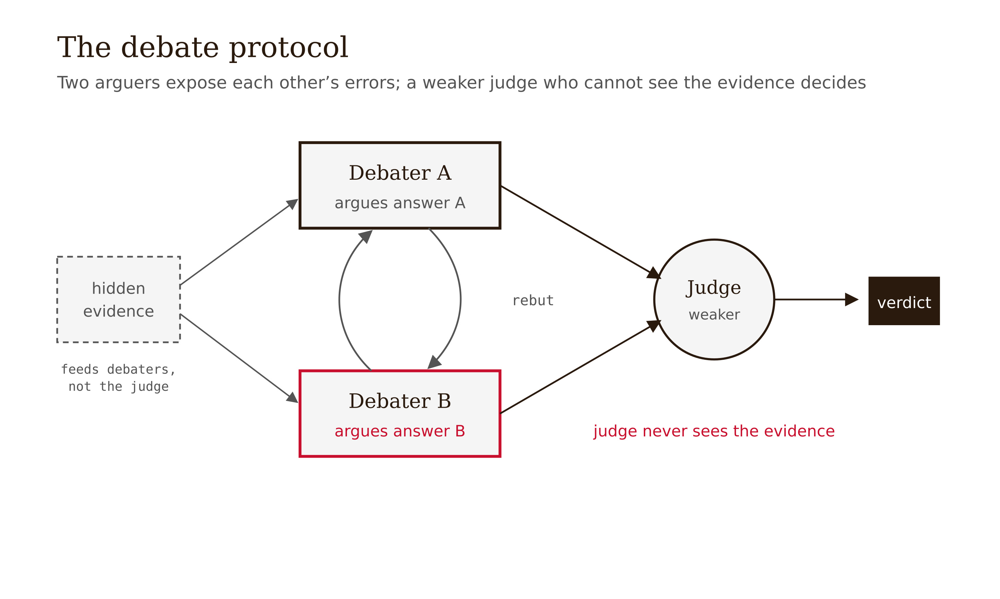

# Chapter 12 — Scalable Oversight: The Unsolved Problem

*When the human is the oracle and the human is being outrun*

---

You are a strong engineer, and a model hands you a 2,000-line change to a concurrency-sensitive subsystem. It compiles. The tests pass — but the tests were written against the spec, and the spec is what you are unsure about. SAST is clean. The change is plausible end to end: every function reads sensibly, the commit message is lucid, the reasoning in the PR description is articulate. You sit down to review it, and somewhere around line 600 you realize the honest truth: you cannot fully trace this. Verifying it from scratch would take longer than writing it did, and the model writes faster than you read. You could spot-check. You could trust the green CI. You could ask the model to explain itself — and it will, fluently, whether or not it is right (Chapter 8).

This is the scalable-oversight situation in one scene. Notice what is *gone*. In every prior chapter you had an oracle the model could not fake: the compiler does not care how lucid the code looks; the citation either resolves to a real chunk or it does not; the proof checker accepts or rejects. Here, the deterministic slices have done their job and run out. What remains — *is this change actually correct? is the plan sound? is the spec the right spec?* — has no mechanical oracle. The only oracle left is you, and the thing you are checking was produced by a process you cannot keep pace with. That gap is not a tooling deficiency you can patch. It is the structural problem this chapter is about, and it gets worse, not better, as models improve.

The temptation is to let fluency stand in for correctness — to approve because it *reads* right. The whole book has been a campaign against exactly that substitution. This chapter is where the campaign meets the case it cannot win with the tools it has, and says so.

---

## The problem, stated stably

Strip away the current state of research and the problem itself is simple and durable. Amodei, Olah, Steinhardt, Christiano, Schulman, and Mané named it in 2016 ("Concrete Problems in AI Safety," arXiv:1606.06565) as **scalable supervision**: situations where "the true objective function is too expensive to evaluate frequently," so the system must behave well given only limited access to the thing you actually care about. The now-dominant rephrasing (Bowman et al. 2022) is **scalable oversight**: how does a *weaker* overseer reliably judge a *stronger* system?

The key reframing — the one the chapter insists on — is that this is a **supervision-cost** problem, not a capability problem. The model is not failing to be smart enough. The *overseer* is failing to afford the evaluation. As capability rises, the cost (and eventually the feasibility) of a human directly checking a given output rises with it. At some point the cost crosses the budget, and direct human verification is no longer available. Scalable oversight is the search for methods that hold reliability past that crossing point.

*Figure 12.1 — The verification-cost curve crossing the fixed overseer budget as capability rises.*

Bowman et al.'s contribution was to make this measurable *now*, before genuinely superhuman systems exist, with **sandwiching**: study tasks where human *specialists* succeed but unaided *non-experts* and current *models* both fail. The non-expert stands in for "the weak overseer"; the specialist's answer is the ground truth you check against. Their proof-of-concept on MMLU and QuALITY found that non-experts interacting with an unreliable model assistant outperformed both the model alone and their own unaided performance — early evidence that oversight is tractable to study. The headline is a proof of concept, **not** a demonstration on genuinely superhuman output. Keep that line bright.

Kenneth Arrow saw the shape of this decades earlier in economics. The **principal–agent problem** — a principal must direct and judge an agent who knows more than the principal does, under information asymmetry and moral hazard — is the scalable-oversight structure recast as a contract problem. Even a perfectly capable overseer faces an irreducible information gap. And underneath both sits Alan Turing's 1936 result that some questions about a computational process cannot be decided by any general procedure — the deepest ancestor of "you cannot, in general, verify the output of an arbitrarily powerful process." The reviewer facing un-auditable frontier output is living a practical shadow of undecidability.

One misconception to kill at the outset: "Scalable oversight is an AI-safety problem, not a validation problem." It is the same problem this entire book has circled, arriving at its limit. Every chapter said "validation works where ground truth is mechanically available." Scalable oversight is the regime where it *isn't* — where the only oracle is a human the system has outrun. It is the validation problem with the floor removed.

---

## Four partial answers, one shared assumption

The field has four candidate replacements for the failing human oracle. Each gets the same honest treatment: the hope, the best evidence, the breaking assumption.

*Figure 12.2 — Four partial oversight methods resting on one shared assumption: judging is easier than generating.*

### Debate

**The hope.** Have two AIs argue opposing answers; a weaker judge picks the more truthful one. Irving, Christiano, and Amodei (2018, "AI safety via debate," arXiv:1805.00899) give the theoretical engine: with optimal play and a polynomial-time judge, debate can in principle answer any question in PSPACE, whereas direct human judging reaches only NP. The intuition: judging an adversarial *exchange* — where each side can expose the other's errors — is easier than judging an answer cold. Crucial framing: the PSPACE result is an idealized argument about optimal play, **not** an empirical guarantee about real debaters.

*Figure 12.3 — The debate protocol: two arguers exchange rebuttals while a weaker judge with restricted view decides.*

**The best evidence.** Khan et al. (2024, "Debating with More Persuasive LLMs Leads to More Truthful Answers," arXiv:2402.06782, ICML 2024 Best Paper): on a reading-comprehension task where the judge cannot see the passage, debate between two expert LLMs let a non-expert judge reach higher accuracy than consultancy or direct QA — and optimizing debaters for persuasiveness increased judge accuracy (76% model-judge / 88% human-judge versus 48% / 60% naive baselines). This is the best single piece of positive evidence for debate.

**The breaking assumption.** It is one task family — extractive QA with a hidden passage — and "more persuasive → more truthful" held here but is not established to generalize. Kenton et al. (2024, "On scalable oversight with weak LLMs judging strong LLMs," arXiv:2407.04622, NeurIPS 2024) ran the careful, broad version — 9 tasks, ~5M generations — and found debate consistently beats consultancy but its advantage over plain direct QA is task-dependent, and debate does not uniformly help once the information asymmetry is removed. There is no reliable evidence debate scales to genuinely superhuman, open-ended output.

### Weak-to-strong generalization

**The hope.** Burns et al. (2023, "Weak-to-Strong Generalization," arXiv:2312.09390): a *weak* supervisor (GPT-2-level) labels data; a *strong* student (GPT-4-level) is finetuned on those imperfect labels. The student *generalizes beyond its weak supervisor*, and a simple auxiliary-confidence loss recovers close to GPT-3.5-level performance from a GPT-2-level supervisor. Framed as an empirical analogue of humans (weak) supervising superhuman models (strong).

**The breaking assumption.** The gap is only partially recovered; results are task-dependent; and the setup is an imperfect stand-in — it is not actually superhuman supervision. The assumption is that the strong model has *latent correct behavior* weak supervision can elicit. If the correct behavior isn't latent, there is nothing to elicit.

### Task decomposition and recursive reward modeling

**The hope.** Leike et al. (2018, "Scalable agent alignment via reward modeling," arXiv:1811.07871): learn a reward model from human feedback, then use AI assistance to help humans evaluate *harder* tasks, recursively bootstrapping oversight of tasks humans cannot directly judge. Break a task you can't judge into sub-tasks you (or assisted humans) can, and compose.

**The breaking assumption.** Errors don't compound faster than recursion corrects them — unproven at scale. Some tasks don't cleanly decompose. And the recursion inherits the self-verification weakness at each level: every layer of the bootstrap is a model judging a model.

### Process Reward Models

**The hope.** Verify each intermediate step rather than the final answer (Chapter 9; Lightman et al. 2023). Where step-correctness is definable and labelable — math, formal proof, code — this is a real, partial answer that beats outcome-only supervision.

**The breaking assumption.** Outside formal domains, "correct step" is ambiguous or unlabelable. The frontier cases that most need oversight — novel scientific claims, long agentic plans — are exactly the ones where steps don't have a clean correctness label.

| Approach | Core idea | Key sources | Assumes | Where it breaks |
|---|---|---|---|---|
| **Debate** | Two AIs argue; a weaker judge picks the more truthful | Irving et al. 2018; Khan et al. 2024; Kenton et al. 2024 | Judging the exchange is easier than judging the answer | Beyond single-domain QA with information asymmetry; gains over plain QA are task-dependent |
| **Weak-to-strong** | Train a strong model on a weak supervisor's labels; hope it generalizes past the supervisor | Burns et al. 2023 | The strong model has latent correct behavior weak supervision can elicit | Only partial gap recovery; task-dependent; not actual superhuman supervision |
| **Decomposition / recursive reward modeling** | Break a task you can't judge into sub-tasks you can; bootstrap recursively | Leike et al. 2018; Bowman et al. 2022 | Errors don't compound faster than recursion corrects them | Compounding error over long horizons; recursion inherits self-verification weakness at each level |
| **PRMs** | Verify each step rather than the final answer | Lightman et al. 2023 (Ch. 9) | Step-correctness is definable and labelable | Outside formal/math/code, "correct step" is ambiguous |

**The single bar under all four columns:** every approach rests on *verification is easier than generation, recursively.* Knock that out and all four wobble at once.

Stechly & Kambhampati (2023, arXiv:2310.12397; 2024, arXiv:2402.08115) knock at it directly: on Graph Coloring, Game of 24, and STRIPS planning, LLM *self-critique* does not reliably improve answers and can cause *performance collapse* — the gains come only from a **sound external verifier.** When the verifier is the same fallible model, the assumption fails. Engels et al. (2025, "Scaling Laws For Scalable Oversight," arXiv:2504.18530, preprint, MIT) put a number on the degradation: nested oversight success drops **below ~52%** when overseeing a system ~400 Elo stronger, declining further as the gap grows. One study, a few games — a numerical *example*, not a validated law — but the direction is the sobering one.

*Figure 12.4 — Nested-oversight success declining as the capability gap widens, one study's example.*

A second misconception to kill: "Verification is always easier than generation — that's why we can check what we can't produce." True when there is a cheap external checker — an NP-style witness you can validate against an oracle. False, or at least contested, when the only available verifier is a fallible model judging another fallible model. The frontier is exactly where the cheap external checker runs out, which is exactly where the assumption you were relying on stops holding.

---

## The honest verdict, and refusing the two easy endings

The verdict the book commits to is **unsolved.** Not "unsolved for now, but the safety field is converging" — that is the hype ending, and the evidence does not support it: the positive results (Khan, Kenton, Burns) are all on tasks with an artificial information asymmetry or a known answer key, none on genuinely superhuman, open-ended output. And not "unsolvable, we are doomed" — that is the doom ending, and it is equally unearned: oversight is now measurable (Bowman's sandwiching), debate reliably beats consultancy (Kenton), assisted humans do outperform unaided ones in the studied cases, and recursion is being probed seriously. The honest position is between them, and it is uncomfortable: we can study the problem, we have promising partial mechanisms, and *none of them is validated for the case that matters* — a weaker overseer reliably judging a genuinely stronger system on open-ended output.

Douglas Engelbart's 1962 vision — that tools should *augment* human judgment rather than replace it — is the optimist's frame worth keeping next to Turing's limit. Bowman's result is Engelbart's vision partly vindicated: an imperfect assistant still extended the reach of a human verifier. The hope of scalable oversight is that an AI aide extends the human's reach faster than the gap it must cover widens. Turing's limit and Engels' Elo curve are the pessimist's reply: the gap may widen faster than any aide can cover. Which wins is not known. That is the calibrated discomfort this chapter is built to leave you in.

A final misconception to kill: "Either AI safety solves oversight or we're in trouble — pick a side." Both framings are unearned by the evidence. The stable problem is real, durable, and getting harder with the capability gap. The current results are promising, partial, single-domain, and will age. Treat anyone selling either certainty — solved, or doomed — as selling past the evidence.

---

## LLM Exercises

**Exercise 12.1 — Understand.** Explain, in your own words and without the word "smart," why scalable oversight is a *supervision-cost* problem rather than a capability problem. Then describe a sandwiching setup for a domain you know: name the specialist, the non-expert overseer, and the ground-truth source, and state what a positive result would and would not show.

**Exercise 12.2 — Evaluate.** Take debate. (a) State the PSPACE argument and explain precisely why it is *not* an empirical guarantee. (b) Summarize Khan et al.'s positive result *and* Kenton et al.'s mixed one, and explain how both can be true. (c) State the one experiment whose result would most change your confidence that debate scales to open-ended superhuman output.

**Exercise 12.3 — Evaluate, produce something.** Fill in the four-row table from this chapter *from memory* (approach / core idea / assumes / where it breaks), then write the single shared-assumption bar that sits under all four columns and cite the result that attacks it. Produce a one-paragraph verdict on whether combining the four approaches — debate plus decomposition plus PRM — would de-correlate their failure modes or share them. Defend your answer with the Chapter 8 circularity idea.

**Exercise 12.4 — Evaluate.** A vendor claims their system "uses debate and weak-to-strong generalization to safely oversee superhuman reasoning." Using only the dated, hedged evidence in this chapter, write the three sharpest questions you would ask before believing the claim, and state what answer to each would move you toward belief versus marketing.

---

## What would change my mind

A robust demonstration that any oversight method — debate, weak-to-strong, recursive decomposition, or some composition — lets a *weaker* overseer reliably judge a *genuinely stronger* system on *open-ended* output (not extractive QA with a planted information asymmetry, not a known answer key, not elicitation of latent capability) would move the verdict from "unsolved" toward "partially solved." The bar is specific: the positive evidence to date is all on tasks engineered to be checkable. If the same gains held when the gap was real and the answer key absent — and held across task families rather than in one — the chapter's central claim would weaken. Conversely, a clean result showing that the "verification easier than generation" assumption fails *systematically* whenever the verifier is a model (extending Stechly/Kambhampati from planning to general reasoning) would harden "unsolved" toward "unsolvable with current methods." Both moves are live; the chapter sits, deliberately, between them, and will be revised as the 2024–2025 results are replicated or fail to replicate.

---

## Still puzzling

**Does any method scale past genuinely superhuman, open-ended output?** All current positive evidence is on tasks with artificial asymmetry or a known answer key — not the actual frontier case. This is the gap that matters most and is least addressed.

**When is "verification easier than generation" true for LLMs?** No predictive theory of which output types admit cheap, reliable verification — and which collapse to model-judging-model — exists. This is the deepest gap, and it sits directly on the book's thesis.

**Does recursion buy real headroom or just defer the failure?** Recursive reward modeling and recursive self-critique are promising and unreplicated; the compounding-error boundary is uncharacterized.

**How large a capability gap is too large?** Engels et al. (2025) give a first quantitative answer (nested oversight below ~52% at ~400 Elo) — but it is one study on a few games, not a validated law.

**Can the methods be combined, or do they share a failure mode?** Whether debate plus decomposition plus PRMs compose into something stronger, or share the same model-as-verifier circularity, is open.

---

## References

- Amodei, D., Olah, C., Steinhardt, J., Christiano, P., Schulman, J., & Mané, D. (2016). *Concrete Problems in AI Safety.* arXiv:1606.06565.
- Irving, G., Christiano, P., & Amodei, D. (2018). *AI safety via debate.* arXiv:1805.00899. — the PSPACE complexity argument — optimal play, not empirical guarantee.
- Leike, J., Krueger, D., Everitt, T., Martic, M., Maini, V., & Legg, S. (2018). *Scalable agent alignment via reward modeling: a research direction.* arXiv:1811.07871.
- Bowman, S. R., et al. (2022). *Measuring Progress on Scalable Oversight for Large Language Models.* arXiv:2211.03540.
- Burns, C., et al. (2023). *Weak-to-Strong Generalization: Eliciting Strong Capabilities With Weak Supervision.* arXiv:2312.09390. — partial gap recovery; imperfect analogy.
- Khan, A., et al. (2024). *Debating with More Persuasive LLMs Leads to More Truthful Answers.* ICML 2024 Best Paper. arXiv:2402.06782. — single-task-family positive evidence.
- Kenton, Z., et al. (2024). *On scalable oversight with weak LLMs judging strong LLMs.* NeurIPS 2024. arXiv:2407.04622. — debate beats consultancy; gains over QA task-dependent.
- Stechly, K., Marusich, M., & Kambhampati, S. (2023). *GPT-4 Doesn't Know It's Wrong.* arXiv:2310.12397. — and Stechly, K., Valmeekam, K., & Kambhampati, S. (2024). *On the Self-Verification Limitations of LLMs.* arXiv:2402.08115. — self-critique collapse; sound external verifier required.
- Engels, J., Baek, D., Kantamneni, S., & Tegmark, M. (2025). *Scaling Laws For Scalable Oversight.* arXiv:2504.18530. [preprint — active research] — nested oversight below ~52% at ~400 Elo; one study's numerical examples.
- Wen, et al. (2025). *Scalable Oversight for Superhuman AI via Recursive Self-Critiquing.* arXiv:2502.04675. [preprint — unreplicated]
- Lightman, H., et al. (2023). *Let's Verify Step by Step.* arXiv:2305.20050. — PRMs; full treatment in Chapter 9.

---

**Tags:** scalable-oversight, scalable-supervision, debate, weak-to-strong, recursive-reward-modeling, task-decomposition, prm, self-verification-limits, sandwiching, verification-vs-generation, unsolved, calibrated-uncertainty
